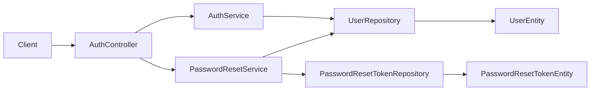

# Authentication Context

## Purpose and scope

Authentication verifies a user's password for login and provides a signed-out
password-reset flow. It exists so account access is not derived from an
unverified user lookup. The current implementation returns an MVP authentication
token and caller-scoped product endpoints still use `X-User-Id`; the proposed
JWT/refresh-session replacement is documented separately so it is not confused
with current runtime behavior. AUTH-SEC-01 adds a stateless default-deny HTTP
boundary: only approved unauthenticated routes are reachable without credentials.
Bearer-token decoding remains deferred to AUTH-SEC-02, so no private request can
yet authenticate through the new boundary.

## Runtime behavior and use

- `POST /api/auth/login` validates credentials and returns the login response.
- `POST /api/auth/password-reset-requests` accepts an account identifier and
  creates a time-limited reset request without revealing whether the account exists.
- `POST /api/auth/password-resets` atomically consumes one valid reset token and
  writes the replacement password.
- The web sign-in and forgot-password flows are the primary consumers; user
  registration remains owned by the Users feature.
- `POST /api/users`, the authentication/reset routes, `GET /api/features`, and
  `GET /actuator/health` are the only approved public method/path pairs.
- Every other route returns a stable `401 auth.required` Problem Details response
  until AUTH-SEC-02 enables framework Bearer JWT authentication.
- CSRF remains enabled for browser-facing routes. AUTH-SEC-01 deliberately excludes
  the current cookie-free API and Actuator transport; AUTH-SEC-04/05 must replace
  that temporary exclusion before adding cookie-backed refresh or logout endpoints.

## Architecture and data flow

`AuthController` validates transport DTOs and delegates one operation. `AuthServiceImpl`
performs password verification and uses `AuthTokenService` to build the MVP token.
`PasswordResetServiceImpl` uses conditional persistence of `PasswordResetTokenEntity`
through `PasswordResetTokenRepository`, then updates the owning `UserEntity`. The
service transaction keeps token consumption and password replacement together; an
already-used, expired, or unknown token does not expose its state.

`SecurityConfig` owns the stateless Spring Security filter chain. Its security-specific
entry point and access-denied handler serialize the same RFC 7807 response family as
the MVC exception layer, without exposing authentication or authorization internals.

## Feature-owned files and responsibilities

| Layer | Files and classes | Responsibility |
|---|---|---|
| API | `AuthController`, `AuthLoginDto`, `AuthLoginResponseDto`, `PasswordResetRequestDto`, `PasswordResetDto` | Defines login and reset HTTP contracts and validates request payloads. |
| Application | `AuthService`, `AuthServiceImpl`, `AuthTokenService` | Verifies credentials and produces the MVP login response. |
| Application | `PasswordResetService`, `PasswordResetServiceImpl` | Issues reset requests and atomically redeems a reset token. |
| Infrastructure | `SecurityConfig`, `ProblemAuthenticationEntryPoint`, `ProblemAccessDeniedHandler` | Enforces stateless default-deny request policy and serializes safe security failures. |
| Persistence | `PasswordResetTokenEntity`, `PasswordResetTokenRepository` | Stores token hash, expiry, and single-use state. |
| Collaborator | `user.domain.UserEntity`, `UserRepository` | Supplies credential data and persists the new password. |

## Interactions and persistence

- Users owns account creation; Authentication reads and updates its credentials.
- Notifications may later deliver reset material, but this module does not make
  delivery guarantees itself.
- The reset-token table is managed by the repository schema and JPA update mode;
  its conditional claim prevents two concurrent redemptions from both succeeding.
- `GlobalExceptionHandler` converts MVC failures to RFC 7807; security-filter failures
  use the matching dedicated handlers because they occur before MVC.

## Authoritative documentation

- [Authentication endpoints in the API reference](../../foundation/api.md#authentication)
- [Authentication and session security system design](authentication-security-system-design.md)
- [Authentication security SDD tasks](authentication-security-tasks.md)
- [Password-reset proposal](../users/proposals/password-reset-flow.md)
- [Backend architecture](../../foundation/architecture.md)
- [Testing guide](../../foundation/testing.md)
- [Authentication source package](../../../src/main/java/io/backend/lined/auth/)
- AUTH-SEC-01 is implemented; later authentication-security tasks remain tracked by
  the task index and master task table.
