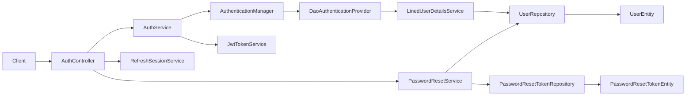

# Authentication Context

## Purpose and scope

Authentication verifies a user's password for login, starts independently
revocable refresh sessions, current-session logout, and a signed-out password-reset flow. It
exists so account access is not derived from an unverified user lookup. Login
uses Spring Security's `AuthenticationManager`, `DaoAuthenticationProvider`,
and identifier-resolving `LinedUserDetailsService` before returning a
short-lived HS256 JWT access token and an HttpOnly refresh cookie,
while caller-scoped product endpoints still use `X-User-Id` until AUTH-SEC-07
migrates trusted identity. AUTH-SEC-01 and AUTH-SEC-02 provide a stateless,
default-deny HTTP boundary: only approved unauthenticated routes are reachable
without credentials, and valid Bearer JWTs authenticate all other routes.

## Runtime behavior and use

- `POST /api/auth/login` resolves email or username credentials through Spring
  Security, creates a separate server-side refresh session, returns only
  access-token metadata, and sends the opaque refresh credential in an
  HttpOnly cookie. Unknown identifiers and bad passwords receive one
  indistinguishable `401 auth.credentials.invalid` response.
- `POST /api/auth/password-reset-requests` accepts an account identifier and
  creates a time-limited reset request without revealing whether the account exists.
- `POST /api/auth/password-resets` atomically consumes one valid reset token and
  writes the replacement password.
- `GET /api/auth/csrf` initializes the non-secret CSRF cookie used by browser
  requests that authenticate through cookies.
- `POST /api/auth/refresh` atomically rotates the current refresh credential,
  extends idle activity within the absolute deadline, and returns a new access JWT.
  Unknown, expired, revoked, consumed, or replayed credentials receive the same
  `401 auth.session.invalid` response; replay revokes the session family.
- `POST /api/auth/logout` silently revokes the session identified by the current
  refresh cookie, preserves other sessions for the same user, and returns `204`
  with an expired refresh cookie. Missing or unknown cookies are treated as
  already logged out.
- The web sign-in and forgot-password flows are the primary consumers; user
  registration remains owned by the Users feature.
- `POST /api/users`, the authentication/reset routes, `GET /api/features`,
  token-bearing `GET /api/calendar/feed/{token}.ics`, and `GET /actuator/health`
  are the only approved public method/path pairs.
- Every other route requires a valid `Authorization: Bearer <JWT>` credential.
  Missing, malformed, expired, or otherwise unapproved JWTs return a stable
  `401 auth.required` Problem Details response.
- Access JWTs use HS256 and contain only `sub`, `iss`, `aud`, `iat`, `exp`, and
  `jti`; issuer, audience, 15-minute lifetime, clock skew, and Base64 signing key
  are external `lined.security.jwt.*` configuration. `LINED_JWT_SECRET` must decode
  to at least 32 random bytes and has no runtime fallback.
- CSRF remains enabled for browser-facing routes and cookie-authenticated refresh;
  cookie-free `/api/**` requests and Actuator remain excluded because they use
  Bearer or public transport authentication. Refresh uses the non-HttpOnly CSRF
  cookie plus `X-XSRF-TOKEN` header and keeps the refresh credential HttpOnly.

## Architecture and data flow

`AuthController` validates transport requests and delegates one operation. `AuthServiceImpl`
submits credentials to `AuthenticationManager`, receives an authenticated
`LinedUserPrincipal`, creates a `RefreshSessionService` session and initial hashed refresh-token
history record, and uses `JwtTokenService` to issue the access JWT. The same service rotates a
presented refresh credential only after the persistence layer atomically consumes it. The API
transport adapter is the only layer that reads or writes the transient raw refresh value; the
database stores only its SHA-256 hash. The provider hides unknown-user lookup failures, while the
service maps all credential and refresh failures to stable non-enumerating Problem Details.
`PasswordResetServiceImpl` uses conditional persistence of `PasswordResetTokenEntity`
through `PasswordResetTokenRepository`, then updates the owning `UserEntity`. The
service transaction keeps token consumption and password replacement together; an
already-used, expired, or unknown token does not expose its state.

`SecurityConfig` owns the stateless Spring Security filter chain. Its security-specific
entry point and access-denied handler serialize the same RFC 7807 response family as
the MVC exception layer, without exposing authentication or authorization internals.

## Feature-owned files and responsibilities

| Layer | Files and classes | Responsibility |
|---|---|---|
| API | `AuthController`, `AuthLoginDto`, `AuthLoginResponseDto`, `PasswordResetRequestDto`, `PasswordResetDto` | Defines login, logout, and reset HTTP contracts and validates request payloads. |
| API | `RefreshTokenCookieWriter`, `RefreshTokenCookieReader` | Writes and reads the raw refresh credential only through the configured cookie transport; the writer also applies the server-calculated deadline. |
| Application | `AuthService`, `AuthServiceImpl`, `LinedUserDetailsService`, `LinedUserPrincipal`, `JwtTokenService`, `JwtProperties` | Delegates password authentication to framework primitives, resolves Lined account credentials, issues approved JWT claims, and owns validated JWT configuration. |
| Application | `RefreshSessionService`, `RefreshTokenGenerator`, `RefreshTokenHasher`, `RefreshSessionProperties`, `RefreshCookieProperties` | Creates sessions, revokes the current session, atomically rotates one-time 256-bit Base64URL credentials, hashes them with SHA-256, enforces idle/absolute deadlines, and owns validated lifetime/cookie configuration. |
| Application | `PasswordResetService`, `PasswordResetServiceImpl` | Issues reset requests and atomically redeems a reset token. |
| Infrastructure | `SecurityConfig`, `ProblemAuthenticationEntryPoint`, `ProblemAccessDeniedHandler` | Enforces stateless default-deny policy, framework Bearer JWT validation, and safe security failures. |
| Persistence | `PasswordResetTokenEntity`, `PasswordResetTokenRepository`, `AuthSessionEntity`, `AuthRefreshTokenEntity`, and their repositories | Stores reset-token and refresh-token hashes, session deadlines, and future token-history lifecycle state without raw refresh values. |
| Collaborator | `user.domain.UserEntity`, `UserRepository` | Supplies credential data and persists the new password. |

## Interactions and persistence

- Users owns account creation; Authentication reads and updates its credentials.
- Notifications may later deliver reset material, but this module does not make
  delivery guarantees itself.
- The reset-token table is managed by the repository schema and JPA update mode;
  its conditional claim prevents two concurrent redemptions from both succeeding.
- `auth_sessions` owns one login/device lifecycle per successful authentication;
  `auth_refresh_tokens` keeps the complete hashed rotation history. Refresh
  consumption, rotation, and replay-family revocation are owned by AUTH-SEC-05;
  current-session logout is owned by AUTH-SEC-06.
- `GlobalExceptionHandler` converts MVC failures to RFC 7807; security-filter failures
  use the matching dedicated handlers because they occur before MVC.

## Authoritative documentation

- [Authentication endpoints in the API reference](../../foundation/api.md#authentication)
- [Authentication and session security system design](authentication-security-system-design.md)
- [Authentication security SDD tasks](authentication-security-tasks.md)
- [Password-reset proposal](../users/proposals/password-reset-flow.md)
- [Backend architecture](../../foundation/architecture.md)
- [Testing guide](../../foundation/testing.md)
- [Authentication source package](../../../src/main/java/io/backend/lined/auth/)
- AUTH-SEC-01 through AUTH-SEC-06 are implemented; later authentication-security tasks
  remain tracked by the task index and master task table.
