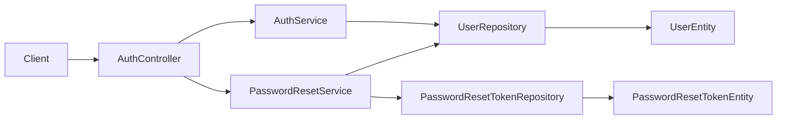

# Authentication Context

## Purpose and scope

Authentication verifies a user's password for login and provides a signed-out
password-reset flow. It exists so account access is not derived from an
unverified user lookup. The feature currently returns an MVP authentication
token; caller-scoped product endpoints still use `X-User-Id` and are not
protected by a Spring Security request filter.

## Runtime behavior and use

- `POST /api/auth/login` validates credentials and returns the login response.
- `POST /api/auth/password-reset-requests` accepts an account identifier and
  creates a time-limited reset request without revealing whether the account exists.
- `POST /api/auth/password-resets` atomically consumes one valid reset token and
  writes the replacement password.
- The web sign-in and forgot-password flows are the primary consumers; user
  registration remains owned by the Users feature.

## Architecture and data flow

`AuthController` validates transport DTOs and delegates one operation. `AuthServiceImpl`
performs password verification and uses `AuthTokenService` to build the MVP token.
`PasswordResetServiceImpl` uses conditional persistence of `PasswordResetTokenEntity`
through `PasswordResetTokenRepository`, then updates the owning `UserEntity`. The
service transaction keeps token consumption and password replacement together; an
already-used, expired, or unknown token does not expose its state.

## Feature-owned files and responsibilities

| Layer | Files and classes | Responsibility |
|---|---|---|
| API | `AuthController`, `AuthLoginDto`, `AuthLoginResponseDto`, `PasswordResetRequestDto`, `PasswordResetDto` | Defines login and reset HTTP contracts and validates request payloads. |
| Application | `AuthService`, `AuthServiceImpl`, `AuthTokenService` | Verifies credentials and produces the MVP login response. |
| Application | `PasswordResetService`, `PasswordResetServiceImpl` | Issues reset requests and atomically redeems a reset token. |
| Persistence | `PasswordResetTokenEntity`, `PasswordResetTokenRepository` | Stores token hash, expiry, and single-use state. |
| Collaborator | `user.domain.UserEntity`, `UserRepository` | Supplies credential data and persists the new password. |

## Interactions and persistence

- Users owns account creation; Authentication reads and updates its credentials.
- Notifications may later deliver reset material, but this module does not make
  delivery guarantees itself.
- The reset-token table is managed by the repository schema and JPA update mode;
  its conditional claim prevents two concurrent redemptions from both succeeding.
- Shared RFC 7807 error conversion is provided by `GlobalExceptionHandler`; it is
  infrastructure, not part of this feature's public contract.

## Authoritative documentation

- [Authentication endpoints in the API reference](../../foundation/api.md#authentication)
- [Password-reset proposal](../users/proposals/password-reset-flow.md)
- [Backend architecture](../../foundation/architecture.md)
- [Testing guide](../../foundation/testing.md)
- [Authentication source package](../../../src/main/java/io/backend/lined/auth/)
- No separate authentication migration or operational document exists in this repository.
