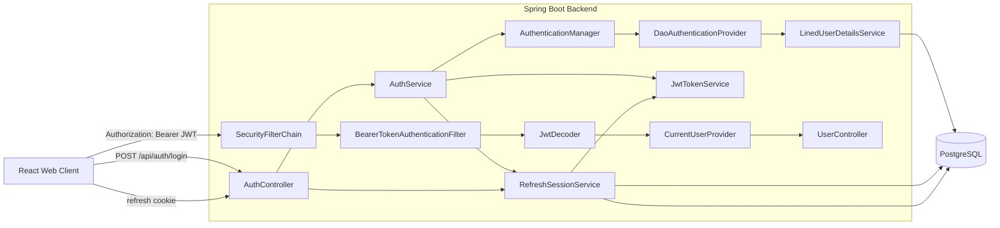
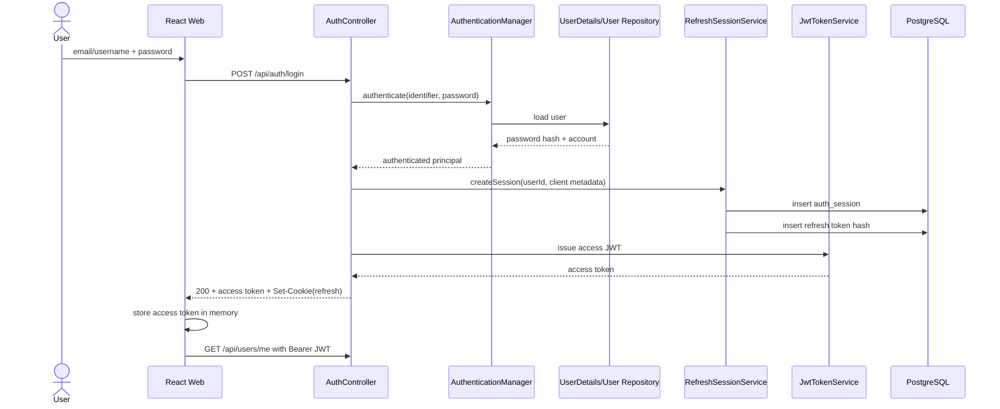
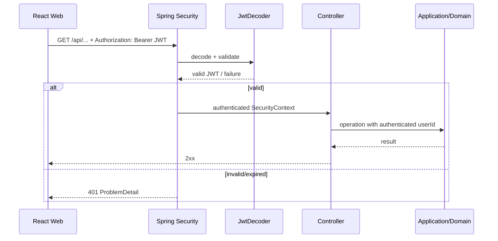
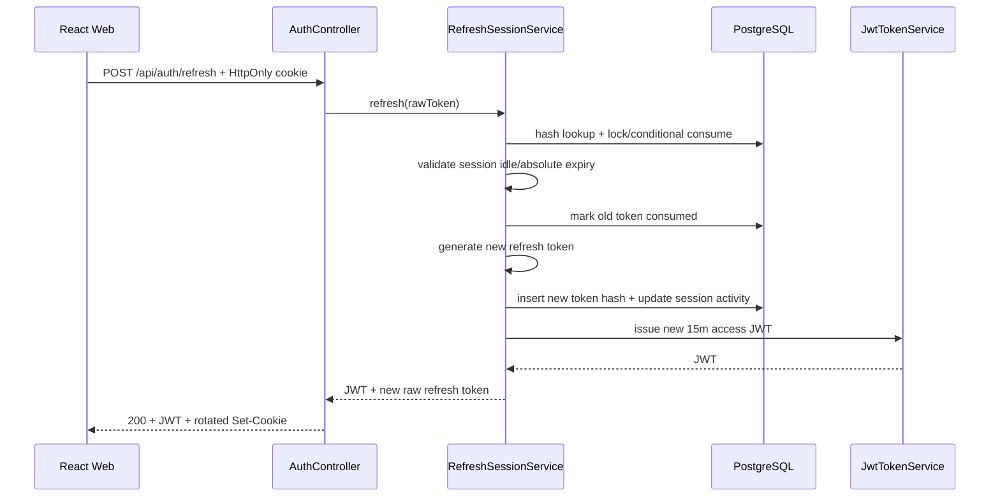
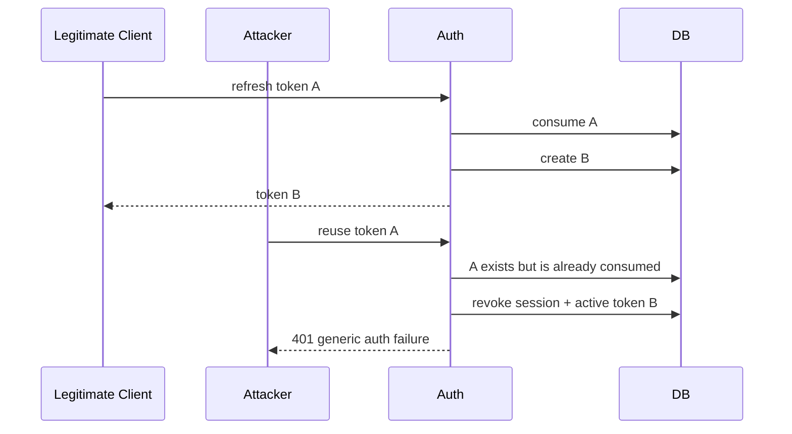
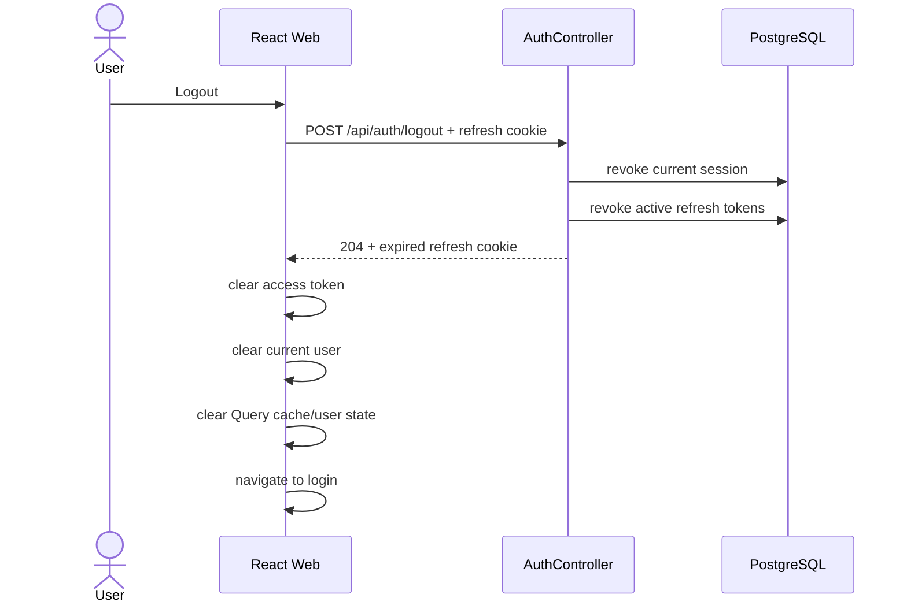
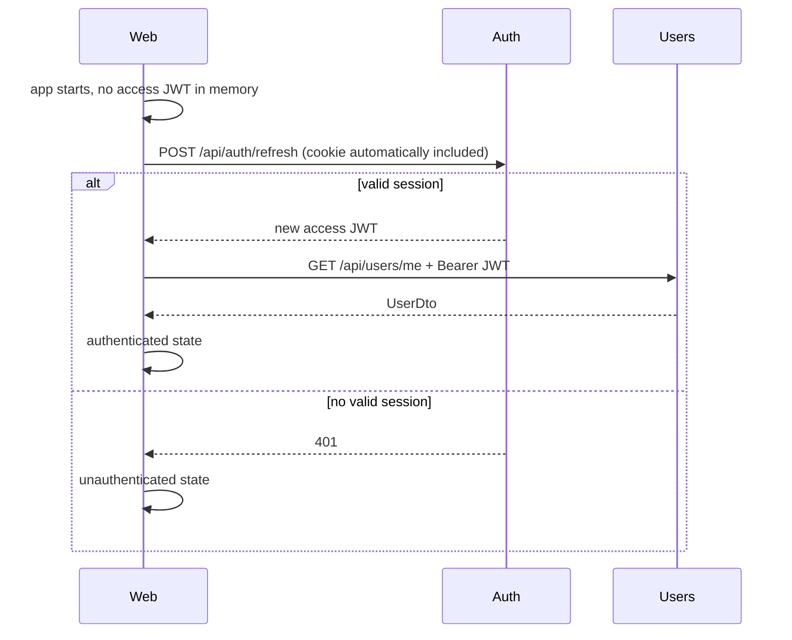

# Lined Authentication & Session Security — System Design

**Document type:** System Design Specification (SDD-ready)  
**Scope:** Authentication foundation, JWT access tokens, refresh sessions, Spring Security integration, frontend session handling, operational exposure  
**Status:** Proposed / ready for task decomposition  
**Version:** 1.0  
**Date:** 2026-08-24  
**Repository:** `Pan14ek/lined`  
**Primary backend:** Spring Boot 3.5.6, Java 17  
**Primary web client:** React + TypeScript + Vite + Zustand + TanStack Query + `ky`

---

## 1. Purpose

This document defines the target production-oriented authentication and session-security architecture for Lined.

The current backend can verify a user's password and issue a custom HMAC token, but caller-scoped product APIs still trust the client-supplied `X-User-Id` header. The current web client persists that user ID and attaches it to API requests. This design removes that trust boundary and replaces it with standard Spring Security Bearer JWT authentication.

This specification is intentionally written to support **Spec-Driven Development (SDD)**. It captures:

- the problem and desired behavior before implementation;
- explicit requirements and security invariants with stable IDs;
- architectural decisions and their rationale;
- API and persistence contracts;
- failure semantics;
- frontend and backend responsibilities;
- testable acceptance criteria;
- migration and rollout constraints;
- clear boundaries for later task decomposition.

Implementation tasks generated from this document MUST reference the relevant requirement and acceptance-criteria IDs.

---

## 2. SDD Usage Contract

### 2.1 Why this document is structured this way

Current SDD workflows such as GitHub Spec Kit and Kiro converge on a similar lifecycle:

```text
Requirements
    ↓
Design / Plan
    ↓
Tasks
    ↓
Implementation
    ↓
Verification
```

GitHub Spec Kit describes its default workflow as `Spec → Plan → Tasks → Implement`, while Kiro separates `requirements.md`, `design.md`, and `tasks.md`. This document combines the **approved requirements and system design** for one bounded security capability so that a later task-generation step does not need to invent missing architectural decisions.

### 2.2 Rules for task generation

When this document is decomposed into tasks:

1. Every implementation task MUST reference one or more IDs from `AUTH-FR-*`, `AUTH-SR-*`, `AUTH-NFR-*`, or `AUTH-AC-*`.
2. Tasks MUST be independently reviewable and have explicit verification steps.
3. A task MUST NOT silently change an architectural decision from Section 8.
4. If implementation discovers that a decision is invalid, this document MUST be amended first or an ADR MUST be created.
5. Security-critical code MUST prefer Spring Security and JDK/framework primitives over custom authentication protocols.
6. A task is not complete only because code compiles; its associated unit/integration tests and documentation changes are part of the task.
7. Cross-cutting migration work MUST explicitly identify all usages of `X-User-Id`, persisted `userId`, or the existing custom `AuthTokenService`.
8. No task may re-introduce client-controlled identity after `X-User-Id` removal.

### 2.3 Suggested downstream SDD artifacts

This document can feed:

```text
authentication-security-system-design.md
        ↓
authentication-security-tasks.md
        ↓
individual task specs / PRs
        ↓
implementation
```

For a tool such as Spec Kit, this design may also be used as source context when generating a smaller spec per implementation slice.

---

## 3. Current Repository Baseline

The design is based on the repository state inspected on 2026-08-24.

### 3.1 Current backend authentication

Relevant current files:

```text
backend/lined/src/main/java/io/backend/lined/auth/
├── api/
│   ├── AuthController.java
│   ├── AuthLoginDto.java
│   ├── AuthLoginResponseDto.java
│   ├── PasswordResetRequestDto.java
│   └── PasswordResetDto.java
└── service/
    ├── AuthService.java
    ├── AuthServiceImpl.java
    ├── AuthTokenService.java
    └── PasswordResetService...
```

Current behavior:

- `POST /api/auth/login` exists.
- `AuthServiceImpl` resolves a user by email or username.
- `PasswordEncoder.matches(...)` verifies the password.
- a custom `AuthTokenService` creates a custom HMAC-SHA256 token;
- the token payload currently contains version, user ID, and expiration;
- password reset endpoints already exist;
- product endpoints are not authenticated by a Spring Security request filter.

### 3.2 Current login response

The current response includes:

```text
accessToken
tokenType
expiresIn
userId
username
email
roles
```

The target design changes the web authentication source of truth:

```text
login
  → access token + refresh session

GET /api/users/me
  → current user profile
```

Therefore user profile fields should no longer be required in the login response.

### 3.3 Current user identity mechanism

The current API still uses:

```http
X-User-Id: <id>
```

This is unsafe as an authentication mechanism because the caller controls the header value.

`GET /api/users/me` already exists, but currently resolves the caller through the same MVP header. Its public contract can remain stable while the identity source changes to the authenticated token subject.

### 3.4 Current frontend behavior

The current web client:

- stores `userId` in a persisted Zustand store;
- persists it under `lined-auth`;
- adds `X-User-Id` to requests in `lined-web/src/lib/apiClient.ts`.

Target behavior:

- access JWT lives only in memory;
- refresh credential lives in an HttpOnly cookie;
- API requests use `Authorization: Bearer <access-token>`;
- `userId` is not trusted as client identity;
- `/api/users/me` supplies current-user data;
- logout/account transitions clear user-specific client caches.

### 3.5 Current dependencies

The backend currently has:

```gradle
implementation 'org.springframework.security:spring-security-crypto:6.4.4'
```

but does not have the complete Spring Security web/resource-server starters required by this design.

---

## 4. Problem Statement

The current authentication implementation has four primary limitations.

### P1 — Client-controlled identity

A client can provide an arbitrary `X-User-Id`. Without an independent authorization check, this creates an impersonation boundary and enables BOLA/IDOR-style vulnerabilities.

### P2 — Custom token protocol

The current project implements its own token format and signing logic. Issuing a custom HMAC token is only part of a complete authentication protocol. Production use also requires robust parsing, signature verification, expiration handling, malformed-token handling, authentication context population, and standardized error handling.

### P3 — No durable refresh-session lifecycle

The current access token is the only authentication token. There is no first-class concept of:

- a browser/device session;
- refresh token rotation;
- server-side session revocation;
- current-session logout;
- future multi-device session management;
- refresh-token replay detection.

### P4 — Frontend authentication state is persisted incorrectly

The current client persists a user ID and uses it as identity. A secure client must instead operate from server-verified credentials and server-resolved user data.

---

## 5. Goals

### G1

All protected backend endpoints authenticate callers through Spring Security using a standard Bearer JWT.

### G2

No protected product endpoint accepts `X-User-Id` as an identity source.

### G3

JWT access tokens are short-lived and contain only identity/protocol claims required by the resource server.

### G4

Authorization data such as roles, permissions, lobby membership, and ownership remains authoritative in the database/domain model rather than being embedded as long-lived JWT authorization state.

### G5

Lined supports renewable web sessions with server-side revocation using high-entropy opaque refresh tokens.

### G6

Refresh tokens are never stored in plaintext in the database and are rotated after use.

### G7

A refresh-token replay can be detected and invalidates the affected session/token family.

### G8

The web client does not persist access or refresh credentials in `localStorage`.

### G9

The architecture supports future multiple concurrent sessions/devices without implementing an Active Sessions UI now.

### G10

The architecture does not block future Google OAuth authentication, while Google OAuth itself remains outside this implementation scope.

### G11

Security errors are returned through one consistent Problem Details contract.

### G12

Production secrets, Swagger exposure, Actuator exposure, and runtime configuration follow production-safe defaults.

---

## 6. Non-Goals

The following are deliberately out of scope for this system-design phase and should receive separate specifications where required.

### NG1 — Google/Apple OAuth implementation

Future Google OAuth must be supported architecturally, but it is not implemented in this iteration.

Suggested future flag:

```text
auth.google-oauth.feature.enabled
```

Final naming must follow the feature-flag module conventions at implementation time.

### NG2 — External Identity Provider migration

Keycloak, Auth0, Amazon Cognito, or another external identity provider is not introduced now.

Lined remains the authentication authority for the current product phase.

### NG3 — Domain authorization / BOLA audit

This specification establishes **who the caller is**.

A separate authorization specification must establish **what the caller may access**, including:

- lobby owner/member/stranger rules;
- event ownership;
- private event/task visibility;
- billing permissions;
- admin permissions;
- BOLA/IDOR protection.

### NG4 — Full brute-force/rate-limit policy

Login and password-reset rate limiting are required before broad public launch, but detailed thresholds, account/IP strategy, delay strategy, storage, and lockout behavior require a separate security specification.

This design MUST leave clean integration points for rate limiting and MUST NOT make future throttling difficult.

### NG5 — Password-policy redesign

Password length/quality rules and compromised-password checking are not redesigned here.

### NG6 — Email verification

Registration email verification is not defined in this document.

### NG7 — MFA

Multi-factor authentication is not implemented.

### NG8 — Active Sessions UI

Persistence supports multiple sessions; user-facing session-management UI is future work.

### NG9 — Native mobile authentication implementation

The backend session model must not prevent native mobile usage, but Keychain/Keystore client integration is not implemented here.

### NG10 — Automated JWT signing-key rotation

The design must permit future rotation; automatic rotation is deferred.

### NG11 — Immediate access-token revocation

Access JWTs expire naturally after 15 minutes. No per-request access-token denylist is introduced in v1.

---

## 7. Terminology

| Term | Meaning in this design |
|---|---|
| Access token | Short-lived signed JWT used in the HTTP `Authorization` header. |
| Refresh token | High-entropy opaque random credential used to renew an authenticated session. |
| Auth session | Server-side record representing one login/browser/device session. |
| Token family | The sequence of refresh tokens generated by rotation for one auth session. |
| Rotation | Consuming one refresh token and replacing it with a new refresh token. |
| Replay/reuse | Attempting to use a refresh token that has already been consumed/revoked. |
| Authentication | Establishing caller identity. |
| Authorization | Deciding whether an authenticated caller can perform an operation. |
| Principal | Authenticated identity exposed through Spring Security. |
| `sub` | JWT subject; Lined user ID. |
| `jti` | Unique JWT access-token identifier. |
| `iss` | JWT issuer. |
| `aud` | JWT intended audience. |

---

## 8. Architectural Decisions

This section is normative. Generated tasks MUST preserve these decisions unless the specification is amended.

### ADR-AUTH-001 — Use Spring Security

**Decision:** Add Spring Security web/resource-server support.

Target dependencies:

```gradle
implementation 'org.springframework.boot:spring-boot-starter-security'
implementation 'org.springframework.boot:spring-boot-starter-oauth2-resource-server'

testImplementation 'org.springframework.security:spring-security-test'
```

Remove the manually pinned dependency:

```gradle
implementation 'org.springframework.security:spring-security-crypto:6.4.4'
```

Spring Boot dependency management should select compatible Spring Security module versions.

**Rationale:** Use supported, tested framework behavior for filter-chain authentication, Bearer-token processing, JWT verification, authentication context, and test support.

---

### ADR-AUTH-002 — Do not implement a custom authentication filter

**Decision:** Use the standard Spring Security resource-server Bearer flow and `SecurityFilterChain`.

Do not create a custom `OncePerRequestFilter` solely to parse JWTs.

**Rationale:** Spring Security already provides the standard Bearer authentication filter flow. Custom filters add security-sensitive code without product value.

---

### ADR-AUTH-003 — Keep the Lined login endpoint

**Decision:**

```http
POST /api/auth/login
```

remains the product login endpoint.

Spring Security Resource Server validates Bearer tokens; it does not replace Lined's credential-login API.

Credential verification should migrate to Spring Security abstractions:

```text
AuthController
    ↓
AuthService / Authentication orchestration
    ↓
AuthenticationManager
    ↓
DaoAuthenticationProvider
    ↓
LinedUserDetailsService
    ↓
PasswordEncoder
```

`LinedUserDetailsService` may resolve the supplied identifier as either email or username.

**Rationale:** Preserve the REST API while replacing manual credential-verification plumbing with framework-standard authentication.

---

### ADR-AUTH-004 — JWT access token

**Decision:** Access tokens are JWTs.

Lifetime:

```text
15 minutes
```

Required claims:

```text
sub = userId
iss = lined
aud = lined-api
iat
exp
jti
```

Roles/permissions MUST NOT be embedded in the v1 JWT.

**Rationale:**

- JWT cryptographic integrity prevents callers from modifying claims without invalidating the signature.
- Authorization stored in JWTs becomes stale until expiry.
- Lined has dynamic domain authorization such as lobby membership and ownership that must use current database state.
- A small identity JWT reduces coupling between authentication and the domain permission model.

---

### ADR-AUTH-005 — Database/domain remains authorization source of truth

JWT answers:

```text
Who is the caller?
```

The database/domain model answers:

```text
What may this caller do?
```

Examples of data not encoded in the JWT:

```text
USER / ADMIN role state
BILLING_REFUND permission
lobby membership
lobby ownership
event ownership
private-event visibility
subscription entitlement
```

The first security filter chain only requires a valid authenticated identity. Detailed authorization is handled in a separate authorization design.

---

### ADR-AUTH-006 — HS256 for current monolith

**Decision:** Use HMAC-SHA-256 (`HS256`) for access-token signing in the current single-backend modular monolith.

Use a cryptographically random secret with at least 256 bits of entropy.

The implementation MUST explicitly constrain the accepted signing algorithm and MUST NOT accept unsigned tokens or algorithm downgrades.

**Rationale:** In the current architecture the same application issues and verifies tokens, so asymmetric key distribution provides little operational value.

**Future:** When independent services must validate tokens without receiving signing authority, migrate to an asymmetric algorithm such as RSA/ECDSA.

---

### ADR-AUTH-007 — Externalized signing secret

The signing secret MUST NOT be:

- committed to Git;
- hard-coded in Java;
- embedded in the Docker image;
- committed in `application-prod.*`;
- exposed through logs or Actuator.

Target configuration source:

```text
local/test → environment/test configuration
staging    → deployment secret
production → AWS Secrets Manager when deployed on AWS
```

The current fallback such as:

```text
local-development-only-change-me
```

MUST NOT be a permitted production fallback.

Application startup in production MUST fail if a production signing secret is absent or invalid.

---

### ADR-AUTH-008 — Key rotation is supported conceptually, automated later

Key rotation means replacing the JWT signing key without permanently relying on one secret.

v1 does not require automatic rotation.

The configuration and token service MUST avoid a hard-coded singleton secret design that would make later rotation impractical.

Future rotation can use a `kid` header and a validation window where:

```text
new tokens → new key
existing tokens → old or new key accepted
after > access-token TTL → old key removed
```

Because access tokens live only 15 minutes, rotation migration windows can remain short.

---

### ADR-AUTH-009 — Opaque refresh tokens

Refresh tokens are not JWTs.

They MUST be:

- generated with `SecureRandom`;
- at least 256 bits of entropy;
- encoded using a transport-safe format such as Base64URL;
- treated as credentials;
- never logged;
- stored server-side only as a cryptographic hash.

Recommended v1:

```text
32 random bytes
Base64URL without padding
SHA-256 token hash stored in DB
```

A pepper is not required for the refresh-token hash because a correctly generated token has high entropy and is not human-memorable like a password.

---

### ADR-AUTH-010 — Session lifetime

Each login creates one server-side auth session.

Target timeouts:

```text
Access JWT lifetime:        15 minutes
Refresh idle timeout:       7 days
Session absolute lifetime: 30 days
```

Behavior:

- successful refresh updates session activity and may extend the idle deadline;
- the idle deadline MUST never extend beyond the absolute expiration;
- inactivity for seven days requires authentication again;
- reaching 30 days from login requires authentication again regardless of activity.

Session expiration MUST be enforced server-side.

---

### ADR-AUTH-011 — Refresh-token rotation

Each successful refresh:

1. validates the presented refresh token;
2. atomically consumes it;
3. generates a new refresh token;
4. stores the new token hash;
5. issues a new 15-minute access JWT;
6. updates session activity/idle expiry;
7. returns the new access token;
8. replaces the web refresh cookie.

The old refresh token becomes unusable immediately.

---

### ADR-AUTH-012 — Refresh-token reuse detection

If a previously consumed/revoked refresh token is presented again:

- the client receives a generic authentication failure;
- the backend treats the event as possible credential theft;
- the associated auth session/token family is revoked;
- active refresh tokens for the session become invalid;
- the event is recorded in security telemetry/logging;
- reauthentication is required.

The response MUST NOT disclose token-history details to an untrusted caller.

**Concurrency note:** Two simultaneous refresh requests using the same token cause one atomic consume to win. The second request is considered reuse in v1. The web client MUST therefore implement single-flight refresh. Concurrency behavior MUST be covered by integration tests.

---

### ADR-AUTH-013 — Access JWT is not immediately revoked on normal logout

Normal logout revokes the current refresh session.

An already-issued access JWT can remain cryptographically valid until its 15-minute expiration.

No JWT denylist is introduced in v1.

**Accepted trade-off:** Maximum residual access-token validity after logout is 15 minutes.

**Future options if requirements change:**

- access-token denylist by `jti`;
- user/session security version;
- introspection/stateful access tokens;
- shorter access-token TTL.

---

### ADR-AUTH-014 — Multi-device sessions are supported by the data model

Each login creates a separate session.

Example:

```text
User 15
├── Session A — Chrome on Mac
├── Session B — iPhone
└── Session C — another browser
```

`POST /api/auth/logout` revokes the **current session only**.

Future:

```http
POST /api/auth/logout-all
```

and an Active Sessions UI may be added without changing the core persistence model.

---

### ADR-AUTH-015 — Web access token lives in memory

The web client MUST NOT store access JWTs in:

```text
localStorage
sessionStorage as long-lived credential
IndexedDB as authentication persistence
```

The access JWT is held only in volatile application memory, e.g. a non-persisted Zustand auth state.

Reloading the page intentionally loses the access token.

The web client restores the session by using the refresh cookie to obtain a new access token.

---

### ADR-AUTH-016 — Web refresh token uses an HttpOnly cookie

For the web client, the raw refresh credential is stored in a cookie with production attributes:

```text
HttpOnly
Secure
SameSite=Lax
Path=/api/auth
host-only where possible
```

The `Domain` attribute SHOULD be omitted unless deployment architecture requires it.

The raw refresh token is not accessible to JavaScript.

Production must use HTTPS.

Cookie expiry MUST NOT override server-side idle/absolute expiration rules.

---

### ADR-AUTH-017 — Same-origin production topology is preferred

Preferred public routing:

```text
https://lined.app/
    → React

https://lined.app/api/*
    → Spring Boot
```

The backend may internally listen on port `8080`; this port is not exposed as part of the public product URL.

Benefits:

- simpler cookie semantics;
- smaller CORS surface;
- simpler CSRF reasoning;
- one public origin.

If deployment later uses:

```text
https://app.lined.app
https://api.lined.app
```

CORS MUST use an explicit origin allowlist and credentials configuration. Wildcard origins MUST NOT be combined with credentialed requests.

Local development may explicitly allow the Vite origin.

---

### ADR-AUTH-018 — Mobile compatibility without mobile implementation

Backend application services MUST not assume refresh credentials can only originate from browser cookies.

The domain/application refresh logic receives a refresh credential value from a transport adapter.

Current web transport:

```text
HttpOnly cookie
    ↓
Web controller/adapter
    ↓
RefreshTokenService
```

Future native mobile transport:

```text
OS secure storage (Keychain / Keystore-backed)
    ↓
native API transport
    ↓
same session/refresh application service
```

No native client transport is implemented in this iteration.

---

### ADR-AUTH-019 — Remove `X-User-Id` completely

`X-User-Id` MUST be removed from:

- production controllers;
- local runtime behavior;
- frontend API client;
- tests except migration/regression checks asserting it is ignored/not supported;
- API docs;
- request examples.

There is no local/test backdoor that re-enables it.

Caller identity comes only from the authenticated Spring Security context.

---

### ADR-AUTH-020 — `/api/users/me` is the current-user source of truth

Keep:

```http
GET /api/users/me
```

Target flow:

```text
Bearer JWT
    ↓
Spring Security
    ↓
JWT sub = userId
    ↓
CurrentUserProvider
    ↓
User service/repository
    ↓
UserDto
```

The frontend uses this endpoint to resolve the current profile after authentication/session restoration.

---

### ADR-AUTH-021 — Application/domain code does not depend directly on token transport

Avoid spreading:

```java
SecurityContextHolder.getContext()
```

or `Jwt` parsing throughout domain services.

Introduce a narrow identity abstraction, for example:

```java
public interface CurrentUserProvider {
    long requireUserId();
}
```

with a Spring Security implementation at the infrastructure/security boundary.

Alternative naming is allowed if responsibilities remain the same.

Controllers/application services may depend on the abstraction; domain entities and repositories MUST NOT depend on Spring Security.

---

### ADR-AUTH-022 — Stateless Spring Security request authentication

Protected API requests use:

```text
SessionCreationPolicy.STATELESS
```

The application does not use `HttpSession` as the authenticated-user source.

The server-side `auth_session` defined in this document represents refresh-session lifecycle, not a servlet HTTP session.

---

### ADR-AUTH-023 — Public endpoint policy

Target public/unauthenticated routes:

```text
POST /api/users
POST /api/auth/login
POST /api/auth/refresh
POST /api/auth/password-reset-requests
POST /api/auth/password-resets
GET  /api/features
GET  /actuator/health
```

Everything else is authenticated by default:

```text
anyRequest().authenticated()
```

Notes:

- `POST /api/auth/refresh` is publicly routable but requires a valid refresh credential to succeed.
- `POST /api/auth/password-resets` requires a valid reset token.
- public registration still requires validation and later abuse protections.
- `/api/features` is already designed as an approved public discovery catalog and MUST NOT expose internal/admin feature metadata.
- additional public routes require explicit security review and documentation.

---

### ADR-AUTH-024 — Swagger/OpenAPI is not publicly exposed in production

Target:

```text
local       → enabled
test        → as required
staging     → enabled/restricted
production  → public Swagger UI disabled
```

If Lined later exposes a public developer API, public API documentation becomes a separate product/security decision.

Swagger availability is not itself an authorization boundary; protected APIs remain protected regardless of documentation exposure.

---

### ADR-AUTH-025 — Actuator exposure is minimal

Public:

```text
GET /actuator/health
```

with minimal status only.

Not public:

```text
/actuator/prometheus
/actuator/metrics
/actuator/loggers
/actuator/threaddump
/actuator/env
/actuator/heapdump
```

Preferred production setup places internal management endpoints on a non-public management route/port/network path.

Public health response must not disclose component details.

Target production setting:

```properties
management.endpoint.health.show-details=never
```

or an equivalent restricted configuration.

---

### ADR-AUTH-026 — Standard Problem Details error contract

Authentication/authorization failures MUST use the same API error shape as the rest of the backend.

Use Spring `ProblemDetail` / Problem Details semantics.

Security filters execute before MVC exception handlers, therefore security-specific components must serialize compatible errors:

```text
AuthenticationEntryPoint → 401 ProblemDetail
AccessDeniedHandler      → 403 ProblemDetail
```

Recommended custom properties:

```text
code
traceId
```

Example:

```json
{
  "type": "https://lined.app/problems/authentication-required",
  "title": "Authentication required",
  "status": 401,
  "detail": "Authentication is required to access this resource.",
  "instance": "/api/lobbies",
  "code": "auth.required",
  "traceId": "..."
}
```

---

### ADR-AUTH-027 — 401 and 403 semantics

```text
401 Unauthorized
= valid authentication is absent

403 Forbidden
= caller is authenticated but not permitted
```

Examples:

```text
missing JWT        → 401
malformed JWT      → 401
invalid signature  → 401
expired JWT        → 401
invalid refresh    → 401
valid JWT + denied operation → 403
```

A later authorization/BOLA specification may intentionally use `404` for selected resource-existence hiding scenarios.

---

### ADR-AUTH-028 — Frontend automatically refreshes once

When a protected request receives `401` due to an expired/absent usable access token:

```text
request
  ↓
401
  ↓
attempt one refresh
  ├── success → install access token → retry original request once
  └── failure → clear local auth/user state → login
```

The client MUST prevent infinite `401 → refresh → 401` loops.

The refresh endpoint itself MUST NOT recursively trigger refresh logic.

---

### ADR-AUTH-029 — Frontend refresh is single-flight

If multiple requests receive `401` concurrently:

```text
N failed requests
      ↓
one shared refresh operation
      ↓
new access token
      ↓
retry waiting requests
```

The client MUST NOT launch N concurrent refresh calls with the same refresh token because refresh rotation intentionally invalidates the previous token.

---

### ADR-AUTH-030 — Logout means current-session termination

Endpoint:

```http
POST /api/auth/logout
```

Behavior:

Backend:

```text
refresh credential identifies current session
    ↓
revoke session
    ↓
revoke active refresh token(s)
    ↓
expire refresh cookie
```

Frontend:

```text
drop access token
clear current user
clear TanStack Query user-specific cache
clear user-specific Zustand state
redirect to login
```

Other device/browser sessions remain active.

---

### ADR-AUTH-031 — Future Google OAuth reuses token/session issuance

Credential verification and Lined session issuance MUST remain separable.

Current:

```text
email/username + password
    ↓
AuthenticationManager
    ↓
authenticated Lined user
    ↓
Lined Token/Session Issuance
```

Future:

```text
Google OAuth
    ↓
verified external identity
    ↓
mapped Lined user
    ↓
same Lined Token/Session Issuance
```

This avoids coupling JWT/session creation specifically to password login.

A future OAuth specification can introduce provider identity mapping and feature-flag behavior without replacing the core auth-session model.

---

## 9. Requirements

### 9.1 Functional Requirements

#### AUTH-FR-001 — Credential login

The system MUST authenticate a valid user through:

```http
POST /api/auth/login
```

using email or username plus password.

#### AUTH-FR-002 — Generic invalid credentials

Invalid identifier and invalid password MUST result in the same externally visible authentication failure.

The API MUST NOT reveal whether the account exists.

#### AUTH-FR-003 — Access JWT issuance

Successful login MUST issue a JWT access token with a 15-minute lifetime.

#### AUTH-FR-004 — Refresh session issuance

Successful login MUST create a server-side auth session and an initial refresh token.

#### AUTH-FR-005 — Web refresh cookie

The web login response MUST set the refresh credential as an HttpOnly cookie.

#### AUTH-FR-006 — Bearer authentication

Protected endpoints MUST accept caller authentication through:

```http
Authorization: Bearer <JWT>
```

#### AUTH-FR-007 — Token validation

The backend MUST validate at least:

- token signature;
- accepted algorithm;
- `exp`;
- `iss`;
- `aud`;
- required subject format.

#### AUTH-FR-008 — Current user

`GET /api/users/me` MUST resolve the user ID from authenticated server context, not from a request-supplied user ID.

#### AUTH-FR-009 — Session refresh

`POST /api/auth/refresh` MUST issue a new access JWT when a valid refresh session is presented.

#### AUTH-FR-010 — Refresh rotation

Every successful refresh MUST replace the presented refresh token with a newly generated token.

#### AUTH-FR-011 — Idle timeout

A refresh session MUST become unusable after seven days without successful refresh activity.

#### AUTH-FR-012 — Absolute timeout

A refresh session MUST become unusable no later than 30 days after login.

#### AUTH-FR-013 — Refresh reuse detection

Reuse of a consumed/revoked refresh token MUST revoke the associated session/token family.

#### AUTH-FR-014 — Logout

`POST /api/auth/logout` MUST revoke the current auth session and clear the web refresh cookie.

#### AUTH-FR-015 — Multi-session support

A user MUST be able to own multiple independent auth sessions.

#### AUTH-FR-016 — Access-token memory storage

The web client MUST keep the access JWT in volatile memory only.

#### AUTH-FR-017 — Session bootstrap

After browser reload, the web client MUST attempt to restore authentication through the refresh endpoint rather than from persisted access-token/user-ID credentials.

#### AUTH-FR-018 — Automatic refresh

The web client MUST be able to recover from access-token expiration using a single refresh operation and retry eligible failed requests once.

#### AUTH-FR-019 — Cache isolation

Logout/session invalidation MUST clear user-specific client cache/state so that a later user cannot see the previous user's cached private data.

#### AUTH-FR-020 — Public feature discovery

`GET /api/features` remains unauthenticated and returns only the approved public feature catalog.

#### AUTH-FR-021 — Registration remains public

`POST /api/users` remains unauthenticated so new users can register.

Abuse protection is defined in a follow-up specification.

---

### 9.2 Security Requirements / Invariants

#### AUTH-SR-001 — No client-controlled identity

A caller MUST NOT be treated as a user because it supplied a numeric/string user ID header or request parameter.

#### AUTH-SR-002 — No `X-User-Id`

`X-User-Id` MUST have no authentication meaning anywhere after migration.

#### AUTH-SR-003 — No refresh token plaintext at rest

The raw refresh token MUST NOT be stored in PostgreSQL.

#### AUTH-SR-004 — No token logging

Access tokens, refresh tokens, password reset tokens, JWT signing secrets, and raw passwords MUST NOT appear in application logs.

#### AUTH-SR-005 — No production default signing secret

Production MUST fail safe if a configured signing key is absent or invalid.

#### AUTH-SR-006 — Algorithm constraint

The JWT verifier MUST accept only the explicitly configured signing algorithm.

#### AUTH-SR-007 — Short access-token exposure

An access JWT MUST expire after 15 minutes.

#### AUTH-SR-008 — Refresh replay response

Refresh-token replay MUST revoke the affected auth session.

#### AUTH-SR-009 — Session expiry server authority

Idle and absolute session expiration MUST be enforced by backend state/time, not client timers.

#### AUTH-SR-010 — HttpOnly refresh credential

Web JavaScript MUST NOT be able to read the refresh credential.

#### AUTH-SR-011 — HTTPS production

Production authentication cookies and Bearer traffic MUST use HTTPS.

#### AUTH-SR-012 — Authorization not trusted from JWT

Changing role/permission/membership state in the database MUST not require waiting for a JWT role claim to expire because authorization state is not encoded in the v1 JWT.

#### AUTH-SR-013 — Consistent unauthenticated errors

Malformed/expired/invalid tokens MUST not cause unhandled exceptions or leak signing/validation internals.

#### AUTH-SR-014 — Internal operational endpoints

Sensitive Actuator endpoints MUST NOT be Internet-public.

#### AUTH-SR-015 — Frontend account isolation

Authenticated user data from one session MUST NOT survive logout in a way visible to a subsequent user.

#### AUTH-SR-016 — Refresh atomicity

Refresh-token consume-and-replace MUST be transactionally safe so the same token cannot successfully generate multiple successors.

---

### 9.3 Non-Functional Requirements

#### AUTH-NFR-001 — Framework standardization

Use Spring Security built-in Bearer/JWT infrastructure rather than a custom request-authentication filter.

#### AUTH-NFR-002 — Maintainability

Security responsibilities must be separated into configuration, credential authentication, token issuance, session persistence, current-user resolution, and HTTP error handling.

#### AUTH-NFR-003 — Testability

Clock/time-dependent token and session logic SHOULD use an injectable `Clock` so expiry behavior can be tested deterministically.

#### AUTH-NFR-004 — Configurability

Token/session TTLs, issuer, audience, cookie behavior, and signing secret references must be external configuration.

#### AUTH-NFR-005 — Observability

Authentication/session security events must emit safe structured logs and/or metrics without credentials.

#### AUTH-NFR-006 — Future identity-provider compatibility

Token/session issuance must not be tightly coupled to password authentication.

#### AUTH-NFR-007 — Future mobile compatibility

Session services must not depend on browser cookie APIs.

#### AUTH-NFR-008 — No servlet session dependency

Authenticated API traffic remains stateless at the Spring Security HTTP-session level.

---

## 10. Target High-Level Architecture



### 10.1 Responsibility boundaries

**Spring Security**

- request security filter chain;
- Bearer token extraction;
- JWT verification integration;
- `SecurityContext`;
- `AuthenticationManager`;
- credential-provider infrastructure;
- `401`/`403` hooks.

**Lined authentication module**

- login API orchestration;
- JWT claim construction/issuance;
- refresh-session lifecycle;
- refresh-token generation/hash/rotation;
- logout;
- security events;
- authentication API DTOs.

**Users module**

- user persistence;
- account lookup;
- current profile;
- roles as current domain state.

**Future authorization layer**

- permission/membership/ownership decisions.

---

## 11. Proposed Package Structure

Exact naming can follow repository conventions, but responsibilities should map approximately to:

```text
io.backend.lined.auth
├── api
│   ├── AuthController
│   ├── AuthLoginDto
│   ├── AuthLoginResponseDto
│   ├── RefreshResponseDto            # optional if same shape reused
│   └── ...
├── service
│   ├── AuthService
│   ├── JwtTokenService
│   ├── RefreshSessionService
│   ├── RefreshTokenGenerator
│   └── RefreshTokenHasher
├── domain
│   ├── AuthSessionEntity
│   └── RefreshTokenEntity
└── repository
    ├── AuthSessionRepository
    └── RefreshTokenRepository

io.backend.lined.security
├── SecurityConfig
├── LinedUserDetailsService
├── JwtAuthenticationConverter        # only if needed for subject/principal mapping
├── CurrentUserProvider
├── SpringSecurityCurrentUserProvider
├── ProblemAuthenticationEntryPoint
└── ProblemAccessDeniedHandler
```

Do not create abstraction layers with no concrete responsibility merely to match this diagram.

---

## 12. Spring Security Configuration

### 12.1 Security filter chain behavior

Conceptually:

```java
http
    .sessionManagement(session ->
        session.sessionCreationPolicy(SessionCreationPolicy.STATELESS))
    .authorizeHttpRequests(auth -> auth
        .requestMatchers(
            POST, "/api/users",
            POST, "/api/auth/login",
            POST, "/api/auth/refresh",
            POST, "/api/auth/password-reset-requests",
            POST, "/api/auth/password-resets"
        ).permitAll()
        .requestMatchers(GET, "/api/features").permitAll()
        .requestMatchers(GET, "/actuator/health").permitAll()
        .anyRequest().authenticated())
    .oauth2ResourceServer(resourceServer ->
        resourceServer.jwt(...))
    .exceptionHandling(...);
```

This is illustrative rather than copy-paste implementation code.

### 12.2 CSRF boundary

Bearer-token API requests do not rely on browser cookies for request authentication.

The refresh/logout transport does use a cookie.

For the preferred same-origin production topology:

- refresh cookie uses `SameSite=Lax` or stronger;
- unsafe cross-site POSTs must not receive the credential;
- CORS must not permit arbitrary credentialed origins;
- Origin/Referer validation may be added to cookie-auth endpoints as defense in depth.

The implementation MUST NOT blindly change to a cross-site cookie configuration such as `SameSite=None` without a separate CSRF review.

If deployment topology requires cross-site credential cookies, explicit CSRF protection becomes a required design update before launch.

### 12.3 `WWW-Authenticate`

401 responses generated for Bearer authentication SHOULD preserve standards-compatible `WWW-Authenticate: Bearer` behavior while returning the Lined Problem Details body.

---

## 13. JWT Design

### 13.1 Access-token claims

Example payload:

```json
{
  "sub": "123",
  "iss": "lined",
  "aud": ["lined-api"],
  "iat": 1787562000,
  "exp": 1787562900,
  "jti": "550e8400-e29b-41d4-a716-446655440000"
}
```

### 13.2 Claim rules

`sub`

- string representation of immutable Lined user ID;
- MUST parse to a valid expected user-ID format;
- is the only identity input used by `CurrentUserProvider`.

`iss`

```text
lined
```

or a configurable stable issuer URI/string chosen before implementation.

`aud`

```text
lined-api
```

The decoder MUST require the intended audience.

`iat`

- access-token creation time.

`exp`

- exactly 15 minutes after issuance, subject to clock-skew configuration.

`jti`

- random UUID or equivalent unique identifier;
- supports diagnostics and future revoke/token-tracking strategies;
- MUST NOT be used as a secret.

### 13.3 Excluded claims

Do not include in v1:

```text
email
username
display name
roles
permissions
lobby memberships
subscription state
feature entitlements
private-data flags
```

These either create PII duplication or stale authorization state.

### 13.4 Clock skew

A small configurable validation skew may be used for distributed clock tolerance.

It MUST remain materially smaller than the 15-minute access-token lifetime.

All production nodes must use synchronized system time.

---

## 14. Signing-Key Design

### 14.1 v1 algorithm

```text
HS256
```

### 14.2 Secret requirements

Minimum:

```text
256 random bits
```

Do not derive it from a human password or repository name.

For the initial Spring configuration, `LINED_JWT_SECRET` is a Base64-encoded value that decodes
to at least 32 random bytes. This makes the required key length unambiguous at deployment time.

Example generation tooling for operators may use a cryptographically secure command such as `openssl rand`, but the generated value itself must never be committed.

```bash
openssl rand -base64 32
```

### 14.3 Configuration

Suggested conceptual configuration:

```yaml
lined:
  security:
    jwt:
      issuer: lined
      audience: lined-api
      access-token-ttl: 15m
      secret: ${LINED_JWT_SECRET}
```

Production profile MUST not provide a weak fallback value.

### 14.4 Future asymmetric migration

A future split into independent services can migrate token signing to:

```text
private key → auth issuer
public key  → resource services
```

This does not change the public Bearer-token API shape.

---

## 15. Refresh Session Persistence

A dedicated auth session and refresh-token history are recommended.

A single `current_refresh_token_hash` column is insufficient for robust replay detection because the backend must distinguish:

```text
unknown token
vs
previously consumed token from this session
```

### 15.1 `auth_sessions`

Conceptual schema:

```sql
auth_sessions
-------------
id                  UUID PRIMARY KEY
user_id             BIGINT NOT NULL
created_at          TIMESTAMPTZ NOT NULL
last_used_at        TIMESTAMPTZ NOT NULL
idle_expires_at     TIMESTAMPTZ NOT NULL
absolute_expires_at TIMESTAMPTZ NOT NULL
revoked_at          TIMESTAMPTZ NULL
revocation_reason   VARCHAR(...) NULL
user_agent          VARCHAR(...) NULL
ip_address          VARCHAR(...) NULL
version             BIGINT ...       -- optional optimistic-lock support
```

Indexes:

```text
(user_id)
(idle_expires_at)
(absolute_expires_at)
(revoked_at) where useful
```

### 15.2 `auth_refresh_tokens`

Conceptual schema:

```sql
auth_refresh_tokens
-------------------
id                   UUID PRIMARY KEY
session_id           UUID NOT NULL
token_hash           VARCHAR(64) NOT NULL UNIQUE
issued_at            TIMESTAMPTZ NOT NULL
expires_at           TIMESTAMPTZ NOT NULL
consumed_at          TIMESTAMPTZ NULL
revoked_at           TIMESTAMPTZ NULL
replaced_by_token_id UUID NULL
```

Optional audit field:

```text
reuse_detected_at
```

Indexes:

```text
UNIQUE(token_hash)
(session_id)
(expires_at)
```

Foreign keys:

```text
auth_sessions.user_id       → users.id
auth_refresh_tokens.session_id → auth_sessions.id
```

Deletion behavior must not accidentally remove security history while an active session exists.

### 15.3 Why separate session and token records

`auth_sessions` represents the user's device/login lifecycle.

`auth_refresh_tokens` represents credential rotation history.

This enables:

- multiple sessions per user;
- current-session logout;
- future logout-all;
- rotation;
- replay detection;
- auditability;
- future Active Sessions UI.

---

## 16. Refresh Token Generation and Hashing

### 16.1 Generation

Use:

```java
SecureRandom
```

with at least 32 random bytes.

Token format:

```text
Base64URL(randomBytes)
```

Do not embed user ID, session ID, timestamps, or authorization data in the opaque token.

### 16.2 Hashing

Before persistence:

```text
hash = SHA-256(rawRefreshToken)
```

Persist only `hash`.

On presentation:

```text
request raw token
    ↓
SHA-256
    ↓
lookup token_hash
```

### 16.3 Logging

Never log:

```text
raw token
cookie value
token hash as routine request metadata
```

If a correlation identifier is required, use session ID or safe event IDs rather than credentials.

---

## 17. Authentication Flows

## 17.1 Login



### Login success response

Target body:

```json
{
  "accessToken": "<jwt>",
  "tokenType": "Bearer",
  "expiresIn": 900
}
```

Target header:

```http
Set-Cookie: lined_refresh=...; HttpOnly; Secure; SameSite=Lax; Path=/api/auth; ...
```

The response SHOULD NOT need to carry:

```text
userId
username
email
roles
```

because `/api/users/me` is the profile source of truth.

Since Lined is not yet broadly public, prefer making the contract clean now rather than preserving the temporary response shape indefinitely.

### Login failure

```http
401 Unauthorized
```

Generic external error:

```text
Invalid email, username, or password
```

No account-existence disclosure.

---

## 17.2 Protected request



---

## 17.3 Refresh



Target response body:

```json
{
  "accessToken": "<new-jwt>",
  "tokenType": "Bearer",
  "expiresIn": 900
}
```

### Session idle update

On successful refresh:

```text
last_used_at = now
idle_expires_at = min(now + 7 days, absolute_expires_at)
```

### Failure conditions

Return 401 for:

- no refresh credential;
- unknown token;
- expired refresh token;
- revoked session;
- idle-expired session;
- absolute-expired session;
- consumed token/replay.

Externally, avoid detailed token-state disclosure.

---

## 17.4 Refresh replay detection



The legitimate user will need to authenticate again because the session is treated as compromised.

---

## 17.5 Logout



A previously issued access JWT may remain valid for up to 15 minutes, but there is no refresh path for that revoked session.

---

## 17.6 Browser reload/bootstrap



The application should model an explicit bootstrap state so routes do not briefly render as authenticated/unauthenticated before restoration completes.

---

## 18. API Contract

## 18.1 `POST /api/auth/login`

Public.

Request:

```json
{
  "identifier": "alice@example.com",
  "password": "..."
}
```

Existing DTO aliases for email/username may remain if required by current API compatibility, but one canonical identifier should be resolved internally.

Success:

```http
200 OK
Set-Cookie: lined_refresh=...
Content-Type: application/json
```

```json
{
  "accessToken": "<jwt>",
  "tokenType": "Bearer",
  "expiresIn": 900
}
```

Failure:

```text
400 validation failure
401 invalid credentials
429 future rate-limit spec
```

---

## 18.2 `POST /api/auth/refresh`

Public route, credential required.

Request body:

```text
none for web v1
```

Web refresh token:

```text
HttpOnly cookie
```

Success:

```http
200 OK
Set-Cookie: lined_refresh=<rotated-token>; ...
```

```json
{
  "accessToken": "<jwt>",
  "tokenType": "Bearer",
  "expiresIn": 900
}
```

Failure:

```text
401 auth.session.invalid
```

Do not expose whether a token is unknown, expired, consumed, or replayed.

---

## 18.3 `POST /api/auth/logout`

Authenticated-session endpoint.

For web, current refresh cookie identifies the server-side session to revoke.

Success:

```http
204 No Content
Set-Cookie: lined_refresh=; Max-Age=0; ...
```

Logout SHOULD be idempotent from the user's perspective. Repeated calls should not expose session/token details.

---

## 18.4 `GET /api/users/me`

Protected.

Request:

```http
Authorization: Bearer <access-jwt>
```

Success:

```http
200 OK
```

Existing `UserDto` may remain the response model.

Identity source changes from `X-User-Id` to `SecurityContext`.

---

## 18.5 `GET /api/features`

Public.

This endpoint already represents an approved public feature catalog.

It MUST NOT become a generic admin feature-flag dump.

Future Google OAuth availability may be exposed here only when it is intentionally part of the public client contract.

---

## 19. Security Context and Current User

### 19.1 Authentication principal

After JWT validation, Spring Security owns the trusted authenticated context.

The JWT `sub` is mapped to the Lined user ID.

### 19.2 `CurrentUserProvider`

Recommended abstraction:

```java
public interface CurrentUserProvider {
  long requireUserId();
}
```

Spring implementation:

```text
SecurityContext
    ↓
authenticated principal/JWT
    ↓
subject
    ↓
validated long user ID
```

Responsibilities:

- fail with authentication error when no trusted principal exists;
- validate subject format;
- avoid exposing JWT parsing to domain/application code.

### 19.3 Role loading

The current user's roles/permissions are not required to be authorities embedded in the JWT.

For v1 domain authorization, services can load current role/permission state from the database when needed.

If later global permission checks need Spring method security, introduce a deliberate authority-loading/caching design rather than adding stale roles to JWT opportunistically.

---

## 20. Frontend Design

## 20.1 Auth store target state

Current:

```text
persisted userId
```

Target conceptual state:

```ts
type AuthStatus =
  | 'bootstrapping'
  | 'authenticated'
  | 'unauthenticated';

interface AuthState {
  accessToken: string | null;
  status: AuthStatus;
  setAccessToken(...): void;
  clearAuthentication(...): void;
}
```

Do not persist the access token.

The actual current user should be server data, preferably obtained through the existing query layer for `/users/me`, not duplicated indefinitely in multiple stores.

## 20.2 API client

Replace current hook:

```text
X-User-Id
```

with:

```http
Authorization: Bearer <access-token>
```

when a token exists.

For cookie transport:

```text
credentials: include
```

must be configured where required, particularly if dev/staging frontend and API are on different origins.

## 20.3 Refresh coordinator

Introduce one shared refresh coordinator/promise.

Pseudo-flow:

```text
if refreshInFlight exists:
    await it
else:
    refreshInFlight = performRefresh()

await refreshInFlight
retry eligible request once
```

Always clear `refreshInFlight` when complete.

## 20.4 Do not refresh these failures recursively

At minimum:

```text
/api/auth/login
/api/auth/refresh
/api/auth/logout
/password reset flows as appropriate
```

must not enter a recursive automatic-refresh loop.

## 20.5 Logout cleanup

Logout MUST clear:

- access token;
- current-user query;
- TanStack Query cache containing private/user-scoped data;
- authenticated user-scoped Zustand state;
- any derived lobby/task/event state that can expose previous-account data.

The cache-isolation behavior must be tested separately from visual logout navigation.

---

## 21. Operational Configuration

Suggested configuration namespace:

```yaml
lined:
  security:
    jwt:
      issuer: lined
      audience: lined-api
      access-token-ttl: 15m
      secret: ${LINED_JWT_SECRET}
    session:
      refresh-idle-timeout: 7d
      absolute-timeout: 30d
    cookie:
      refresh-name: lined_refresh
      secure: true
      same-site: Lax
      path: /api/auth
```

Exact Spring property representation may differ.

### 21.1 Environment expectations

**Local**

- local-only signing secret through `.env` or developer environment;
- production fallback secret prohibited;
- Vite origin explicitly allowed if separate ports are used;
- cookie `Secure` behavior may be relaxed only for local HTTP development if required.

**Test**

- deterministic test signing secret;
- injectable test `Clock`;
- short configurable TTLs for selected test scenarios;
- no dependency on real AWS secrets.

**Staging**

- non-development secret;
- HTTPS;
- production-like cookie behavior;
- Swagger available only as intentionally configured;
- production-like security filter chain.

**Production**

- secret from AWS Secrets Manager or equivalent;
- HTTPS only;
- secure cookies;
- no debug auth logging;
- Swagger public UI disabled;
- minimal public health;
- internal-only metrics/diagnostics.

---

## 22. Security Error Model

Recommended stable application error codes:

```text
auth.required
auth.credentials.invalid
auth.token.invalid
auth.session.invalid
access.denied
```

Avoid unnecessarily fine-grained public codes such as:

```text
refresh.token.already.used
refresh.token.hash.not_found
jwt.signature.mismatch
```

These are internal diagnostics, not client contracts.

### 22.1 Example 401

```json
{
  "type": "https://lined.app/problems/authentication-required",
  "title": "Authentication required",
  "status": 401,
  "detail": "Authentication is required to access this resource.",
  "instance": "/api/lobbies",
  "code": "auth.required",
  "traceId": "..."
}
```

### 22.2 Example invalid credentials

```json
{
  "type": "https://lined.app/problems/invalid-credentials",
  "title": "Invalid credentials",
  "status": 401,
  "detail": "Invalid email, username, or password.",
  "instance": "/api/auth/login",
  "code": "auth.credentials.invalid",
  "traceId": "..."
}
```

### 22.3 Example 403

```json
{
  "type": "https://lined.app/problems/access-denied",
  "title": "Access denied",
  "status": 403,
  "detail": "You do not have permission to perform this operation.",
  "instance": "/api/...",
  "code": "access.denied",
  "traceId": "..."
}
```

---

## 23. Security Events and Observability

Emit safe structured events/metrics for:

```text
auth.login.success
auth.login.failure
auth.access_token.invalid
auth.refresh.success
auth.refresh.failure
auth.refresh.reuse_detected
auth.session.revoked
auth.logout
```

Useful dimensions where safe:

```text
environment
reason category
session ID
user ID (subject to logging/PII policy)
trace ID
client type
```

Never include:

```text
password
JWT raw value
refresh raw value
reset token
signing secret
Authorization header
Cookie header
```

IP/user-agent may be stored as security/audit metadata but should not be treated as strong authentication factors.

The design may use existing Micrometer/OpenTelemetry infrastructure rather than creating a separate monitoring stack.

---

## 24. Threat Model

| Threat | Design mitigation |
|---|---|
| Caller changes `X-User-Id` to impersonate another user | `X-User-Id` removed; identity comes from verified JWT subject. |
| Caller modifies JWT `sub` or another claim | JWT signature validation fails. |
| JWT algorithm manipulation | Verifier explicitly constrained to configured algorithm. |
| Stolen access JWT | Short 15-minute lifetime; no long-term browser persistence. |
| XSS reads refresh credential | Refresh cookie is HttpOnly. |
| XSS reads persistent access JWT | Access token is not stored in localStorage. |
| Database leak exposes refresh tokens | Only SHA-256 hashes stored; raw tokens are high entropy. |
| Refresh token stolen and reused after victim rotates | Reuse detection revokes session/token family. |
| Concurrent refresh calls break rotation | Atomic consume + frontend single-flight; concurrency tests required. |
| Stale role in token preserves removed privilege | Roles/permissions not stored in JWT v1. |
| Signing secret appears in repository/image | Secret externalized; no production default. |
| Attacker enumerates accounts via login | Generic invalid-credentials response. |
| Sensitive runtime details exposed publicly | Swagger production disabled; Actuator restricted. |
| Previous user data visible after another login | Logout/session invalidation clears user-specific frontend cache/state. |
| Cross-site request abuses refresh cookie | Preferred same-origin deployment + SameSite cookie + strict CORS; cross-site deployment requires explicit CSRF re-review. |
| User logs out but stolen access token still works briefly | Accepted 15-minute maximum residual window; refresh session revoked. |
| Brute-force login/password reset | Follow-up rate-limit specification required before public launch. |

---

## 25. Migration Plan

This is a breaking security migration and should be implemented in controlled slices.

### Phase M1 — Security dependencies and configuration

- add Spring Security starters;
- remove explicit crypto version;
- add test support;
- introduce `SecurityConfig`;
- define JWT config properties;
- keep application functional while protected routes are prepared.

### Phase M2 — JWT issuer/decoder

- replace custom token format with JWT issuance;
- configure decoder validation for signature, issuer, audience, timestamps;
- preserve login endpoint;
- add unit tests for claims and validation.

### Phase M3 — Refresh persistence

- add auth-session tables/migrations;
- add token generator/hasher;
- create login session;
- set refresh cookie.

### Phase M4 — Refresh and logout APIs

- add refresh endpoint;
- implement atomic rotation;
- implement replay handling;
- implement current-session logout.

### Phase M5 — Server identity migration

- implement `CurrentUserProvider`;
- convert `/api/users/me`;
- convert every caller-scoped endpoint away from `X-User-Id`;
- remove header from API docs and backend code;
- require authentication by default.

### Phase M6 — Web-client migration

- remove persisted `userId` auth identity;
- hold access token in memory;
- attach Bearer token;
- implement session bootstrap;
- implement single-flight refresh;
- clear private cache/state on logout.

### Phase M7 — Production exposure hardening

- externalize secret;
- disable public production Swagger;
- restrict Actuator;
- confirm CORS/cookie production topology;
- ensure auth credentials are redacted from logs.

### Phase M8 — Verification and cleanup

- remove old `AuthTokenService` custom format;
- remove old tests/docs referencing MVP token/header;
- run unit/integration/frontend suites;
- run negative security cases;
- update architecture/API/authentication docs.

No compatibility mode that continues accepting `X-User-Id` should remain after migration.

---

## 26. Testing Strategy

Security is not complete without negative-path integration coverage.

### 26.1 Unit tests

#### JWT issuance

Test:

- correct `sub`;
- correct `iss`;
- correct `aud`;
- `iat`;
- `exp = iat + 15m`;
- unique `jti`;
- configured algorithm;
- deterministic behavior using test `Clock`.

#### Refresh token generator

Test:

- expected entropy/byte length;
- URL-safe encoding;
- different calls produce different values;
- no predictable fixed token.

#### Refresh token hasher

Test:

- deterministic SHA-256 for same token;
- different tokens produce different hashes;
- raw token is not stored by persistence mapping.

#### Session expiration service

Test:

- idle expiration;
- absolute expiration;
- idle extension;
- idle expiry capped at absolute expiry;
- revoked session rejection.

### 26.2 Spring Security slice/controller tests

Test endpoint policy:

- public login accessible without JWT;
- public registration accessible;
- public feature endpoint accessible;
- protected endpoint without token → 401;
- protected endpoint with valid token reaches controller;
- authorization failure → 403 ProblemDetail;
- security failures use expected ProblemDetail shape.

### 26.3 HTTP integration tests

Use the real Spring Boot application and PostgreSQL Testcontainer.

Required scenarios:

#### AUTH-IT-001 — valid login

```text
register/create user
POST login with correct password
→ 200
→ access JWT present
→ refresh cookie present
→ auth session persisted
→ refresh hash persisted, raw token absent
```

#### AUTH-IT-002 — unknown user login

```text
POST login with unknown identifier
→ 401
→ generic invalid credentials
```

#### AUTH-IT-003 — wrong password

Same externally visible response as unknown identifier.

#### AUTH-IT-004 — valid access token

```text
login
GET protected endpoint with Bearer token
→ request authenticated
```

#### AUTH-IT-005 — missing access token

```text
GET protected endpoint
→ 401 ProblemDetail
```

#### AUTH-IT-006 — modified JWT payload/signature

```text
change sub/claim without valid resign
→ 401
```

#### AUTH-IT-007 — expired JWT

Use test Clock/configuration.

```text
expired access token
→ 401
```

#### AUTH-IT-008 — wrong issuer

```text
valid signature but invalid iss
→ 401
```

#### AUTH-IT-009 — wrong audience

```text
valid signature but invalid aud
→ 401
```

#### AUTH-IT-010 — `/users/me`

```text
Alice JWT
GET /api/users/me
→ Alice
```

No caller-supplied user ID is required.

#### AUTH-IT-011 — `X-User-Id` spoofing regression

```text
Alice JWT
X-User-Id: Bob
→ authenticated identity remains Alice
```

Prefer complete header removal; if framework still receives arbitrary headers, they have no identity effect.

#### AUTH-IT-012 — refresh success

```text
login → refresh A
refresh A
→ new access JWT
→ refresh B
→ A consumed
→ B active
```

#### AUTH-IT-013 — old refresh reuse

```text
A → B
reuse A
→ 401
→ session revoked
→ B can no longer refresh
```

#### AUTH-IT-014 — refresh idle expiry

Advance test clock > 7 days inactivity.

```text
refresh
→ 401
```

#### AUTH-IT-015 — absolute expiry

Advance > 30 days despite prior activity.

```text
refresh
→ 401
```

#### AUTH-IT-016 — logout

```text
login
logout
refresh with former current session
→ 401
```

#### AUTH-IT-017 — multi-device/session isolation

```text
login A
login B
logout A
refresh A → 401
refresh B → 200
```

#### AUTH-IT-018 — concurrent refresh

Send two concurrent refresh requests with token A.

Required invariant:

```text
at most one successor token can be valid
```

Under v1 replay policy, the session may subsequently be revoked when the losing request is interpreted as reuse. The behavior must be deterministic and documented.

#### AUTH-IT-019 — public feature endpoint

```text
GET /api/features without auth
→ 200 approved public catalog
```

#### AUTH-IT-020 — non-public endpoint default

A newly introduced product endpoint without explicit public matcher should require authentication by default.

### 26.4 Frontend tests

Test:

- no `X-User-Id` header;
- valid access token produces Bearer header;
- access token is not persisted;
- startup refresh success restores user;
- startup refresh failure yields unauthenticated state;
- 401 triggers one refresh and one retry;
- refresh failure clears auth state;
- five concurrent 401s trigger one refresh call;
- logout clears query/user state;
- switching user after logout cannot render previous user's cached private data.

---

## 27. Acceptance Criteria

### AUTH-AC-001

`spring-boot-starter-security` and resource-server support are active; no custom JWT request filter is used.

### AUTH-AC-002

The old custom HMAC token format is no longer returned by login.

### AUTH-AC-003

A successful login returns a 15-minute standards-based JWT with the approved claims.

### AUTH-AC-004

JWT validation rejects modified, expired, wrong-issuer, and wrong-audience tokens.

### AUTH-AC-005

Every protected product API derives caller identity from Spring Security, not `X-User-Id`.

### AUTH-AC-006

`X-User-Id` is removed from frontend request generation, backend authentication behavior, and API documentation.

### AUTH-AC-007

`GET /api/users/me` works using the Bearer JWT subject.

### AUTH-AC-008

A login creates an independent server-side auth session.

### AUTH-AC-009

The refresh credential is an opaque random token, stored only as a hash in PostgreSQL.

### AUTH-AC-010

Web refresh credential is stored in an HttpOnly cookie with production-safe attributes.

### AUTH-AC-011

A refresh rotates the refresh token and returns a new access JWT.

### AUTH-AC-012

A consumed refresh token cannot successfully create another token.

### AUTH-AC-013

Detected refresh-token reuse revokes the affected auth session.

### AUTH-AC-014

Refresh session expires after seven days of inactivity and after 30 days absolutely.

### AUTH-AC-015

Logout revokes only the current server-side session.

### AUTH-AC-016

Another independent session for the same user remains usable after current-session logout.

### AUTH-AC-017

The web access token is held in memory and is not persisted to localStorage.

### AUTH-AC-018

Browser reload can restore a valid session using refresh + `/api/users/me`.

### AUTH-AC-019

Concurrent frontend 401s perform one refresh request, not one refresh per failed API request.

### AUTH-AC-020

Logout removes user-specific cached/private frontend state.

### AUTH-AC-021

Security filter errors use the project's Problem Details-compatible response contract.

### AUTH-AC-022

Public production Swagger UI is disabled.

### AUTH-AC-023

Only minimal Actuator health information is public; metrics/loggers/thread dumps are not Internet-public.

### AUTH-AC-024

Production JWT signing material is externalized and absent from repository/default production configuration.

### AUTH-AC-025

Backend integration tests cover login, JWT validation, refresh, replay, logout, multi-session behavior, and `X-User-Id` removal.

### AUTH-AC-026

The authentication design remains compatible with future Google OAuth by keeping Lined session/token issuance independent of password verification.

---

## 28. Definition of Done

This authentication-foundation iteration is complete when all of the following are true:

```text
[ ] Spring Security protects private APIs by default
[ ] password login uses Spring authentication abstractions
[ ] standard JWT access tokens replace custom HMAC token format
[ ] access token lifetime is 15 minutes
[ ] JWT signature/iss/aud/exp validation is enforced
[ ] roles/permissions are not used as JWT source-of-truth
[ ] refresh sessions are persisted
[ ] refresh token is opaque, hashed at rest, and rotated
[ ] refresh idle timeout is 7 days
[ ] absolute auth-session lifetime is 30 days
[ ] refresh replay revokes the session
[ ] logout revokes current session
[ ] multi-session backend model works
[ ] X-User-Id is completely removed as identity
[ ] /api/users/me uses authenticated identity
[ ] frontend uses Bearer access JWT
[ ] frontend access JWT is memory-only
[ ] web refresh token is HttpOnly/Secure in production
[ ] frontend performs single-flight refresh
[ ] frontend clears private cache on logout
[ ] 401/403 security responses use Problem Details contract
[ ] signing secret is externalized
[ ] Swagger/Actuator production exposure is hardened
[ ] required backend integration tests pass
[ ] frontend auth/session tests pass
[ ] authentication/API docs match runtime behavior
```

Passing this Definition of Done does **not** mean total Lined security is complete.

Before a broad public launch, at minimum separate specifications are still required for:

```text
Authorization / BOLA / IDOR
Login + password-reset abuse/rate limiting
Password policy / account recovery finalization
Email delivery and, if chosen, email verification
```

---

## 29. Recommended Task-Decomposition Boundaries

This is not the final task file. It defines sensible task boundaries for the later SDD task-generation phase.

### Slice AUTH-SEC-01 — Spring Security foundation

Covers:

```text
ADR-AUTH-001
ADR-AUTH-002
ADR-AUTH-022
ADR-AUTH-023
AUTH-AC-001
```

Expected work:

- dependencies;
- SecurityFilterChain;
- public-route policy;
- test scaffolding;
- ProblemDetails security handlers skeleton.

### Slice AUTH-SEC-02 — JWT access-token implementation

Covers:

```text
ADR-AUTH-004
ADR-AUTH-006
ADR-AUTH-007
AUTH-FR-003
AUTH-FR-007
AUTH-AC-002..004
```

Expected work:

- `JwtEncoder`;
- `JwtDecoder`;
- claims;
- issuer/audience/time validation;
- replace custom token service;
- signing config.

### Slice AUTH-SEC-03 — Spring credential authentication

Covers:

```text
ADR-AUTH-003
AUTH-FR-001
AUTH-FR-002
```

Expected work:

- AuthenticationManager;
- DaoAuthenticationProvider;
- email/username resolving UserDetailsService;
- adapt `AuthServiceImpl`;
- generic errors.

### Slice AUTH-SEC-04 — Auth-session persistence

Covers:

```text
ADR-AUTH-009
ADR-AUTH-010
ADR-AUTH-014
AUTH-FR-004
AUTH-FR-015
```

Expected work:

- schema migration;
- entities/repositories;
- token generator/hasher;
- session creation;
- configurable Clock/timeouts.

### Slice AUTH-SEC-05 — Refresh rotation and replay protection

Covers:

```text
ADR-AUTH-011
ADR-AUTH-012
AUTH-FR-009..013
```

Expected work:

- refresh API;
- atomic token claim;
- successor token;
- idle/absolute validation;
- replay-family revoke;
- concurrency tests.

### Slice AUTH-SEC-06 — Logout

Covers:

```text
ADR-AUTH-013
ADR-AUTH-030
AUTH-FR-014
```

Expected work:

- current session revoke;
- cookie invalidation;
- idempotent behavior;
- multi-session test.

### Slice AUTH-SEC-07 — Trusted identity migration

Covers:

```text
ADR-AUTH-019
ADR-AUTH-020
ADR-AUTH-021
AUTH-SR-001
AUTH-SR-002
```

Expected work:

- CurrentUserProvider;
- `/users/me` conversion;
- remove `X-User-Id` from all backend endpoints;
- regression tests;
- API doc cleanup.

### Slice AUTH-SEC-08 — Web auth/session client

Covers:

```text
ADR-AUTH-015
ADR-AUTH-016
ADR-AUTH-028
ADR-AUTH-029
AUTH-FR-016..019
```

Expected work:

- replace persisted userId auth store;
- Bearer header;
- memory token;
- refresh bootstrap;
- single-flight retry;
- `/users/me`;
- logout/cache cleanup.

### Slice AUTH-SEC-09 — Production security exposure/config

Covers:

```text
ADR-AUTH-017
ADR-AUTH-024
ADR-AUTH-025
AUTH-SR-005
AUTH-SR-014
```

Expected work:

- production secret config;
- CORS/origin settings;
- cookie config;
- Swagger profile;
- Actuator exposure;
- log redaction verification.

### Slice AUTH-SEC-10 — Security verification and documentation

Covers:

```text
Section 26
Section 27
Section 28
```

Expected work:

- complete integration suite;
- frontend tests;
- concurrency test;
- docs;
- remove obsolete custom-token code;
- confirm CI executes relevant test suites.

The final generated `tasks.md` may split these slices further if a slice is too large for one PR.

---

## 30. Task Template for SDD

Each generated task SHOULD follow a structure similar to:

```markdown
# AUTH-SEC-XX — <Task Name>

## Objective
What observable capability this task delivers.

## Requirement Traceability
- AUTH-FR-...
- AUTH-SR-...
- AUTH-AC-...

## In Scope
...

## Out of Scope
...

## Existing Code to Inspect
- path/to/current/file
- path/to/current/test

## Implementation Requirements
1. ...
2. ...

## Data/API Changes
...

## Failure Cases
...

## Tests
### Unit
...
### Integration
...

## Documentation Updates
...

## Verification Commands
...

## Done When
- [ ] ...
```

This prevents an implementation agent from receiving a vague instruction such as "add JWT auth" without the behavioral contract that makes the task reviewable.

---

## 31. Open Decisions Deferred to Follow-up Specs

These are intentionally not blockers for decomposing this design into the authentication-foundation tasks above.

### OD-001 — Login/password-reset throttling thresholds

Need a separate decision on:

- IP-based limit;
- account-based limit;
- account + IP combination;
- progressive delay;
- lockout/DoS trade-offs;
- counter persistence;
- HTTP `429`;
- distributed deployment behavior.

### OD-002 — Password policy

Need a separate decision on:

- minimum length;
- passphrases;
- maximum accepted length;
- password blocklist/compromised-password checks;
- BCrypt cost/version upgrade strategy.

### OD-003 — Email verification

Need product/security decision on:

- required before lobby creation/invitation;
- resend flow;
- verification-token persistence;
- abuse limiting.

### OD-004 — Google OAuth

Need future spec for:

- provider registration;
- identity linking;
- duplicate-email handling;
- account takeover/linking protection;
- feature flag;
- frontend flow;
- native mobile OAuth differences.

### OD-005 — Logout-all / session-management UI

Backend model supports it; implementation deferred.

### OD-006 — Immediate access-token invalidation

Not required under current 15-minute risk acceptance.

---

## 32. References

### Spec-Driven Development

- GitHub Spec Kit documentation — https://github.github.com/spec-kit/
- GitHub Spec Kit: What is Spec-Driven Development? — https://github.com/github/spec-kit/blob/main/docs/concepts/sdd.md
- GitHub Spec Kit: Spec of Specs / decomposition guidance — https://github.com/github/spec-kit/blob/main/docs/concepts/spec-of-specs.md
- Kiro Specs CLI — https://kiro.dev/docs/cli/v3/specs/
- Kiro first project / requirements-design-tasks workflow — https://kiro.dev/docs/getting-started/first-project/

### Spring Security

- Spring Security OAuth2 Resource Server JWT — https://docs.spring.io/spring-security/reference/servlet/oauth2/resource-server/jwt.html
- Spring Security Bearer Tokens — https://docs.spring.io/spring-security/reference/servlet/oauth2/resource-server/bearer-tokens.html
- Spring Security Servlet Architecture — https://docs.spring.io/spring-security/reference/servlet/architecture.html
- Spring Security `SessionCreationPolicy` — https://docs.spring.io/spring-security/reference/api/java/org/springframework/security/config/http/SessionCreationPolicy.html

### OWASP

- Authentication Cheat Sheet — https://cheatsheetseries.owasp.org/cheatsheets/Authentication_Cheat_Sheet.html
- Session Management Cheat Sheet — https://cheatsheetseries.owasp.org/cheatsheets/Session_Management_Cheat_Sheet.html
- Forgot Password Cheat Sheet — https://cheatsheetseries.owasp.org/cheatsheets/Forgot_Password_Cheat_Sheet.html
- JSON Web Token Cheat Sheet for Java — https://cheatsheetseries.owasp.org/cheatsheets/JSON_Web_Token_Cheat_Sheet.html
- OAuth2 Cheat Sheet — https://cheatsheetseries.owasp.org/cheatsheets/OAuth2_Cheat_Sheet.html

### Current Lined repository areas affected

- `backend/lined/build.gradle`
- `backend/lined/src/main/java/io/backend/lined/auth/`
- `backend/lined/src/main/java/io/backend/lined/user/`
- `backend/lined/src/main/java/io/backend/lined/featureflag/`
- `backend/lined/docs/product/authentication/CONTEXT.md`
- `backend/lined/docs/product/users/proposals/users-me-endpoint.md`
- `backend/lined/docs/foundation/api.md`
- `backend/lined/docs/foundation/testing.md`
- `lined-web/src/lib/apiClient.ts`
- `lined-web/src/store/auth.ts`
- `lined-web/src/features/auth/`

---

## 33. Final Architectural Summary

The target Lined authentication model is:

```text
                      ┌──────────────────────────────┐
                      │       Credential Login       │
                      │ email/username + password    │
                      └──────────────┬───────────────┘
                                     │
                          AuthenticationManager
                                     │
                                     ▼
                          authenticated userId
                                     │
                    ┌────────────────┴────────────────┐
                    ▼                                 ▼
          JWT Access Token                    Auth Session
             15 minutes                      PostgreSQL
                    │                                 │
                    │                         Opaque Refresh Token
                    │                           hash at rest
                    │                                 │
                    ▼                                 ▼
        Authorization: Bearer              HttpOnly Web Cookie
                    │                                 │
                    ▼                                 │
         Spring Security Filter                       │
                    │                                 │
          signature/exp/iss/aud                       │
                    │                                 │
                    ▼                                 │
            SecurityContext                           │
                    │                                 │
                    ▼                                 │
               userId                                 │
                    │                                 │
                    ▼                                 │
        DB/domain authorization                       │
                                                      │
                              POST /api/auth/refresh ◄┘
                                         │
                                   rotate token
                                         │
                                   new access JWT
```

Core principles:

```text
Identity is cryptographically verified.
Authorization is current domain state.
Access credentials are short-lived.
Refresh credentials are revocable and rotated.
The browser does not persist secrets in localStorage.
The server never trusts a caller-supplied user ID.
Framework-standard security is preferred over custom protocol code.
The specification remains the source of truth for task generation.
```
