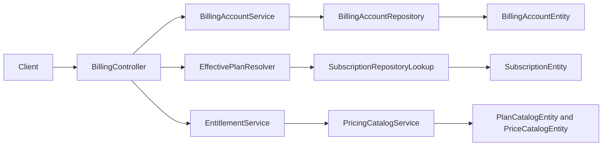

# Billing Context

## Purpose and scope

Billing gives each user a personal billing account, derives an effective plan,
and exposes the caller's plan and lobby limits. It exists to make entitlement
decisions server-side and to provide a provider-neutral foundation for later
catalog, checkout, webhook, and subscription work.

## Runtime behavior and use

- `GET /api/billing/me` derives the current caller from `X-User-Id`, resolves
  the effective plan at the current time, and returns entitlement limits.
- User registration ensures a personal billing account; Lobbies consults
  entitlement limits before creation and lifecycle changes.
- Provider/customer, catalog, price, and subscription classes are persisted
  foundation types. The current REST surface intentionally does not expose
  checkout or provider-webhook operations.

## Architecture and data flow

`BillingController` never accepts another user's ID. `BillingAccountService`
loads the caller account, `EffectivePlanResolver` derives the current plan from
subscription state, and `EntitlementService` translates plan code into limits.
Repositories and JPA entities persist account, provider-customer, catalog,
price, and subscription data; `SubscriptionStateMachine` defines allowed state
transitions for the persisted subscription aggregate.

## Feature-owned files and responsibilities

| Layer | Files and classes | Responsibility |
|---|---|---|
| API | `BillingController`, `BillingMeDto`, `BillingLimitsDto`, `BillingSubscriptionDto`, `LegacyBillingEndpointRemovalAdvice` | Defines caller-scoped billing state and rejects removed legacy endpoints. |
| Application | `BillingAccountService`, `EffectivePlanResolver`, `PricingCatalogService`, `PaidSubscription`, `PaidSubscriptionLookupPort`, `SubscriptionRepositoryLookup` | Loads accounts/catalog data and resolves a provider-neutral effective plan. |
| Account persistence | `BillingAccountEntity`, `BillingAccountRepository`, `BillingAccountStatus`, `BillingAccountType`, `ProviderCustomerEntity`, `ProviderCustomerRepository` | Persists personal billing accounts and provider customer references. |
| Catalog persistence | `PlanCatalogEntity`, `PlanCatalogRepository`, `PlanCode`, `PriceCatalogEntity`, `PriceCatalogRepository`, `PriceCode`, `BillingInterval` | Persists plans/prices and typed catalog identifiers. |
| Subscription persistence | `SubscriptionEntity`, `SubscriptionRepository`, `SubscriptionStatus`, `SubscriptionEvent`, `SubscriptionStateMachine`, `BillingAuditableEntity` | Persists subscription lifecycle state and audit timestamps. |

## Interactions and persistence

- Users provisions a personal account; Entitlement is the consumer-facing
  policy module; Lobbies enforces the resulting limits.
- Billing account initialization and account/catalog/subscription reads run in
  application transactions. Subscription entities use optimistic locking and
  state-machine validation to preserve lifecycle consistency.
- Database mapping is defined by the billing JPA entities and `schema.sql`.
  Provider-specific adapters are planned work, not an implemented runtime feature.

## Authoritative documentation

- [Billing endpoint in the API reference](../../foundation/api.md#billing)
- [Billing implementation plan](BILLING_TASKS.md)
- [Historical checkout proposal](proposals/payment-checkout-api.md)
- [Billing source package](../../../src/main/java/io/backend/lined/billing/)
- [Backend architecture](../../foundation/architecture.md)
