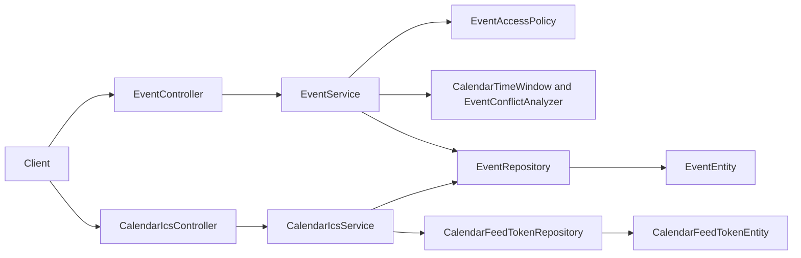

# Calendar Context

## Purpose and scope

Calendar manages lobby events, scheduling conflicts, common free slots, and
personal iCalendar (ICS) export/import. It exists to coordinate shared time
while preserving the visibility of private events and allowing external
calendar clients to exchange standard RFC 5545 data.

## Runtime behavior and use

- `/api/calendar/events` creates, updates, lists, reads, and deletes events;
  conflict endpoints provide event and caller conflict information.
- `/api/calendar/feed-token` creates/revokes a secret feed credential, and
  `/api/calendar/feed/{token}.ics` exports an authorized personal calendar.
- `/api/calendar/import` accepts raw or multipart ICS content and upserts
  caller-private events by UID in a selected lobby, explicitly persisting
  `EventVisibility.PRIVATE` with legacy `shared=false` compatibility.
- Lobbies requests free slots; Privacy governs what callers can view or infer;
  Notifications uses event activity for permitted delivery and reminders.

## Architecture and data flow

`EventController` owns JSON event operations; `CalendarIcsController` owns
tokenized feed and import transport. `EventServiceImpl` applies access,
time-window, conflict, free-slot, and version rules. `CalendarIcsServiceImpl`
serializes/export-imports ICS and persists feed tokens. Both service flows use
the event repository and transactional persistence rather than client-side
calendar interpretation.

## Feature-owned files and responsibilities

| Layer | Files and classes | Responsibility |
|---|---|---|
| API | `EventController`, `EventCreateDto`, `EventUpdateDto`, `EventDto`, `EventMapper`, `EventConflictDto`, `EventConflictSideDto`, `UserConflictDto`, `FreeSlotDto` | Defines event commands, scheduling reads, and response mappings. |
| ICS API | `CalendarIcsController`, `CalendarFeedTokenDto`, `CalendarImportResultDto` | Defines feed-token, public feed, and raw/multipart import contracts. |
| Application | `EventService`, `EventServiceImpl`, `EventAccessPolicy`, `CalendarTimeWindow`, `EventConflictAnalyzer`, `FreeSlotCalculator` | Enforces visibility, valid time ranges, conflicts, and free-slot calculation. |
| ICS application | `CalendarIcsService`, `CalendarIcsServiceImpl` | Issues/revokes tokens and converts calendar data to/from ICS. |
| Persistence | `EventEntity`, `EventRepository`, `EventVisibility`, `CalendarFeedTokenEntity`, `CalendarFeedTokenRepository` | Persists event state/visibility and revocable opaque feed credentials. |

## Interactions and persistence

- Lobbies supplies membership and the common-member set; Users provides event
  ownership; Tasks is independent but shares lobby context.
- Privacy policy is enforced before event data enters list, detail, conflict,
  free-slot, or export responses.
- Event updates use optimistic version checks. ICS import performs UID-based
  upserts with private visibility transactionally, while feed revocation makes
  older token URLs return the documented terminal response.
- JPA entities and `schema.sql` own database mapping; no separate calendar
  migration document exists.

## Authoritative documentation

- [Calendar endpoints in the API reference](../../foundation/api.md#calendar)
- [ICS proposal](proposals/calendar-ics-integration.md)
- [Private events and tasks design](../privacy/private-events-and-tasks-system-design.md)
- [Cross-surface privacy audit record](../../research/experiment/audits/private-item-cross-surface-audit.md)
- [Calendar source package](../../../src/main/java/io/backend/lined/event/)
- [Backend architecture](../../foundation/architecture.md)
