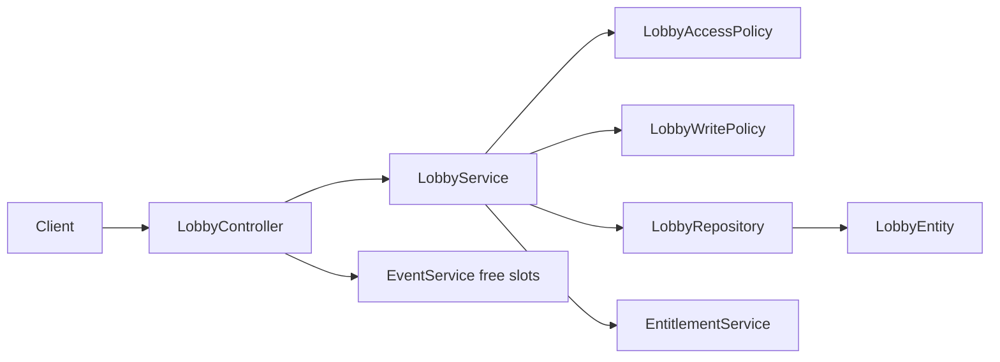

# Lobbies Context

## Purpose and scope

Lobbies are shared spaces that group members, tasks, and calendar events. The
feature owns lobby creation, membership-sensitive reads and mutations,
lifecycle/archive behavior, owner transfer, and free-slot queries.

## Runtime behavior and use

- `/api/lobbies` creates, lists caller lobbies, reads a lobby, updates owner
  controlled fields, removes a member, and deletes a lobby.
- Caller-scoped lobby operations receive the trusted ID resolved by
  `CurrentUserProvider`; `X-User-Id` is not an authorization input.
- Lifecycle endpoints select a free lobby, restore an archived lobby, and list
  archived lobbies. `GET /api/lobbies/{id}/free-slots` delegates scheduling
  calculation to Calendar after verifying membership.
- Tasks, Calendar, Invitations, Notifications, and Billing all use a lobby as
  their shared context or enforce its lifecycle/write restrictions.
- The Lobbies feature flag blocks lobby creation, lifecycle/membership changes,
  metadata updates, deletion, and invitation flows. Shared lobby reads remain
  available, while free-slot calculation belongs to the Calendar feature flag.

## Architecture and data flow

`LobbyController` owns the REST surface. `LobbyServiceImpl` applies ownership,
membership, lifecycle, archive, and versioned update rules. `LobbyAccessPolicy`
and `LobbyWritePolicy` centralize authorization and lifecycle restrictions;
`LobbyRepository` persists the `LobbyEntity` aggregate and member association.

## Feature-owned files and responsibilities

| Layer | Files and classes | Responsibility |
|---|---|---|
| API | `LobbyController`, `LobbyCreateDto`, `LobbyUpdateDto`, `LobbyDto`, `LobbyMapper` | Defines lobby commands, reads, and mappings. |
| Application | `LobbyService`, `LobbyServiceImpl`, `LobbyAccessPolicy`, `LobbyWritePolicy`, `LobbyWriteAction` | Implements membership/owner checks, write restrictions, and lifecycle behavior. |
| Persistence | `LobbyEntity`, `LobbyRepository`, `LobbyTypes`, `LobbyLifecycleStatus`, `LobbyAccessMode`, `LobbyRestrictionReason` | Persists shared-space state, members, lifecycle, and restriction reason. |

## Interactions and persistence

- Billing and Entitlement decide whether a lobby can be created or made free.
- Calendar uses the lobby's member set for conflicts and free slots; Tasks and
  Notifications use it for authorization and preference scope; Invitations
  create membership through their own feature.
- Versioned lobby mutations require `If-Match`; lifecycle and membership changes
  are transactional so aggregate invariants remain durable.
- A lobby ID is visible only to its owner or members; complete outsiders get
  `404`, while visible members who lack an owner-only action get `403`.
- The schema/JPA mapping is owned by `LobbyEntity`; no separate lobby design
  document exists beyond the API reference.

## Authoritative documentation

- [Lobbies endpoints in the API reference](../../foundation/api.md#lobbies)
- [Lobbies source package](../../../src/main/java/io/backend/lined/lobby/)
- [Backend architecture](../../foundation/architecture.md)
- No additional lobby proposal, migration, or operational document exists in this repository.
