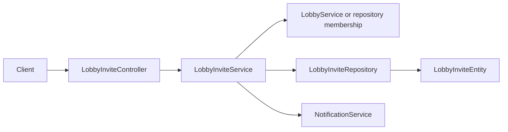

# Lobby Invitations Context

## Purpose and scope

Lobby Invitations provides consent-based membership: members invite a user,
inspect pending invitations, resend or cancel them, and the recipient accepts
or declines. It exists instead of directly adding a user to a lobby without
the recipient's consent.

## Runtime behavior and use

- `POST /api/lobbies/{lobbyId}/invites` creates a pending invitation; lobby
  members can list, resend, or cancel it.
- `GET /api/lobby-invites/mine` lists the caller's pending invitations.
- Accepting or declining changes the invitation terminal state; acceptance adds
  lobby membership exactly once under the same transactional workflow.

## Architecture and data flow

`LobbyInviteController` maps the invitation endpoints to `LobbyInviteService`.
`LobbyInviteServiceImpl` validates lobby access, recipient identity, status
transitions, and membership insertion. `LobbyInviteRepository` persists
`LobbyInviteEntity`; conditional transition behavior prevents concurrent
acceptance from creating duplicate membership outcomes.

## Feature-owned files and responsibilities

| Layer | Files and classes | Responsibility |
|---|---|---|
| API | `LobbyInviteController`, `LobbyInviteDto`, `LobbyInviteMapper` | Defines invitation commands, reads, and response mapping. |
| Application | `LobbyInviteService`, `LobbyInviteServiceImpl` | Enforces invitation lifecycle, sender/recipient permissions, and acceptance semantics. |
| Persistence | `LobbyInviteEntity`, `LobbyInviteRepository`, `LobbyInviteStatus` | Stores invitation parties, target lobby, status, expiry, and transition data. |

## Interactions and persistence

- Lobbies supplies membership and owner/member authorization; Users supplies
  sender and recipient identities.
- Notifications can surface invitation activity; it is not the persistence
  authority for invitation state.
- Accept/decline/cancel transitions are transactional. Acceptance couples a
  successful conditional pending-state claim with lobby membership persistence.
- The entity and repository own JPA/database interaction; no separate invitation
  migration or design document exists in this repository.

## Authoritative documentation

- [Lobby Invitations endpoints in the API reference](../../foundation/api.md#lobby-invites)
- [Lobby invitation source package](../../../src/main/java/io/backend/lined/lobby/invite/)
- [Lobbies context](../lobbies/context.md)
- No additional invitation proposal, migration, or operational document exists in this repository.
