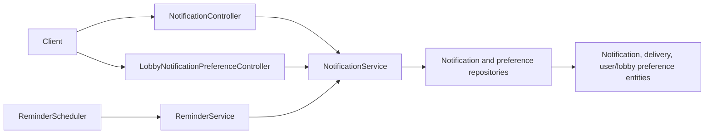

# Notifications Context

## Purpose and scope

Notifications provides a caller inbox plus global and per-lobby delivery
preferences. It exists so feature activity can be represented durably and
delivery choices survive across devices instead of remaining UI-only state.

## Runtime behavior and use

- `/api/notifications/preferences` reads and version-updates global preferences.
- `/api/lobbies/{lobbyId}/notification-preferences` reads and version-updates
  the caller's preferences for one shared lobby.
- `/api/notifications/mine` lists the caller's inbox; marking an item read
  updates only the notification visible to that caller.
- Task, Calendar, Lobby, and Invitation workflows call the service for allowed
  notification intents. `ReminderScheduler` invokes `ReminderService` for
  time-based event/task reminders.

## Architecture and data flow

`NotificationServiceImpl` is the feature's application seam for preference
reads/writes, inbox reads, read state, and creation/delivery coordination.
`ReminderServiceImpl` derives due reminder candidates, while `ReminderScheduler`
triggers it. The repositories persist notification, delivery, and preference
state; preference updates use entity versions and `If-Match`.

## Feature-owned files and responsibilities

| Layer | Files and classes | Responsibility |
|---|---|---|
| API | `NotificationController`, `LobbyNotificationPreferenceController`, `NotificationDto`, `NotificationDeliveryDto`, `NotificationPreferencesDto`, `NotificationPreferencesUpdateDto`, `LobbyNotificationPreferencesDto`, `LobbyNotificationPreferencesUpdateDto`, `NotificationMapper` | Defines inbox and global/per-lobby preference contracts. |
| Application | `NotificationService`, `NotificationServiceImpl`, `ReminderService`, `ReminderServiceImpl`, `ReminderScheduler` | Applies preference, inbox, read, delivery-intent, and scheduled-reminder behavior. |
| Persistence | `NotificationEntity`, `NotificationDeliveryEntity`, `UserNotificationPreferenceEntity`, `LobbyNotificationPreferenceEntity`, their repositories, `NotificationType`, `NotificationDeliveryChannel`, `NotificationDeliveryStatus` | Stores messages, delivery records, preferences, and controlled states. |

## Interactions and persistence

- User identity scopes global preferences and inboxes; Lobbies scopes per-lobby
  preferences; Tasks, Calendar, and Invitations are notification producers.
- Privacy-sensitive Task and Calendar paths suppress content that must not be
  disclosed through a notification.
- Preference writes and notification state changes are transactional and version
  checked where ETags are returned. Entities and repositories define JPA/schema
  interaction; no separate notification migration document exists.

## Authoritative documentation

- [Notifications endpoints in the API reference](../../foundation/api.md#notifications)
- [Event-reminder proposal](../events/proposals/event-reminder-scheduler.md)
- [Notifications source package](../../../src/main/java/io/backend/lined/notification/)
- [Backend architecture](../../foundation/architecture.md)
