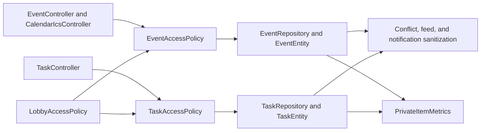

# Privacy Context

## Purpose and scope

Privacy protects private calendar events and tasks from other members of the
same lobby. It exists because lobby membership alone must not grant access to
another member's private schedule or work item, including through conflict,
free-slot, notification, and aggregate response paths.

## Runtime behavior and use

- Calendar event commands and reads distinguish `PRIVATE` from `SHARED` event
  visibility. A private event is owned and mutable only by its creator.
- Task commands and reads distinguish private tasks, enforce the private-task
  self-assignment invariant, and exclude inaccessible tasks from caller lists.
- Calendar conflict/export and notification paths use the access policies or
  sanitized DTOs so an otherwise unauthorized caller cannot infer private data.
- Imported ICS events explicitly persist `PRIVATE`; privacy counters expose
  only fixed item-type and visibility labels, never private content or IDs.
- Privacy is a cross-feature policy: Calendar and Tasks expose the REST
  endpoints; Lobbies supplies membership; Notifications suppresses prohibited
  disclosure. It has no independent REST controller.

## Architecture and data flow

`EventAccessPolicy` and `TaskAccessPolicy` are the authorization seams.
`EventServiceImpl` and `TaskServiceImpl` call them before exposing or mutating
data. Repository queries perform visibility-aware filtering; response builders
such as `EventConflictSideDto` prevent sensitive event fields from crossing
the HTTP boundary when the caller lacks access.

## Feature-owned files and responsibilities

| Area | Files and classes | Responsibility |
|---|---|---|
| Calendar policy | `event.domain.EventVisibility`, `event.service.EventAccessPolicy`, `EventService`, `EventServiceImpl` | Defines event visibility values and owner/caller access decisions. |
| Calendar persistence and transport | `EventEntity`, `EventRepository`, `EventController`, `CalendarIcsController`, `EventDto`, `EventConflictDto`, `EventConflictSideDto`, `UserConflictDto`, `CalendarIcsServiceImpl` | Applies visibility in storage queries, event/ICS flows, and sanitized conflict output. |
| Task policy | `task.domain.TaskVisibility`, `task.service.TaskAccessPolicy`, `TaskService`, `TaskServiceImpl` | Defines task visibility, self-assignment, and caller authorization. |
| Task persistence and transport | `TaskEntity`, `TaskRepository`, `TaskController`, `TaskDto`, `TaskCreateDto`, `TaskUpdateDto` | Applies visibility in persistence and task HTTP operations. |
| Privacy observability | `PrivateItemMetrics`, `PrivateItemType` | Emits bounded created, denied-access, and visibility-change counters without content or identity labels; write counters wait for commit, while confirmed denial observations preserve the `404` result. |
| Collaborators | `LobbyAccessPolicy`, `NotificationService`, `PrivateItemNotificationException`, `PrivateTaskAssigneeException` | Supplies lobby membership, suppresses prohibited notifications, and reports privacy violations. |

## Interactions and persistence

- Lobbies is the prerequisite membership feature; it does not override private
  ownership. Users supplies the creator identity used by both policies.
- Calendar feeds and ICS imports preserve private-event semantics; importing
  creates caller-private events explicitly. Task and event notification paths
  avoid leaking private content.
- `EventEntity` and `TaskEntity` persist string enum visibility with JPA and
  optimistic versions. Visibility-aware repository queries and policy checks
  run inside feature service transactions before state is returned or changed.
- The [cross-surface privacy audit](../../research/experiment/audits/private-item-cross-surface-audit.md)
  records confirmed backend surfaces and proposal-only exclusions.
- Schema compatibility and the original migration design are documented in the
  privacy system design; there is no separate privacy controller or operation runbook.

## Authoritative documentation

- [Calendar endpoints in the API reference](../../foundation/api.md#calendar)
- [Tasks endpoints in the API reference](../../foundation/api.md#tasks)
- [Private events and tasks system design](private-events-and-tasks-system-design.md)
- [Private-event enforcement task](tasks/PE-BE-01-private-event-access-enforcement.md)
- [Event visibility migration task](tasks/PE-BE-02-event-visibility-model.md)
- [Private-task task](tasks/PE-BE-03-private-tasks.md)
- [Cross-surface privacy audit task](tasks/PE-BE-04-private-item-cross-surface-audit.md)
- [Cross-surface privacy audit record](../../research/experiment/audits/private-item-cross-surface-audit.md)
- [Calendar source package](../../../src/main/java/io/backend/lined/event/)
- [Tasks source package](../../../src/main/java/io/backend/lined/task/)
