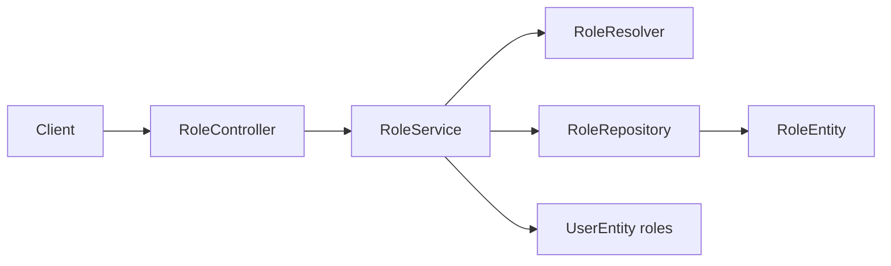

# Roles Context

## Purpose and scope

Roles maintains the built-in role catalog and user-role assignment. It exists
to provide a shared authorization vocabulary for account provisioning and
administrative product behavior rather than duplicating role strings in each
feature.

## Runtime behavior and use

- `/api/roles` lists role records and names, ensures a role exists, and sets,
  adds, or removes roles for a user.
- Account provisioning resolves the default role at registration.
- Other features may inspect role membership for policy decisions; this module
  does not itself expose a separate authentication filter.

## Architecture and data flow

`RoleController` exposes catalog and assignment operations. `RoleServiceImpl`
coordinates validation and user-role changes; `RoleResolverImpl` resolves the
built-in role representation. `RoleRepository` persists `RoleEntity`, while
the user relation is updated as part of the application transaction.

## Feature-owned files and responsibilities

| Layer | Files and classes | Responsibility |
|---|---|---|
| API | `RoleController`, `RoleDto`, `RoleNameDto`, `AssignRolesRequestDto`, `RoleMapper` | Defines catalog and assignment HTTP payloads. |
| Application | `RoleService`, `RoleServiceImpl`, `RoleResolver`, `RoleResolverImpl` | Implements role existence, built-in resolution, and user-role mutations. |
| Persistence | `RoleEntity`, `RoleRepository`, `BuiltInRole` | Stores role data and defines the built-in role vocabulary. |

## Interactions and persistence

- Users owns the user aggregate; Roles updates its role association rather than
  creating a parallel identity store.
- Account provisioning uses role resolution for a new user; Billing and other
  product modules can consume role state through their own policies.
- Role assignment is transactional with the user association. `RoleEntity` and
  its repository provide JPA/schema persistence; no feature-specific migration
  or operational document exists.

## Authoritative documentation

- [Roles endpoints in the API reference](../../foundation/api.md#roles)
- [Roles source package](../../../src/main/java/io/backend/lined/role/)
- [Users context](../users/CONTEXT.md)
- No additional role proposal, migration, or operational document exists in this repository.
