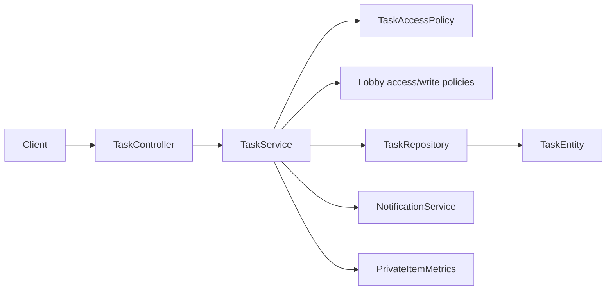

# Tasks Context

## Purpose and scope

Tasks lets lobby members create, update, list, and delete coordinated work. It
also supports caller-wide task listing and protects private tasks from other
members. The feature exists to provide assignable, status-driven work within a
shared lobby without leaking private items.

## Runtime behavior and use

- `POST /api/tasks` creates a task in a lobby; `PATCH` changes its supported
  fields with an `If-Match` version precondition.
- `GET /api/tasks` applies filters; `GET /api/tasks/mine` returns tasks visible
  to the caller across lobbies; `DELETE` removes an authorized task.
- Lobby membership and write policy determine access. Notification creation is
  suppressed where privacy rules prohibit disclosure; privacy operations emit
  bounded operational metrics without task content or identifiers.

## Architecture and data flow

`TaskController` validates DTOs and delegates. `TaskServiceImpl` applies task
state, visibility, assignment, and optimistic-version rules. `TaskAccessPolicy`
encapsulates private-task authorization; `TaskRepository` persists
`TaskEntity`, including status, priority, visibility, creator, assignee, and
lobby relationships.

## Feature-owned files and responsibilities

| Layer | Files and classes | Responsibility |
|---|---|---|
| API | `TaskController`, `TaskCreateDto`, `TaskUpdateDto`, `TaskDto`, `TaskMapper` | Defines task commands, reads, and response mapping. |
| Application | `TaskService`, `TaskServiceImpl`, `TaskAccessPolicy` | Enforces task lifecycle, caller visibility, assignment, and mutation rules. |
| Persistence | `TaskEntity`, `TaskRepository`, `TaskStatus`, `TaskPriority`, `TaskVisibility` | Stores task state and exposes filtered persistence queries. |

## Interactions and persistence

- Lobbies supply membership and lifecycle/write restrictions before task writes.
- Users supply creators and assignees; Notifications can record permitted task
  activity; Calendar is independent but shares the lobby context.
- Task writes run transactionally and use the entity version with `If-Match` to
  reject stale updates. Privacy is repository- and policy-enforced rather than
  a client-side filtering convention; private-item metrics use fixed type and
  visibility labels only.
- Database mappings are owned by `TaskEntity` and the repository schema/JPA
  configuration; no separate task migration document exists.

## Authoritative documentation

- [Tasks endpoints in the API reference](../../foundation/api.md#tasks)
- [Private events and tasks design](../privacy/private-events-and-tasks-system-design.md)
- [Private-task implementation task](../privacy/tasks/PE-BE-03-private-tasks.md)
- [Cross-surface privacy audit record](../../research/experiment/audits/private-item-cross-surface-audit.md)
- [Tasks source package](../../../src/main/java/io/backend/lined/task/)
- [Backend architecture](../../foundation/architecture.md)
