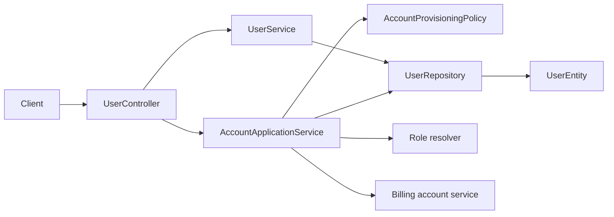

# Users Context

## Purpose and scope

Users owns the account profile: registration, caller and ID lookup, profile
updates, self-service deletion, search, and role-filtered search. It exists as
the canonical identity record used by every caller-scoped product feature.

## Runtime behavior and use

- `POST /api/users` registers an account through account provisioning and
  returns a version ETag.
- `GET /api/users/me`, `GET /api/users/{id}`, search, and role search expose
  profiles for the relevant client flows.
- `PATCH /api/users/{id}` and `DELETE /api/users/{id}` require version-aware
  mutations; deletion is self-service and rejects prohibited ownership states.
- Authentication reads user credentials and owns refresh sessions linked to the
  persisted user ID; account deletion deliberately cascades that account's
  session/token records. Roles assigns built-in roles, and Billing provisions a
  personal billing account during registration.
- The Settings feature flag blocks only profile `PATCH` and account `DELETE`.
  Registration, current-user/ID reads, and search remain shared support paths.

## Architecture and data flow

`UserController` converts HTTP input into application calls and returns ETags
from `VersionPrecondition`. `AccountApplicationServiceImpl` owns registration
orchestration; `UserServiceImpl` owns profile lookup, search, update, and
deletion rules. `UserRepository` persists `UserEntity`; version checks prevent
lost updates and deletion races.

## Feature-owned files and responsibilities

| Layer | Files and classes | Responsibility |
|---|---|---|
| API | `UserController`, `UserCreateDto`, `UserUpdateDto`, `UserDto`, `UserPageDto`, `UserSearchResultDto`, `UserMapper` | Defines profile HTTP contracts, paging/search payloads, and entity mapping. |
| Application | `UserService`, `UserServiceImpl` | Implements lookup, search, versioned updates, and deletion policy. |
| Registration | `AccountApplicationService`, `AccountApplicationServiceImpl`, `AccountProvisioningPolicy`, `AccountProvisioningProperties`, `AccountProvisioningSpec` | Creates the user and applies default-role and billing-account policy. |
| Persistence | `UserEntity`, `UserRepository` | Stores profile, password data, roles, and optimistic-lock version. |
| Shared collaborator | `VersionPrecondition` | Parses `If-Match` and renders response ETags. |

## Interactions and persistence

- Registration is transactional across user persistence, role resolution, and
  billing-account initialization.
- Lobbies use users as owners and members; deletion checks those relationships.
- Tasks, events, notifications, authentication (including refresh sessions),
  and calendar feeds all identify a user by this feature's persisted ID.
- The schema is maintained in `src/main/resources/database/schema.sql` together
  with JPA; case-insensitive user uniqueness is enforced by database indexes.

## Authoritative documentation

- [Users endpoints in the API reference](../../foundation/api.md#users)
- [Current-user proposal](proposals/users-me-endpoint.md)
- [User locale proposal](proposals/user-locale-preference.md)
- [Backend architecture](../../foundation/architecture.md)
- [Users source package](../../../src/main/java/io/backend/lined/user/)
- [Account-provisioning source package](../../../src/main/java/io/backend/lined/app/)
