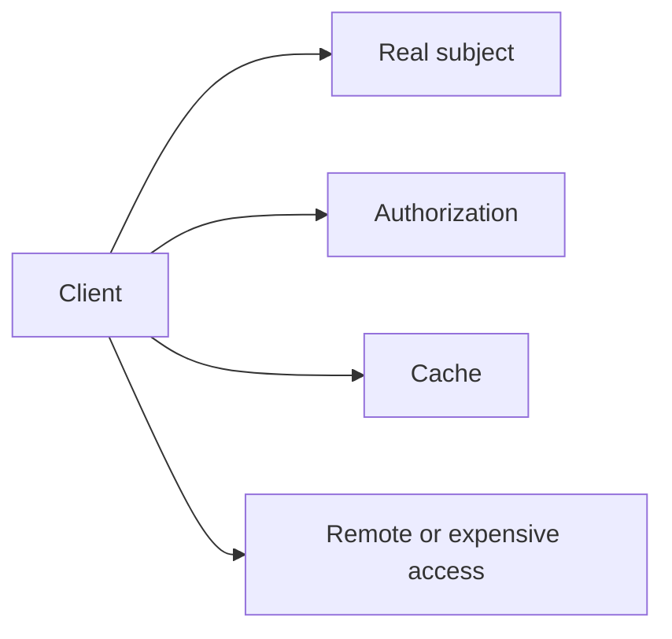
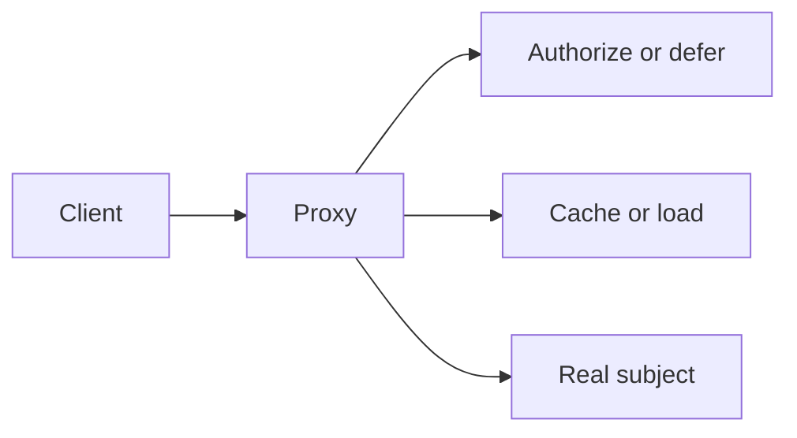

> Status: Active
> Applies to: Java 21 / Spring Boot 3.5.x / React 19 / TypeScript 6
> Category: GoF Structural Design Pattern

# Proxy

## Intent
Stand in for another object to control access, lifecycle, or expensive work.

## Problem
Authorization, lazy loading, caching, or remote access needs a compatible boundary.

## Problem diagram

Clients accumulate access-control, lifecycle, and performance concerns around
the real subject.

## Resolution diagram

The proxy preserves the subject contract while controlling access or work.

## Context
Use this only when the variation, lifecycle, or collaboration pressure is real in the application. The pattern is a vocabulary for a concrete seam, not a target architecture.

## Signals
The proxy's control behavior is meaningful and observable.

## Applicability
Client uses Subject; Proxy decides when/how to call the real subject. The contract should be small enough to test and the owner should be discoverable in the Pattern Registry when used in Lined.

## Do NOT use when
A direct function, service method, map, enum, or feature-local component is clearer. Do not add an interface, hierarchy, registry, or indirection for hypothetical future variation.

## Forces / trade-offs
The pattern can improve locality and substitution, but adds names, lifecycle decisions, indirection, and test seams. Compare those costs with the number of callers, change frequency, and failure modes.

## Structure
Subject, proxy, real subject, client.

## Participants
Subject, proxy, real subject, client.

## Execution / collaboration
Client uses Subject; Proxy decides when/how to call the real subject.

## Benefits
It isolates a demonstrated design force, reduces caller knowledge, and makes the varying decision explicit.

## Costs
More collaborators and concepts can make navigation harder, create lifecycle concerns, and invite over-abstraction.

## Common mistakes
Naming a simple helper as a pattern, hiding ownership in a global registry, leaking provider types, and testing only class wiring instead of behavior.

## Overengineering risks
One implementation, one caller, no real variation, or a stable closed set are reasons to prefer a simpler design. A pattern does not justify shared promotion.

## Java example
~~~java
interface OperationStrategy { Result apply(Input input); }
final class UseCase {
  Result run(Input input, OperationStrategy strategy) { return strategy.apply(input); }
}
~~~

## TypeScript example
~~~ts
type OperationStrategy = (input: Input) => Result;
const run = (input: Input, strategy: OperationStrategy) => strategy(input);
~~~

## Testing implications
Test the contract and externally visible collaboration: selection, ordering, error mapping, lifecycle, and edge cases. Prefer focused unit tests plus an integration test at framework/provider seams.

## Related smells
Duplicate Code, Switch Statements, Feature Envy, Shotgun Surgery, Middle Man, and Speculative Generality may motivate review but do not mandate this pattern.

## Related refactorings
Extract Method, Move Method, Extract Class, Extract Interface, Replace Conditional with Polymorphism, and Replace Inheritance with Delegation.

## Related patterns
Adapter, Facade, Strategy, State, Command, Template Method, and Port and Adapter can overlap; choose one vocabulary that matches the actual force.

## Decision checklist
- What concrete variation or collaboration pressure exists?
- Why is a direct implementation insufficient?
- Is the seam owned by the correct domain/feature?
- Are the lifecycle and error semantics explicit?
- Are tests protecting the contract?
- Is the pattern simpler than the problem it solves?
