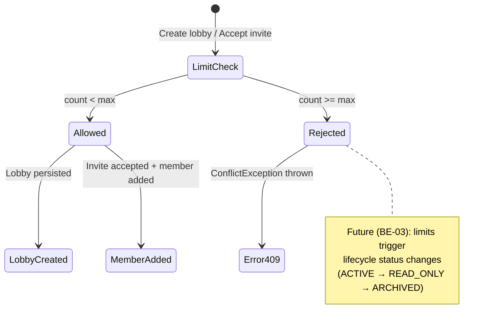
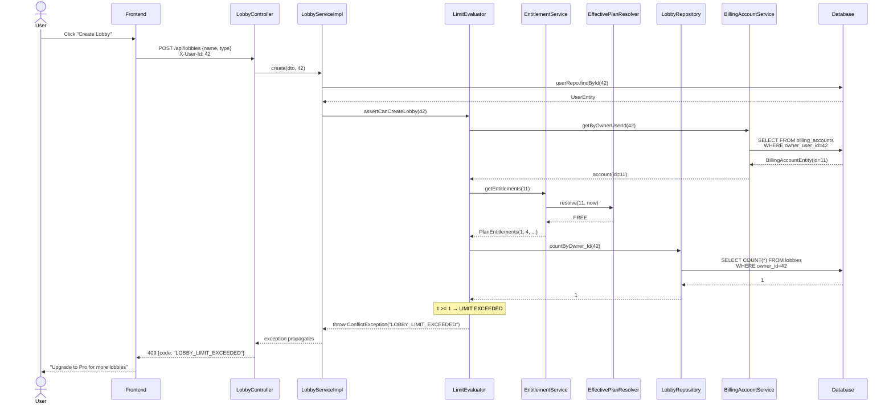
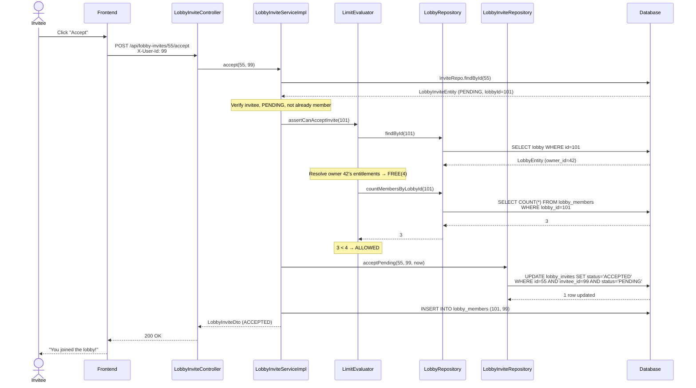
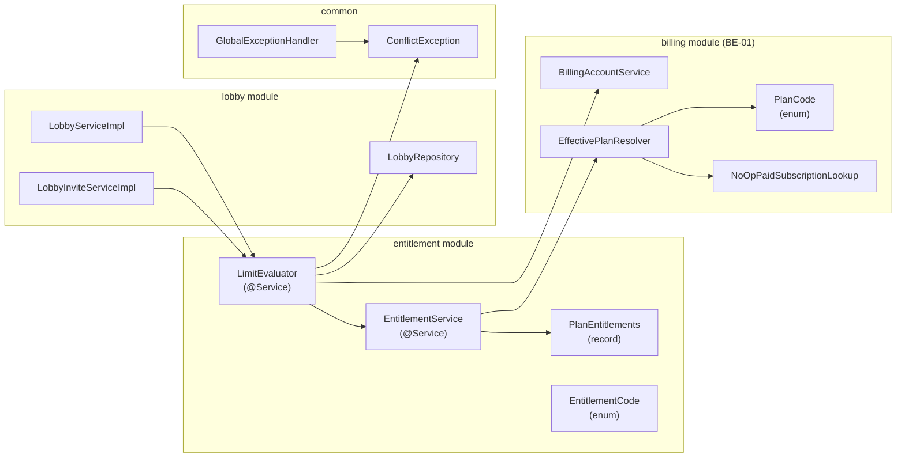
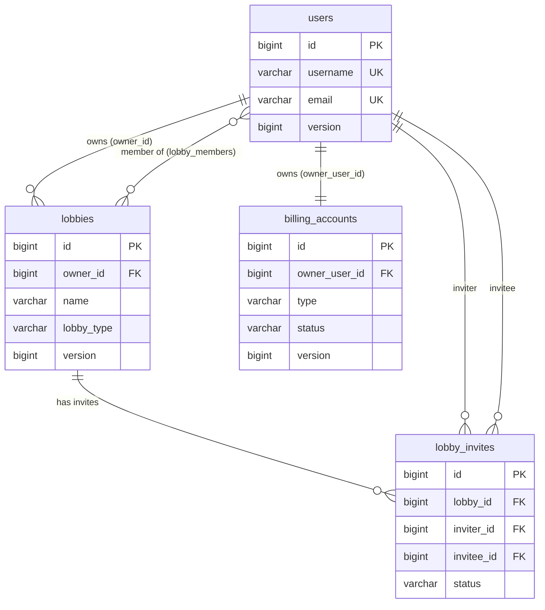
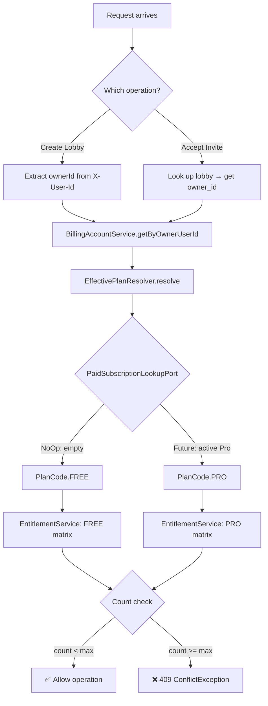

# BE-02 — Entitlement Module + Free Limit Enforcement: System Design

**Feature:** Entitlement module with Free/Pro capability matrix and enforcement of Free-tier limits on lobby creation and invite acceptance.

**Branch:** `feature/be-02-entitlement-module-free-limits`

**Status:** Implementation complete; this document serves as the authoritative design record.

**Date:** 2026-07-24

---

## Table of Contents

1. [Executive Summary](#1-executive-summary)
2. [Current System Analysis](#2-current-system-analysis)
3. [Business Requirements](#3-business-requirements)
4. [User Roles and Permissions](#4-user-roles-and-permissions)
5. [User Flows](#5-user-flows)
6. [Functional Requirements](#6-functional-requirements)
7. [Non-Functional Requirements](#7-non-functional-requirements)
8. [Domain Model](#8-domain-model)
9. [State Model](#9-state-model)
10. [Backend Architecture](#10-backend-architecture)
11. [REST API Design](#11-rest-api-design)
12. [Database Design](#12-database-design)
13. [Frontend Architecture and UX](#13-frontend-architecture-and-ux)
14. [Frontend–Backend Interaction](#14-frontendbackend-interaction)
15. [Feature Flags and Configuration](#15-feature-flags-and-configuration)
16. [External Integrations](#16-external-integrations)
17. [Security Analysis](#17-security-analysis)
18. [Concurrency and Consistency](#18-concurrency-and-consistency)
19. [Error Model](#19-error-model)
20. [Observability](#20-observability)
21. [Testing Strategy](#21-testing-strategy)
22. [Edge Cases](#22-edge-cases)
23. [Implementation Options](#23-implementation-options)
24. [Recommended Solution](#24-recommended-solution)
25. [Rollout Plan](#25-rollout-plan)
26. [Implementation Phases](#26-implementation-phases)
27. [Task Breakdown](#27-task-breakdown)
28. [Acceptance Criteria](#28-acceptance-criteria)
29. [Risks and Technical Debt](#29-risks-and-technical-debt)
30. [Open Questions](#30-open-questions)
31. [Decision Log](#31-decision-log)
32. [Diagrams](#32-diagrams)
33. [Final Summary](#33-final-summary)

---

## 1. Executive Summary

### What the feature does

Introduces a centralized **entitlement module** (`io.backend.lined.entitlement`) that defines a per-plan capability matrix (`PlanEntitlements`) and enforces Free-tier limits at lobby creation and invite acceptance boundaries. A Free user may own at most **1 lobby** with at most **4 members**; a Pro user may own up to **10 lobbies** with up to **20 members** each.

### Who will use it

Every authenticated Lined user. The limits are transparent — users encounter them only when they attempt to exceed their plan's allowance.

### What problem it solves

Without limit enforcement, the Free tier offers the same capacity as Pro, eliminating any commercial reason to upgrade. This feature establishes the **value gate** that gives Pro its product differentiation.

### Why it is valuable for Lined

- Creates a concrete incentive for Pro subscriptions (future revenue).
- Centralizes plan-specific logic in one module instead of scattering `if (plan == PRO)` across the codebase.
- Provides a stable foundation for BE-03 (lobby lifecycle), BE-12 (downgrade/archive), and all future capability-gated features.

### What parts of the system it affects

| Module | Impact |
|---|---|
| `entitlement` (new) | New module: `PlanEntitlements`, `EntitlementCode`, `EntitlementService`, `LimitEvaluator` |
| `billing` | Consumed: `BillingAccountService`, `EffectivePlanResolver` from BE-01 |
| `lobby` | Modified: `LobbyServiceImpl.create()`, `LobbyRepository` (new count queries) |
| `lobby.invite` | Modified: `LobbyInviteServiceImpl.accept()` |
| `common.exception` | Extended: `ConflictException` with two-arg constructor for stable error codes |
| `config` | Extended: `GlobalExceptionHandler` surfaces `code` property in RFC 7807 responses |

### Recommended implementation direction

A stateless, in-memory capability matrix resolved per-request through the existing `BillingAccount → EffectivePlanResolver` chain. Guard methods (`LimitEvaluator`) are injected into lobby service methods as pre-persist checks. No new database tables, no new REST endpoints — only behavioral changes to existing endpoints with new error responses.

---

## 2. Current System Analysis

### 2.1 Existing Related Modules (Facts from Codebase)

#### Billing module (`io.backend.lined.billing`) — delivered in BE-01

| Class | Path | Responsibility |
|---|---|---|
| `BillingAccountEntity` | `billing/domain/account/BillingAccountEntity.java` | JPA entity on `billing_accounts`; one PERSONAL account per user |
| `BillingAccountRepository` | `billing/domain/account/BillingAccountRepository.java` | `findByOwnerUserIdAndType()` |
| `BillingAccountService` | `billing/application/BillingAccountService.java` | `ensurePersonalAccount()` (idempotent), `getByOwnerUserId()` |
| `EffectivePlanResolver` | `billing/application/EffectivePlanResolver.java` | Resolves `PlanCode` (FREE/PRO) for a billing account at a given instant |
| `PaidSubscriptionLookupPort` | `billing/application/PaidSubscriptionLookupPort.java` | Port interface for paid subscription queries |
| `NoOpPaidSubscriptionLookup` | `billing/application/NoOpPaidSubscriptionLookup.java` | Always returns `Optional.empty()` — everyone resolves to FREE |
| `PlanCode` | `billing/domain/plan/PlanCode.java` | Enum: `FREE`, `PRO` |
| `PaidSubscription` | `billing/application/PaidSubscription.java` | Record: `planCode` + `currentPeriodEnd` |

#### Lobby module (`io.backend.lined.lobby`)

| Class | Path | Responsibility |
|---|---|---|
| `LobbyEntity` | `lobby/domain/LobbyEntity.java` | JPA entity: `id`, `version`, `name`, `lobbyType`, `owner` (ManyToOne), `members` (ManyToMany) |
| `LobbyRepository` | `lobby/domain/LobbyRepository.java` | Standard CRUD + `findAllByMemberId()`, plus new: `countByOwner_Id()`, `countMembersByLobbyId()` |
| `LobbyServiceImpl` | `lobby/service/LobbyServiceImpl.java` | `create()` now calls `limitEvaluator.assertCanCreateLobby()` before persist |
| `LobbyAccessPolicy` | `lobby/service/LobbyAccessPolicy.java` | `ensureOwner()`, `ensureMember()` |
| `LobbyController` | `lobby/api/LobbyController.java` | REST controller at `/api/lobbies` |
| `LobbyInviteServiceImpl` | `lobby/invite/service/LobbyInviteServiceImpl.java` | `accept()` now calls `limitEvaluator.assertCanAcceptInvite()` before CAS update |

#### Common infrastructure

| Class | Path | Responsibility |
|---|---|---|
| `BaseAppException` | `common/exception/BaseAppException.java` | Base: `HttpStatus` + `code` + `message` |
| `ConflictException` | `common/exception/ConflictException.java` | 409; new two-arg constructor `(errorCode, message)` for stable codes |
| `GlobalExceptionHandler` | `config/GlobalExceptionHandler.java` | Maps `BaseAppException` to RFC 7807 `ProblemDetail` with `code` property |
| `EntityFinder` | `common/EntityFinder.java` | `findOrThrow(Optional, Supplier<RuntimeException>)` |

#### Legacy plan/subscription modules (pre-billing, slated for removal in BE-04)

| Class | Path | Note |
|---|---|---|
| `PlanEntity` | `plan/domain/PlanEntity.java` | Mutable CRUD entity; seeded FREE/PRO/FAMILY |
| `UserSubscriptionEntity` | `subscription/domain/UserSubscriptionEntity.java` | Direct client-trusted subscription creation |
| `PlanController` | `plan/api/PlanController.java` | Public CRUD — security audit flagged as unsafe |
| `SubscriptionController` | `subscription/api/SubscriptionController.java` | Unguarded start/cancel |

### 2.2 Database Tables (from `schema.sql`)

- `billing_accounts` — `(id, owner_user_id, type, status, version, created_at, updated_at)` with unique constraint on `(owner_user_id, type)`
- `lobbies` — `(id, version, name, lobby_type, owner_id)` with FK to `users`
- `lobby_members` — `(lobby_id, user_id)` join table
- `lobby_invites` — `(id, lobby_id, inviter_id, invitee_id, status, sent_at, created_at, updated_at)` with unique pending constraint

### 2.3 Architectural Fit Assessment

| Question | Answer |
|---|---|
| Fits current architecture? | **Yes** — new top-level module following existing patterns |
| Requires extending existing module? | **Yes** — lobby service, invite service, repository, exception |
| Requires a new module? | **Yes** — `entitlement` package |
| Exposes architectural weaknesses? | **Partially** — no lobby lifecycle status yet (BE-03); count queries include all lobbies, not just ACTIVE |
| Duplicates current functionality? | **No** — no prior limit enforcement existed |

### 2.4 Reusable Patterns Already Present

- `EntityFinder.findOrThrow()` for safe Optional unwrapping
- `BaseAppException` hierarchy with `code` field for stable error codes
- `GlobalExceptionHandler` mapping to RFC 7807 `ProblemDetail`
- `@Version` optimistic locking on entities
- `@Transactional` from `jakarta.transaction` (project convention)
- Builder pattern on entities via Lombok `@Builder`
- `@RequiredArgsConstructor` for constructor injection

---

## 3. Business Requirements

### 3.1 Primary User Problem

Without enforced limits, the Free tier is functionally identical to Pro. There is no product-level incentive to upgrade, which blocks future monetization.

### 3.2 Target Users and Roles

| Actor | Relevance |
|---|---|
| Free user | Encounters limits when creating lobbies or accepting invites |
| Pro user | Enjoys higher limits (10 lobbies, 20 members) |
| Lobby owner | Limits are evaluated against the owner's plan, not the invitee's |
| Invitee | May be blocked from joining if the lobby owner's plan is at capacity |

### 3.3 Business Value

- **Revenue foundation:** Creates the value gap between Free and Pro.
- **Product clarity:** Users understand what they get at each tier.
- **Upgrade friction point:** Encountering a limit is the natural upgrade prompt.

### 3.4 Business Rules

| ID | Rule |
|---|---|
| BR-01 | Limits are determined by the **lobby owner's** effective plan, not the invitee's |
| BR-02 | Free: max 1 lobby, max 4 members per lobby |
| BR-03 | Pro: max 10 lobbies, max 20 members per lobby |
| BR-04 | Limits are enforced at **creation/acceptance time** only — existing over-limit lobbies are not retroactively reduced (that is BE-12) |
| BR-05 | Both `calendarIntegrationEnabled`, `remindersEnabled`, and `freeSlotDetectionEnabled` are capability flags in the matrix but are not enforced by this task |
| BR-06 | Currently all users resolve to FREE because `NoOpPaidSubscriptionLookup` returns empty; Pro enforcement activates automatically when BE-06 wires real subscriptions |

### 3.5 Requirement Categories

**Must-have (this task):**
- Entitlement matrix (Free/Pro) with lobby and member limits
- Enforcement at lobby creation and invite acceptance
- Stable error codes (`LOBBY_LIMIT_EXCEEDED`, `LOBBY_MEMBER_LIMIT_EXCEEDED`) in 409 responses
- Unit tests for service and evaluator; integration tests for end-to-end flow

**Should-have (this task):**
- `EntitlementCode` enum for UI display mapping
- Javadoc on all new public classes and methods

**Future enhancements (out of scope):**
- Lobby lifecycle status and access mode (BE-03)
- Retroactive reduction of over-limit lobbies on downgrade (BE-12)
- Feature-flag gating of the entire billing subsystem (BE-15)
- Calendar integration enforcement
- UI upgrade prompts when limits are hit

**Out of scope:**
- New REST endpoints
- Database schema changes
- Frontend implementation
- Payment integration
- Admin override of limits

---

## 4. User Roles and Permissions

### 4.1 Actors

| Actor | Description |
|---|---|
| Regular user (Free) | Authenticated user without a paid subscription; resolves to FREE plan |
| Regular user (Pro) | Authenticated user with an active Pro subscription; resolves to PRO plan |
| Lobby owner | The user who created the lobby; limits evaluated against their plan |
| Invitee | User accepting a lobby invite; subject to the owner's member limit |
| System (background) | `NoOpPaidSubscriptionLookup` — always returns FREE until BE-06 |

### 4.2 Permission Matrix

| Action | Free User | Pro User | Lobby Owner | Non-Owner Member | Unauthenticated |
|---|---|---|---|---|---|
| Create lobby (within limit) | ✅ | ✅ | N/A | N/A | ❌ |
| Create lobby (over limit) | ❌ 409 | ❌ 409 | N/A | N/A | ❌ |
| Accept invite (within member limit) | ✅ | ✅ | N/A | N/A | ❌ |
| Accept invite (over member limit) | ❌ 409 | ❌ 409 | N/A | N/A | ❌ |
| View own entitlements | N/A (no endpoint yet) | N/A | N/A | N/A | ❌ |

### 4.3 Ownership Checks

- **Lobby creation limit:** Evaluated against the `X-User-Id` header (the prospective owner).
- **Invite acceptance limit:** Evaluated against the **lobby owner's** plan, not the accepting user's plan. The `LimitEvaluator` looks up `lobby.getOwner().getId()` to resolve the owner's billing account and entitlements.

### 4.4 Privilege Escalation Risks

| Risk | Mitigation |
|---|---|
| User spoofing `X-User-Id` header | **Known limitation** — auth is MVP header-based. No enforcement until a proper auth filter is added. |
| Bypassing limits via direct DB manipulation | Out of scope — limits are application-layer guards |
| Legacy `SubscriptionController` granting arbitrary Pro access | Mitigated in BE-04 when legacy endpoints are removed |

---

## 5. User Flows

### 5.1 Lobby Creation — Successful (Free User, First Lobby)

| Step | Actor | Action |
|---|---|---|
| 1 | User | Clicks "Create Lobby" in UI |
| 2 | Frontend | `POST /api/lobbies` with `X-User-Id: 42`, body `{"name":"Family","lobbyType":"FAMILY"}` |
| 3 | `LobbyController` | Extracts `ownerId=42`, delegates to `LobbyServiceImpl.create()` |
| 4 | `LobbyServiceImpl` | Looks up user 42 via `UserRepository` |
| 5 | `LobbyServiceImpl` | Calls `limitEvaluator.assertCanCreateLobby(42)` |
| 6 | `LimitEvaluator` | Resolves `BillingAccountEntity` for user 42 via `BillingAccountService.getByOwnerUserId(42)` |
| 7 | `LimitEvaluator` | Calls `EntitlementService.getEntitlements(accountId)` → resolves FREE matrix via `EffectivePlanResolver` |
| 8 | `LimitEvaluator` | Calls `lobbyRepository.countByOwner_Id(42)` → returns `0` |
| 9 | `LimitEvaluator` | `0 < 1` → check passes, no exception thrown |
| 10 | `LobbyServiceImpl` | Builds `LobbyEntity`, adds owner as first member, persists |
| 11 | `LobbyController` | Returns `200 OK` with `LobbyDto` |

### 5.2 Lobby Creation — Rejected (Free User, Second Lobby)

| Step | Actor | Action |
|---|---|---|
| 1–7 | (same as above) | |
| 8 | `LimitEvaluator` | `lobbyRepository.countByOwner_Id(42)` → returns `1` |
| 9 | `LimitEvaluator` | `1 >= 1` → throws `ConflictException("LOBBY_LIMIT_EXCEEDED", "Lobby limit exceeded for current plan")` |
| 10 | `GlobalExceptionHandler` | Catches `ConflictException`, returns 409 with RFC 7807 body including `"code": "LOBBY_LIMIT_EXCEEDED"` |
| 11 | Frontend | Displays upgrade prompt or error message |

### 5.3 Invite Acceptance — Successful (Free Lobby, 4th Member)

| Step | Actor | Action |
|---|---|---|
| 1 | Invitee | Clicks "Accept" on pending invite |
| 2 | Frontend | `POST /api/lobby-invites/{inviteId}/accept` with `X-User-Id: 99` |
| 3 | `LobbyInviteServiceImpl` | Validates invite belongs to invitee, is PENDING, invitee not already a member |
| 4 | `LobbyInviteServiceImpl` | Calls `limitEvaluator.assertCanAcceptInvite(lobbyId)` |
| 5 | `LimitEvaluator` | Looks up lobby → resolves owner → resolves owner's billing account → resolves FREE entitlements |
| 6 | `LimitEvaluator` | `lobbyRepository.countMembersByLobbyId(lobbyId)` → returns `3` |
| 7 | `LimitEvaluator` | `3 < 4` → check passes |
| 8 | `LobbyInviteServiceImpl` | CAS update via `inviteRepo.acceptPending()`, adds member to lobby |
| 9 | Controller | Returns `200 OK` with `LobbyInviteDto` |

### 5.4 Invite Acceptance — Rejected (Free Lobby, 5th Member)

| Step | Actor | Action |
|---|---|---|
| 1–5 | (same as above) | |
| 6 | `LimitEvaluator` | `countMembersByLobbyId(lobbyId)` → returns `4` |
| 7 | `LimitEvaluator` | `4 >= 4` → throws `ConflictException("LOBBY_MEMBER_LIMIT_EXCEEDED", ...)` |
| 8 | `GlobalExceptionHandler` | Returns 409 with `"code": "LOBBY_MEMBER_LIMIT_EXCEEDED"` |

### 5.5 Edge: User Without Billing Account

| Step | Actor | Action |
|---|---|---|
| 1 | User | Attempts to create lobby |
| 2 | `LimitEvaluator` | `BillingAccountService.getByOwnerUserId(userId)` throws `NotFoundException` |
| 3 | `GlobalExceptionHandler` | Returns 404 — "Personal billing account not found for user X" |

This scenario should not occur for properly provisioned users (registration creates a billing account via `AccountApplicationService`), but could affect users created before BE-01 was deployed if the backfill migration in `schema.sql` missed them.

---

## 6. Functional Requirements

| ID | Requirement |
|---|---|
| FR-001 | The system must define an immutable capability matrix (`PlanEntitlements`) for each plan code (FREE, PRO) containing: `lobbiesMax`, `lobbyMembersMax`, `calendarIntegrationEnabled`, `remindersEnabled`, `freeSlotDetectionEnabled`. |
| FR-002 | The FREE matrix must specify: lobbiesMax=1, lobbyMembersMax=4, calendarIntegrationEnabled=false, remindersEnabled=true, freeSlotDetectionEnabled=true. |
| FR-003 | The PRO matrix must specify: lobbiesMax=10, lobbyMembersMax=20, calendarIntegrationEnabled=true, remindersEnabled=true, freeSlotDetectionEnabled=true. |
| FR-004 | `EntitlementService.getEntitlements(billingAccountId)` must resolve the effective plan at `Instant.now()` via `EffectivePlanResolver` and return the corresponding matrix. |
| FR-005 | `LimitEvaluator.assertCanCreateLobby(ownerUserId)` must count lobbies owned by the user and throw `ConflictException` with code `LOBBY_LIMIT_EXCEEDED` when the count is ≥ the plan's `lobbiesMax`. |
| FR-006 | `LimitEvaluator.assertCanAcceptInvite(lobbyId)` must count current members of the lobby, resolve the **lobby owner's** entitlements, and throw `ConflictException` with code `LOBBY_MEMBER_LIMIT_EXCEEDED` when the count is ≥ the owner's `lobbyMembersMax`. |
| FR-007 | `LobbyServiceImpl.create()` must call `assertCanCreateLobby(ownerId)` after resolving the owner but before persisting the lobby entity. |
| FR-008 | `LobbyInviteServiceImpl.accept()` must call `assertCanAcceptInvite(lobbyId)` after validating the invite is PENDING and the invitee is not already a member, but before the CAS update. |
| FR-009 | `ConflictException` must support a two-argument constructor `(String errorCode, String message)` that surfaces the `errorCode` as the `code` property in the RFC 7807 response. |
| FR-010 | `GlobalExceptionHandler` must include a `code` property in every `ProblemDetail` response for `BaseAppException`. |
| FR-011 | The system must not retroactively enforce limits on existing lobbies that already exceed the Free allowance. |
| FR-012 | `LobbyRepository` must provide `countByOwner_Id(Long ownerId)` and `countMembersByLobbyId(Long lobbyId)` queries for limit evaluation. |
| FR-013 | An `EntitlementCode` enum must name all capabilities for UI display purposes. |

---

## 7. Non-Functional Requirements

### Security

| Requirement | How achieved | How verified |
|---|---|---|
| Limits are enforced server-side, never client-only | `LimitEvaluator` is called in service layer | Integration tests bypass UI |
| Error responses do not leak internal state | RFC 7807 ProblemDetail with stable codes, no stack traces | Controller tests verify response shape |
| Owner plan determines member limits (not invitee's) | `LimitEvaluator.assertCanAcceptInvite` resolves lobby owner | Unit test explicitly sets owner vs invitee |

### Performance

| Requirement | How achieved |
|---|---|
| Limit checks add minimal latency | Count queries use indexed columns (`owner_id`, `lobby_id` via join table); no full-table scans |
| `countMembersByLobbyId` avoids materializing the member collection | JPQL `COUNT()` query |
| Entitlement matrix is resolved from in-memory constants | No DB table for entitlements; `Map.of()` lookup |

### Consistency

| Requirement | How achieved |
|---|---|
| Limit check and persist are atomic | Both occur within the same `@Transactional` method |
| TOCTOU gap on invite acceptance | Mitigated by CAS `acceptPending()` update; see §18 |

### Idempotency

| Requirement | How achieved |
|---|---|
| Already-accepted invite returns success | `LobbyInviteServiceImpl.accept()` checks `status == ACCEPTED` before limit evaluation and returns the existing DTO |

### Maintainability

| Requirement | How achieved |
|---|---|
| Plan limits change in one place | Static constants `EntitlementService.FREE` / `EntitlementService.PRO` |
| New plan codes require one map entry | `ENTITLEMENTS_BY_PLAN` is a `Map<PlanCode, PlanEntitlements>` |
| New capability fields extend one record | `PlanEntitlements` Java record |

### Backward Compatibility

| Requirement | How achieved |
|---|---|
| Existing tests pass without fixture changes | Free limits (1 lobby, 4 members) are above the fixture counts used in existing happy-path tests |
| No new endpoints | Behavioral change only on existing `POST /api/lobbies` and `POST /api/lobby-invites/{id}/accept` |

---

## 8. Domain Model

### 8.1 New Domain Objects

#### `PlanEntitlements` (Value Object / Record)

```java
public record PlanEntitlements(
    int lobbiesMax,
    int lobbyMembersMax,
    boolean calendarIntegrationEnabled,
    boolean remindersEnabled,
    boolean freeSlotDetectionEnabled) {}
```

| Field | Type | Validation | Description |
|---|---|---|---|
| `lobbiesMax` | `int` | > 0 | Maximum lobbies an account owner may own |
| `lobbyMembersMax` | `int` | > 0 | Maximum members per lobby |
| `calendarIntegrationEnabled` | `boolean` | — | Calendar integration capability |
| `remindersEnabled` | `boolean` | — | Reminder notifications capability |
| `freeSlotDetectionEnabled` | `boolean` | — | Free-slot detection capability |

**Responsibility:** Immutable capability snapshot for one plan. No behavior — pure data carrier.

**Lifecycle:** Stateless; created as static constants in `EntitlementService`.

#### `EntitlementCode` (Enum)

```java
public enum EntitlementCode {
  LOBBIES_MAX,
  LOBBY_MEMBERS_MAX,
  CALENDAR_INTEGRATION_ENABLED,
  REMINDERS_ENABLED,
  FREE_SLOT_DETECTION_ENABLED
}
```

**Responsibility:** Provides stable names for UI to display which limit or capability is relevant. Not used in enforcement logic — exists for API/UI contracts.

### 8.2 Modified Entities

#### `LobbyEntity` (no schema change, new repository queries)

Two new derived/JPQL queries on `LobbyRepository`:

- `countByOwner_Id(Long ownerId)` — Spring Data derived count query
- `countMembersByLobbyId(Long lobbyId)` — JPQL `SELECT COUNT(member) FROM LobbyEntity lobby JOIN lobby.members member WHERE lobby.id = :lobbyId`

### 8.3 Dependency Chain

```
LimitEvaluator
  ├── LobbyRepository (count queries)
  ├── BillingAccountService (owner → billing account lookup)
  └── EntitlementService
        └── EffectivePlanResolver
              └── PaidSubscriptionLookupPort (NoOp → always FREE)
```

### 8.4 Aggregate Boundaries

- `LobbyEntity` remains the aggregate root for lobby membership.
- `BillingAccountEntity` remains the aggregate root for commercial state.
- `PlanEntitlements` is a stateless value object — not persisted, no aggregate.
- `LimitEvaluator` is a domain service that spans two aggregates (lobby + billing) — this is acceptable because it only reads from both; writes remain within the lobby aggregate's transaction.

---

## 9. State Model

This feature does not introduce new lifecycle states. The entitlement check is a **stateless guard** evaluated at request time.

However, the error codes produced (`LOBBY_LIMIT_EXCEEDED`, `LOBBY_MEMBER_LIMIT_EXCEEDED`) will become **triggers** for state transitions in future tasks:



---

## 10. Backend Architecture

### 10.1 Module Structure

```text
io.backend.lined.entitlement/
├── application/
│   ├── EntitlementService.java      — Resolves PlanEntitlements for a billing account
│   └── LimitEvaluator.java         — Guards lobby writes against plan limits
└── domain/
    ├── PlanEntitlements.java        — Immutable capability matrix record
    └── EntitlementCode.java         — Enum naming all capability fields
```

### 10.2 Class Responsibilities

| Class | Layer | Responsibility |
|---|---|---|
| `EntitlementService` | Application | Composes `EffectivePlanResolver` with the static `ENTITLEMENTS_BY_PLAN` map to return the correct matrix for a billing account |
| `LimitEvaluator` | Application | Provides guard methods (`assertCanCreateLobby`, `assertCanAcceptInvite`) that compare repository counts against entitlement limits |
| `PlanEntitlements` | Domain | Immutable record carrying the plan's capability values |
| `EntitlementCode` | Domain | Enum for programmatic reference to capability names |

### 10.3 Cross-Module Dependencies

| From | To | Dependency Type |
|---|---|---|
| `entitlement.application.LimitEvaluator` | `billing.application.BillingAccountService` | Constructor injection |
| `entitlement.application.LimitEvaluator` | `lobby.domain.LobbyRepository` | Constructor injection |
| `entitlement.application.EntitlementService` | `billing.application.EffectivePlanResolver` | Constructor injection |
| `lobby.service.LobbyServiceImpl` | `entitlement.application.LimitEvaluator` | Constructor injection |
| `lobby.invite.service.LobbyInviteServiceImpl` | `entitlement.application.LimitEvaluator` | Constructor injection |

**Note:** `LimitEvaluator` depends on `LobbyRepository` directly (not through `LobbyService`). This is a pragmatic choice: the evaluator needs count queries, not business-logic-laden service methods. It creates a bidirectional dependency between `entitlement` and `lobby` at the package level. This is acceptable for the current codebase size; if it becomes a concern, the count queries could be extracted into a `LobbyUsagePort` interface in the entitlement module.

### 10.4 Exception Handling

The two-argument `ConflictException(errorCode, message)` constructor was added to support stable, client-actionable error codes. The `GlobalExceptionHandler` already mapped `BaseAppException.getCode()` to the `code` property in `ProblemDetail` — the new constructor simply allows callers to specify a domain-specific code instead of the generic `common.conflict`.

---

## 11. REST API Design

### 11.1 Modified Endpoints

This task adds no new endpoints. Two existing endpoints gain new error responses:

#### `POST /api/lobbies` — Create Lobby (modified)

| Aspect | Value |
|---|---|
| New error | `409 Conflict` with `code: "LOBBY_LIMIT_EXCEEDED"` |
| Trigger | Owner already owns `lobbiesMax` lobbies |
| Auth | `X-User-Id` header (existing) |
| Idempotency | Not idempotent — each call attempts a new lobby |

**New error response example:**

```json
{
  "type": "https://errors.lined.app/LOBBY_LIMIT_EXCEEDED",
  "title": "Conflict",
  "status": 409,
  "detail": "Lobby limit exceeded for current plan",
  "code": "LOBBY_LIMIT_EXCEEDED"
}
```

#### `POST /api/lobby-invites/{inviteId}/accept` — Accept Invite (modified)

| Aspect | Value |
|---|---|
| New error | `409 Conflict` with `code: "LOBBY_MEMBER_LIMIT_EXCEEDED"` |
| Trigger | Lobby already has `lobbyMembersMax` members |
| Auth | `X-User-Id` header (existing) |
| Idempotency | Already-accepted invites return 200 (existing behavior preserved) |

**New error response example:**

```json
{
  "type": "https://errors.lined.app/LOBBY_MEMBER_LIMIT_EXCEEDED",
  "title": "Conflict",
  "status": 409,
  "detail": "Lobby member limit exceeded for current plan",
  "code": "LOBBY_MEMBER_LIMIT_EXCEEDED"
}
```

### 11.2 Unchanged Error Responses

All existing error cases remain:
- `404 Not Found` — lobby/user/invite not found
- `403 Forbidden` — not owner (for invite creation), not invitee (for accept/decline)
- `400 Bad Request` — validation errors, missing headers
- `409 Conflict` — duplicate invite, user already a member, invite no longer pending

---

## 12. Database Design

### 12.1 Schema Changes

**None.** This task introduces no new tables and no column modifications.

The entitlement matrix is stored in application code (`EntitlementService.FREE`, `EntitlementService.PRO`), not in the database. This is a deliberate choice:

- Plan limits change infrequently and are version-controlled with the code.
- A database-backed matrix would require a migration and admin UI for every limit change — overhead not justified at this stage.
- The `PlanEntitlements` record is immutable and stateless.

### 12.2 New Queries Against Existing Tables

| Query | Table(s) | Index Used |
|---|---|---|
| `countByOwner_Id(:ownerId)` | `lobbies` | PK on `lobbies.id`, FK index on `owner_id` |
| `countMembersByLobbyId(:lobbyId)` | `lobbies` JOIN `lobby_members` | PK on `lobby_members(lobby_id, user_id)` |

Both queries are simple `COUNT()` aggregations on indexed foreign keys. No new indexes required.

### 12.3 Future Schema Implications (out of scope)

- **BE-03** will add `lifecycle_status`, `access_mode`, `restriction_reason`, `archive_at`, `selected_as_free_at` columns to `lobbies`. The `countByOwner_Id` query will then be refined to `WHERE lifecycle_status = 'ACTIVE'`.
- **BE-06** will add `billing_subscriptions` and `billing_provider_customers` tables, enabling real Pro plan resolution.

---

## 13. Frontend Architecture and UX

### 13.1 Current State

No frontend changes are included in BE-02. The frontend is currently stub pages (per the web scaffold status in memory).

### 13.2 Future Frontend Requirements (for reference)

When the lobby creation or invite acceptance UI is implemented, it must handle the new error codes:

| Error Code | Frontend Behavior |
|---|---|
| `LOBBY_LIMIT_EXCEEDED` | Show upgrade prompt: "You've reached the Free plan's lobby limit. Upgrade to Pro for up to 10 lobbies." |
| `LOBBY_MEMBER_LIMIT_EXCEEDED` | Show message: "This lobby has reached its member limit. Ask the lobby owner to upgrade their plan." |

**Validation split:**
- **Frontend:** May pre-check lobby count via the existing `GET /api/lobbies/mine` response length to disable the "Create" button proactively. This is UX sugar, not enforcement.
- **Backend:** Must always enforce limits regardless of frontend behavior. The `LimitEvaluator` is the single source of truth.

### 13.3 Proposed Component Structure (future)

```text
src/features/lobby/
├── components/
│   ├── LobbyLimitBanner.tsx          — Shows limit status
│   └── UpgradePromptDialog.tsx       — Upgrade CTA on limit hit
├── hooks/
│   └── useLobbyLimitCheck.ts         — Pre-flight limit check
└── lib/
    └── lobbyErrors.ts                — Maps error codes to messages
```

---

## 14. Frontend–Backend Interaction

### 14.1 Sequence Diagram — Lobby Creation (Limit Exceeded)



### 14.2 Sequence Diagram — Invite Acceptance (Successful)



---

## 15. Feature Flags and Configuration

### 15.1 Current State

No feature flag is used for BE-02. The entitlement module is always active.

### 15.2 Rationale

- The `NoOpPaidSubscriptionLookup` acts as a natural "everyone is Free" default until BE-06 wires real subscriptions. This makes a feature flag redundant for the limit-enforcement behavior.
- The billing subsystem-wide feature flag (`billing.rollout.mode`) is planned for BE-15 and will gate the entire billing surface including entitlements if needed.

### 15.3 Future Configuration (BE-15)

```yaml
billing:
  rollout:
    mode: SHADOW  # SHADOW → SOFT_LAUNCH → GA
```

When `SHADOW`: limits are evaluated but not enforced (log-only). When `SOFT_LAUNCH`: enforced for new users. When `GA`: enforced for all users.

---

## 16. External Integrations

### 16.1 Current State

No external integrations. The `PaidSubscriptionLookupPort` is implemented by `NoOpPaidSubscriptionLookup`, which returns `Optional.empty()` unconditionally.

### 16.2 Future Integration Point

When a payment provider is integrated (BE-07 through BE-11), the `PaidSubscriptionLookupPort` will be implemented by a provider adapter that queries the `billing_subscriptions` table (populated via webhooks). The entitlement module itself requires no changes — it only depends on the `PlanCode` returned by `EffectivePlanResolver`.

---

## 17. Security Analysis

| Threat | Assessment | Mitigation |
|---|---|---|
| **Bypassing limits via header spoofing** | HIGH risk — `X-User-Id` is not validated against an auth token | **Known MVP limitation.** Proper auth filter is a prerequisite for production. BE-02 does not worsen this — it adds restrictions, not permissions. |
| **Insecure direct object reference (IDOR)** | LOW — limit evaluation uses the authenticated user's ID, not a client-supplied parameter | `LimitEvaluator` receives `ownerUserId` from the controller's `X-User-Id` extraction, not from the request body. |
| **Mass assignment** | N/A — no new DTOs accepting user input | |
| **Sensitive data exposure** | LOW — error responses contain stable codes and generic messages, no internal IDs | `ProblemDetail` shape verified in controller tests |
| **Privilege escalation via legacy endpoints** | MEDIUM — `SubscriptionController` still allows arbitrary subscription creation | Mitigated in BE-04. Until then, a user could theoretically grant themselves Pro via the legacy API. |
| **Rate limiting** | N/A for this task — limits are not rate-based | |
| **Audit logging** | Not implemented — no audit events for limit-exceeded responses | Future: BE-14 adds `billing_audit_log` |

### 17.1 Concrete Mitigations Implemented

1. **Server-side enforcement:** Limits are checked in `LimitEvaluator` within the transactional service layer. No client-side-only checks.
2. **Owner-based evaluation:** Member limits use the lobby owner's plan, preventing a scenario where a Free invitee's plan blocks a Pro owner's lobby.
3. **Stable error codes:** `LOBBY_LIMIT_EXCEEDED` and `LOBBY_MEMBER_LIMIT_EXCEEDED` are safe to expose — they reveal plan-tier behavior, not internal implementation.
4. **No stack traces:** `GlobalExceptionHandler` never includes stack traces in responses; the catch-all handler returns a generic "Unexpected error" message.

---

## 18. Concurrency and Consistency

### 18.1 Race Condition: Concurrent Lobby Creation

**Scenario:** Free user sends two `POST /api/lobbies` requests simultaneously.

**Analysis:**
1. Both requests enter `LobbyServiceImpl.create()`.
2. Both call `limitEvaluator.assertCanCreateLobby(userId)`.
3. Both execute `countByOwner_Id(userId)` and see `0`.
4. Both pass the check and attempt to persist a lobby.
5. **Result:** Both succeed — user ends up with 2 lobbies on Free.

**Mitigation:**
- **Current:** No mitigation. This is a known TOCTOU gap.
- **Impact:** Low — this requires sub-second concurrent requests from the same user, which is an unusual pattern for lobby creation. The over-limit state is non-destructive (the user simply has more lobbies than allowed).
- **Future fix (BE-03):** When lifecycle status is added, the `countByOwner_Id` query can be combined with a `SELECT ... FOR UPDATE` advisory lock on the billing account, or a unique partial index can cap active lobbies per owner. The task document explicitly defers this.

### 18.2 Race Condition: Concurrent Invite Acceptance

**Scenario:** Two users simultaneously accept invites to the same Free lobby that has 3 members.

**Analysis:**
1. Both calls reach `limitEvaluator.assertCanAcceptInvite(lobbyId)`.
2. Both see `countMembersByLobbyId(lobbyId) = 3` → both pass (3 < 4).
3. Both proceed to `inviteRepo.acceptPending()` — this is a CAS update (`WHERE status = 'PENDING'`), so only one succeeds per invite.
4. Both `INSERT INTO lobby_members` — no unique constraint prevents both.
5. **Result:** Lobby ends up with 5 members on Free.

**Mitigation:**
- **Current:** Partially mitigated by the CAS update on invite status (prevents the same invite from being accepted twice), but not fully mitigated for two different invites.
- **Impact:** Low — requires two different invitees accepting simultaneously to a nearly-full lobby.
- **Future fix:** A `BEFORE INSERT` trigger or application-level `SELECT FOR UPDATE` on the lobby row during acceptance. BE-03's lifecycle status column with version-checked updates will narrow this gap further.

### 18.3 Idempotency

| Operation | Idempotent? | Mechanism |
|---|---|---|
| Lobby creation | No | Each call creates a new lobby if within limits |
| Invite acceptance | Yes | `if (status == ACCEPTED) return existing` short-circuit in `accept()` |

### 18.4 Mechanisms Used

| Mechanism | Used? | Where |
|---|---|---|
| Unique constraints | ✅ | `lobby_invites` unique pending constraint per lobby+invitee |
| Optimistic locking | ✅ | `LobbyEntity.version` for updates/deletes (not for creation) |
| Pessimistic locking | ❌ | Not used — would over-serialize lobby creation |
| Idempotency keys | ❌ | Not needed — lobby creation is not idempotent by design |
| CAS updates | ✅ | `inviteRepo.acceptPending()` — `UPDATE WHERE status = 'PENDING'` |
| Distributed locks | ❌ | Not needed — single-instance deployment |

---

## 19. Error Model

### 19.1 New Error Codes

| Code | HTTP Status | Trigger | Retryable | Client Action |
|---|---|---|---|---|
| `LOBBY_LIMIT_EXCEEDED` | 409 | Owner already owns `lobbiesMax` lobbies | No (unless user deletes a lobby or upgrades) | Display upgrade prompt |
| `LOBBY_MEMBER_LIMIT_EXCEEDED` | 409 | Lobby already has `lobbyMembersMax` members | No (unless a member leaves or owner upgrades) | Notify user; suggest owner upgrade |

### 19.2 Existing Error Codes (unchanged)

| Code | HTTP Status | Description |
|---|---|---|
| `common.not_found` | 404 | Lobby/user/invite not found |
| `common.forbidden` | 403 | Not owner/invitee |
| `common.bad_request` | 400 | Validation failure |
| `common.conflict` | 409 | Generic conflict (duplicate invite, already member, etc.) |

### 19.3 Error Response Format

All errors follow RFC 7807 `ProblemDetail`:

```json
{
  "type": "https://errors.lined.app/{code}",
  "title": "{status title}",
  "status": {status code},
  "detail": "{human-readable message}",
  "code": "{stable error code}"
}
```

The `code` field is the stable, machine-readable identifier clients should switch on. The `detail` field is human-readable and may change between releases.

---

## 20. Observability

### 20.1 Current State

No observability was added in BE-02. The existing setup includes:
- Spring Boot Actuator with health, metrics, prometheus endpoints
- OpenTelemetry export to `localhost:4317`
- Micrometer integration

### 20.2 Recommended Observability (for future tasks)

| Category | Metric/Log | Description |
|---|---|---|
| **Business metric** | `entitlement.limit.exceeded{code=LOBBY_LIMIT_EXCEEDED}` | Counter: how often users hit the lobby limit |
| **Business metric** | `entitlement.limit.exceeded{code=LOBBY_MEMBER_LIMIT_EXCEEDED}` | Counter: how often member limits are hit |
| **Business metric** | `entitlement.plan.resolution{plan=FREE}` | Counter: plan resolution outcomes |
| **Structured log** | `limit.check.result` with fields: `userId`, `planCode`, `limitType`, `currentCount`, `maxAllowed`, `result` | Per-check decision log |
| **Alert** | Rate of `LOBBY_LIMIT_EXCEEDED` > threshold | May indicate a UX problem or bot activity |

### 20.3 Sensitive Values Never to Log

- User passwords, auth tokens
- Full billing account details
- Email addresses in structured log fields (use user IDs)

---

## 21. Testing Strategy

### 21.1 Implemented Tests

| Test Class | Type | Scenarios | Path |
|---|---|---|---|
| `EntitlementServiceTest` | Unit (Mockito) | FREE matrix returned for FREE plan; PRO matrix returned for PRO plan | `src/test/java/.../entitlement/application/EntitlementServiceTest.java` |
| `LimitEvaluatorTest` | Unit (Mockito) | 8 tests: allow/reject boundaries for lobby creation (Free 1st/2nd, Pro 10th/11th) and member acceptance (Free 4th/5th, Pro 20th/21st) | `src/test/java/.../entitlement/application/LimitEvaluatorTest.java` |
| `LobbyControllerLimitTest` | Controller (MockMvc standalone) | Verifies 409 response shape with `code` field when service throws `ConflictException` | `src/test/java/.../lobby/api/LobbyControllerLimitTest.java` |
| `LobbyEntitlementLimitIT` | Integration (Testcontainers) | End-to-end: Free owner's 2nd lobby → 409; Free lobby's 5th member → 409 | `src/test/java/.../lobby/api/LobbyEntitlementLimitIT.java` |
| `LobbyServiceImplTest` | Unit (Mockito) | 15 tests including limit-exceeded rejection verifying `lobbyRepo.save()` never called | `src/test/java/.../lobby/service/LobbyServiceImplTest.java` |
| `LobbyInviteServiceImplTest` | Unit (Mockito) | Tests including acceptance with limit evaluator interaction | `src/test/java/.../lobby/invite/service/LobbyInviteServiceImplTest.java` |
| `GlobalExceptionHandlerTest` | Unit | Verifies ProblemDetail shape for BaseAppException including `code` property | `src/test/java/.../config/GlobalExceptionHandlerTest.java` |

### 21.2 Test Scenario Coverage

| Category | Scenario | Test |
|---|---|---|
| **Positive** | Free user creates first lobby | `LimitEvaluatorTest.assertCanCreateLobby_allowsFirstLobby_whenPlanIsFree` |
| **Positive** | Pro user creates 10th lobby | `LimitEvaluatorTest.assertCanCreateLobby_allowsTenthLobby_whenPlanIsPro` |
| **Negative** | Free user creates 2nd lobby → rejected | `LimitEvaluatorTest.assertCanCreateLobby_rejectsSecondLobby_whenPlanIsFree` |
| **Negative** | Pro user creates 11th lobby → rejected | `LimitEvaluatorTest.assertCanCreateLobby_rejectsEleventhLobby_whenPlanIsPro` |
| **Boundary** | Free lobby at 3 members → 4th allowed | `LimitEvaluatorTest.assertCanAcceptInvite_allowsFourthMember_whenPlanIsFree` |
| **Boundary** | Free lobby at 4 members → 5th rejected | `LimitEvaluatorTest.assertCanAcceptInvite_rejectsFifthMember_whenPlanIsFree` |
| **Boundary** | Pro lobby at 19 members → 20th allowed | `LimitEvaluatorTest.assertCanAcceptInvite_allowsTwentiethMember_whenPlanIsPro` |
| **Boundary** | Pro lobby at 20 members → 21st rejected | `LimitEvaluatorTest.assertCanAcceptInvite_rejectsTwentyFirstMember_whenPlanIsPro` |
| **Integration** | Full HTTP → DB round trip for lobby limit | `LobbyEntitlementLimitIT.create_returnsLimitCode_whenFreeOwnerAlreadyOwnsOneLobby` |
| **Integration** | Full HTTP → DB round trip for member limit | `LobbyEntitlementLimitIT.accept_returnsLimitCode_whenFreeOwnedLobbyAlreadyHasFourMembers` |
| **Error shape** | 409 response contains `code` and `status` fields | `LobbyControllerLimitTest.create_returnsConflictWithStableLimitCode` |
| **Authorization** | Limit-exceeded prevents `save()` | `LobbyServiceImplTest` verifies `verify(lobbyRepo, never()).save(any())` |

### 21.3 Test Gaps and Recommendations

| Gap | Severity | Recommendation |
|---|---|---|
| No concurrency test for simultaneous lobby creation | Low | Add a test with `ExecutorService` submitting parallel create requests; verify at most 1 succeeds on Free |
| No test for missing billing account scenario | Low | Add test: user without billing account → 404 on lobby creation |
| No test for `EntitlementService` returning `null` for unknown `PlanCode` | Low | Currently impossible (`PlanCode` is an enum with exhaustive map), but a defensive test would catch map misconfiguration |
| No contract test for error response schema | Medium | Add a schema validation test ensuring `code`, `type`, `status`, `detail` fields are always present |

---

## 22. Edge Cases

| # | Edge Case | Current Behavior | Risk |
|---|---|---|---|
| 1 | User created before BE-01 has no billing account | `BillingAccountService.getByOwnerUserId()` throws `NotFoundException` → 404 on lobby creation | Low — `schema.sql` backfills billing accounts for existing users |
| 2 | User owns lobbies created before BE-02 exceeding Free limit | Existing lobbies are untouched; user cannot create more | By design (BR-04) |
| 3 | Lobby owner transfers ownership to a Free user who already owns 1 lobby | Ownership transfer in `LobbyServiceImpl.update()` does **not** check entitlements | **Gap** — the new owner now owns 2 lobbies on Free. Recommend adding `limitEvaluator.assertCanCreateLobby(newOwnerId)` to `transferOwnership()` in a follow-up |
| 4 | Lobby owner's plan changes from Pro to Free mid-session | Stale entitlements in an ongoing request — limit check uses `Instant.now()` at evaluation time | Negligible — plan changes propagate on next request |
| 5 | Two users accept invites to the same near-full lobby simultaneously | TOCTOU — both may succeed, exceeding member limit | Low impact; see §18.2 |
| 6 | `EffectivePlanResolver` returns a `PlanCode` not in the map | `ENTITLEMENTS_BY_PLAN.get(planCode)` returns `null` → NPE in `LimitEvaluator` | Currently impossible — `PlanCode` enum has only FREE and PRO, both mapped. Adding a new plan code without a matrix entry would cause a runtime NPE. |
| 7 | Owner deletes a lobby then creates a new one | Allowed — deletion reduces count, freeing capacity | Correct behavior |
| 8 | Lobby with 0 members (impossible in current code) | Owner is auto-added as first member on creation | N/A |
| 9 | Invite acceptance for a deleted lobby | `LimitEvaluator.assertCanAcceptInvite()` calls `lobbyRepository.findById()` → lobby found (soft delete not implemented) or not found → 404 | Correct behavior — hard delete cascades invites |
| 10 | Rapid retry of failed lobby creation | Each retry re-evaluates the limit — if still exceeded, still 409 | Correct behavior |
| 11 | Legacy `SubscriptionController` grants Pro subscription | User immediately gains Pro entitlements because `EffectivePlanResolver` would check `PaidSubscriptionLookupPort` — but `NoOpPaidSubscriptionLookup` ignores all subscriptions | No impact until BE-06 replaces NoOp; after that, legacy endpoint becomes a security risk (addressed by BE-04 removal) |

---

## 23. Implementation Options

### Option A: Stateless In-Memory Matrix (Chosen)

**Approach:** Define `PlanEntitlements` as static constants in `EntitlementService`. Resolve the effective plan per-request via `EffectivePlanResolver` and look up the corresponding matrix from a `Map<PlanCode, PlanEntitlements>`.

| Aspect | Assessment |
|---|---|
| **Advantages** | Simple, fast (no DB lookup for limits), version-controlled, testable, zero schema changes |
| **Disadvantages** | Requires code deployment to change limits; cannot be changed at runtime |
| **Complexity** | Low |
| **Risks** | Forgetting to add a matrix entry for a new `PlanCode` → NPE |
| **Effort** | ~1 day |
| **Maintainability** | High — one file to update |
| **Scalability** | Sufficient for current scale (2 plans) |

### Option B: Database-Backed Entitlement Table

**Approach:** Create an `entitlements` table mapping `plan_code` to capability fields. `EntitlementService` queries this table and caches results.

| Aspect | Assessment |
|---|---|
| **Advantages** | Runtime-changeable limits; admin UI can modify without deployment |
| **Disadvantages** | New table + migration, cache invalidation complexity, test fixture overhead, over-engineering for 2 plans |
| **Complexity** | Medium |
| **Risks** | Cache staleness, migration errors, additional integration test surface |
| **Effort** | ~3 days |
| **Maintainability** | Medium — requires admin UI or migration for changes |
| **Scalability** | Better for >5 plans or frequent limit changes |

### Option C: Configuration-Driven (`application.yml`)

**Approach:** Use `@ConfigurationProperties` to externalize limits into `application.yml`.

| Aspect | Assessment |
|---|---|
| **Advantages** | Changeable per environment without code changes; Spring-native |
| **Disadvantages** | Still requires restart; config drift between environments; no per-plan structure in YAML is natural |
| **Complexity** | Low-Medium |
| **Risks** | Misconfiguration in production |
| **Effort** | ~1.5 days |
| **Maintainability** | Medium |
| **Scalability** | Adequate for 2-3 plans |

---

## 24. Recommended Solution

**Option A: Stateless In-Memory Matrix** is the correct choice for the current Lined stage.

### Why Option A

- **Simplicity:** Two plans with fixed limits do not justify database or configuration overhead.
- **Safety:** Limits are compile-time constants — no runtime misconfiguration possible.
- **Testability:** Unit tests construct `PlanEntitlements` directly; no DB fixtures needed.
- **Alignment:** Matches the existing codebase pattern (e.g., `BuiltInRole`, `BuiltInPlan` are also code-defined enums).
- **Evolution path:** When/if Lined needs admin-configurable limits (>5 plans, A/B testing limits), migrating to Option B or C is straightforward — `EntitlementService.getEntitlements()` signature doesn't change.

### Why Not Option B

Premature abstraction. The billing catalog (BE-05) will introduce `billing_plans` and `billing_prices` tables — if limits need to be database-backed, they can be added to that schema at that point.

### Why Not Option C

Configuration drift risk outweighs the marginal flexibility gain. The limits are product constants, not environment-specific settings.

### Compromises

- Limits cannot be changed without deployment.
- No A/B testing of different limits per cohort.
- No admin UI for limit adjustment.

All three are acceptable for pre-revenue MVP stage and can be addressed later if needed.

---

## 25. Rollout Plan

| Step | Action | Risk | Rollback |
|---|---|---|---|
| 1 | **No migration needed** — no schema changes | — | — |
| 2 | **Deploy backend** with entitlement module | Low — all users are Free; limit = 1 lobby | Revert deployment |
| 3 | **Verify in staging:** create 1 lobby (200), create 2nd (409) | — | — |
| 4 | **Monitor:** watch for unexpected 409s from users who had >1 lobby pre-deployment | Low — existing lobbies are not affected | — |
| 5 | **Frontend update** (future task): handle `LOBBY_LIMIT_EXCEEDED` and `LOBBY_MEMBER_LIMIT_EXCEEDED` error codes | — | — |
| 6 | **Remove legacy endpoints** (BE-04): prevents bypass via `SubscriptionController` | Must happen before payment integration | — |

### Rollback Plan

- **Code rollback:** Revert the deployment. Existing lobbies and members are unaffected.
- **Data rollback:** None needed — no data migrations.
- **Feature flag:** Not needed — removing the deployment removes the limits.

---

## 26. Implementation Phases

### Phase 1: Foundation (BE-02 — this task) ✅ DONE

**Goal:** Establish entitlement module and enforce Free limits.

| Area | Tasks |
|---|---|
| Backend | Create `entitlement` package with `PlanEntitlements`, `EntitlementCode`, `EntitlementService`, `LimitEvaluator` |
| Backend | Extend `ConflictException` with stable error code constructor |
| Backend | Wire `LimitEvaluator` into `LobbyServiceImpl.create()` and `LobbyInviteServiceImpl.accept()` |
| Backend | Add `countByOwner_Id()` and `countMembersByLobbyId()` to `LobbyRepository` |
| Tests | Unit tests for `EntitlementService`, `LimitEvaluator`; controller test for error shape; integration test for end-to-end flow |
| Quality | `./gradlew test checkstyleMain spotbugsMain` pass |

**Acceptance criteria:**
- Free user's 2nd lobby → 409 `LOBBY_LIMIT_EXCEEDED`
- Free lobby's 5th member → 409 `LOBBY_MEMBER_LIMIT_EXCEEDED`
- Pro limits at 10/20 (tested via mocks)
- All existing tests pass

### Phase 2: Lobby Lifecycle (BE-03 — next task)

**Goal:** Add lifecycle status to lobbies; refine count queries.

- `countByOwner_Id` refined to `WHERE lifecycle_status = 'ACTIVE'`
- Read-only access mode for over-limit lobbies
- Select-as-free / restore endpoints

### Phase 3: Pro Activation (BE-06 through BE-11)

**Goal:** Replace `NoOpPaidSubscriptionLookup` with real subscription data.

- When this lands, Pro limits activate automatically for paying users.
- Entitlement module requires no changes.

### Phase 4: Downgrade Enforcement (BE-12)

**Goal:** Handle Pro → Free transitions retroactively.

- Over-limit lobbies become READ_ONLY
- 30-day archive schedule
- Reduction workflow

---

## 27. Task Breakdown

```
TASK-001: Create entitlement domain model
Scope:
  - PlanEntitlements record in entitlement/domain/
  - EntitlementCode enum in entitlement/domain/
Affected files:
  - entitlement/domain/PlanEntitlements.java (new)
  - entitlement/domain/EntitlementCode.java (new)
Acceptance criteria:
  - Record compiles with all 5 fields
  - Enum lists all 5 capability codes
Tests:
  - Compile-time verification (record immutability)
Dependencies:
  - None
Risks:
  - None

TASK-002: Implement EntitlementService
Scope:
  - Static FREE/PRO constants
  - getEntitlements(billingAccountId) method
  - Integration with EffectivePlanResolver
Affected files:
  - entitlement/application/EntitlementService.java (new)
Acceptance criteria:
  - FREE matrix: (1, 4, false, true, true)
  - PRO matrix: (10, 20, true, true, true)
  - getEntitlements resolves via EffectivePlanResolver
Tests:
  - EntitlementServiceTest: 2 tests (FREE/PRO resolution)
Dependencies:
  - TASK-001, BE-01 (EffectivePlanResolver)
Risks:
  - None

TASK-003: Implement LimitEvaluator
Scope:
  - assertCanCreateLobby(ownerUserId)
  - assertCanAcceptInvite(lobbyId)
  - Private helper: entitlementsForOwner(ownerUserId)
Affected files:
  - entitlement/application/LimitEvaluator.java (new)
Acceptance criteria:
  - Throws ConflictException with LOBBY_LIMIT_EXCEEDED when count >= lobbiesMax
  - Throws ConflictException with LOBBY_MEMBER_LIMIT_EXCEEDED when count >= lobbyMembersMax
  - Uses lobby owner's plan for member limit (not invitee's)
Tests:
  - LimitEvaluatorTest: 8 tests (boundary conditions for both plans)
Dependencies:
  - TASK-002, LobbyRepository count queries (TASK-005)
Risks:
  - TOCTOU race condition (accepted, deferred)

TASK-004: Extend ConflictException for stable error codes
Scope:
  - Add (String errorCode, String message) constructor
  - Verify GlobalExceptionHandler surfaces code property
Affected files:
  - common/exception/ConflictException.java (modified)
  - config/GlobalExceptionHandler.java (verified — already surfaces code)
Acceptance criteria:
  - ConflictException("LOBBY_LIMIT_EXCEEDED", "msg") → 409 with code field
  - GlobalExceptionHandler includes code in ProblemDetail
Tests:
  - GlobalExceptionHandlerTest: verify code property in response
  - LobbyControllerLimitTest: verify end-to-end 409 shape
Dependencies:
  - None
Risks:
  - None

TASK-005: Add count queries to LobbyRepository
Scope:
  - countByOwner_Id(Long ownerId) — derived query
  - countMembersByLobbyId(Long lobbyId) — JPQL count
Affected files:
  - lobby/domain/LobbyRepository.java (modified)
Acceptance criteria:
  - Both queries return correct counts
  - countMembersByLobbyId uses JPQL COUNT, not collection materialization
Tests:
  - Covered by LimitEvaluator integration tests
Dependencies:
  - None
Risks:
  - None

TASK-006: Wire LimitEvaluator into lobby services
Scope:
  - Inject LimitEvaluator into LobbyServiceImpl
  - Call assertCanCreateLobby before lobby persist
  - Inject LimitEvaluator into LobbyInviteServiceImpl
  - Call assertCanAcceptInvite before invite CAS update
Affected files:
  - lobby/service/LobbyServiceImpl.java (modified)
  - lobby/invite/service/LobbyInviteServiceImpl.java (modified)
Acceptance criteria:
  - Lobby creation blocked at Free limit
  - Invite acceptance blocked at member limit
  - Existing tests pass (fixtures within Free limits)
Tests:
  - LobbyServiceImplTest: verify create rejects when limit exceeded
  - LobbyInviteServiceConcurrencyTest: verify accept rejects when limit exceeded
  - LobbyEntitlementLimitIT: end-to-end integration
Dependencies:
  - TASK-003, TASK-004, TASK-005
Risks:
  - Existing test fixtures might need adjustment if they create >1 lobby
```

---

## 28. Acceptance Criteria

### AC-01: Lobby Creation Limit

```gherkin
Given a Free user who already owns 1 lobby
When the user attempts to create a second lobby
Then the system returns 409 Conflict
And the response body contains code "LOBBY_LIMIT_EXCEEDED"
And no new lobby is persisted
```

### AC-02: Lobby Creation Allowed

```gherkin
Given a Free user who owns 0 lobbies
When the user creates a lobby with valid name and type
Then the system returns 200 OK with the lobby DTO
And the user is added as the first member
```

### AC-03: Member Limit

```gherkin
Given a Free-owned lobby with 4 members
And a pending invite for a 5th user
When the invitee accepts the invite
Then the system returns 409 Conflict
And the response body contains code "LOBBY_MEMBER_LIMIT_EXCEEDED"
And the invite remains PENDING
And the invitee is not added as a member
```

### AC-04: Member Addition Allowed

```gherkin
Given a Free-owned lobby with 3 members
And a pending invite for a 4th user
When the invitee accepts the invite
Then the system returns 200 OK
And the invite status becomes ACCEPTED
And the invitee is added as a member
```

### AC-05: Pro User Higher Limits

```gherkin
Given a Pro user who owns 9 lobbies
When the user creates a 10th lobby
Then the system returns 200 OK
```

### AC-06: Error Response Shape

```gherkin
Given any limit-exceeded error
When the error response is returned
Then it follows RFC 7807 ProblemDetail format
And contains fields: type, title, status, detail, code
And "type" is "https://errors.lined.app/{error_code}"
And "code" matches the stable error code string
```

### AC-07: Existing Lobbies Not Affected

```gherkin
Given a Free user who owned 3 lobbies before BE-02 deployment
When the user views their lobbies
Then all 3 lobbies are visible and functional
And the user cannot create a 4th lobby
```

### AC-08: Idempotent Invite Acceptance

```gherkin
Given an already-accepted invite
When the invitee sends the accept request again
Then the system returns 200 OK with the existing accepted invite
And no duplicate member entry is created
```

### AC-09: Quality Gates

```gherkin
Given the complete implementation
When ./gradlew test checkstyleMain spotbugsMain is run
Then all tasks pass with zero failures
```

---

## 29. Risks and Technical Debt

| # | Risk | Likelihood | Impact | Mitigation | Blocks MVP? |
|---|---|---|---|---|---|
| R-01 | **TOCTOU on concurrent lobby creation** — two simultaneous requests may both pass the count check | Low | Low (user gets extra lobby) | Accept for now; fix with DB constraint or advisory lock in BE-03 | No |
| R-02 | **TOCTOU on concurrent invite acceptance** — two invites to a near-full lobby may both succeed | Low | Low (lobby gets extra member) | Accept for now; same fix as R-01 | No |
| R-03 | **Legacy SubscriptionController bypass** — users can self-grant Pro via `POST /api/subscriptions` | Medium | Medium (bypasses limits) | BE-04 removes legacy endpoints | No (MVP risk accepted; deploy BE-04 before real Pro users exist) |
| R-04 | **Missing billing account** — users created before BE-01 without backfill | Low | Medium (404 on lobby creation) | `schema.sql` includes backfill INSERT; manual repair via `BillingAccountService.ensurePersonalAccount()` | No |
| R-05 | **Ownership transfer bypasses limit check** — transferring lobby ownership to a user already at their limit | Medium | Low (user ends up with limit+1 lobbies) | Add `assertCanCreateLobby(newOwnerId)` in `transferOwnership()` | No (follow-up task recommended) |
| R-06 | **New PlanCode without matrix entry** → NPE | Low | High (500 error for affected users) | Add a defensive check or use `Map.getOrDefault` with FREE as fallback | No |
| R-07 | **Auth header spoofing** — `X-User-Id` is not validated | Known | High (impersonation) | Separate auth concern — not in scope for BE-02 | No (pre-existing risk) |

### Technical Debt

| Item | Severity | Location | Recommendation |
|---|---|---|---|
| `LimitEvaluator` depends directly on `LobbyRepository` (bidirectional package dependency) | Low | `entitlement/application/LimitEvaluator.java` | Extract `LobbyUsagePort` interface if dependency graph becomes complex |
| `countByOwner_Id` counts all lobbies including future archived ones | Medium | `lobby/domain/LobbyRepository.java:24` | Refine to `WHERE lifecycle_status = 'ACTIVE'` in BE-03 |
| No observability for limit-exceeded events | Low | — | Add Micrometer counter in BE-15 |
| Ownership transfer skips limit check | Medium | `lobby/service/LobbyServiceImpl.java:136-141` | Add entitlement check in follow-up |

---

## 30. Open Questions

### Product

| # | Question | Why it matters | Recommended default | Consequences |
|---|---|---|---|---|
| Q-01 | Should Free users who already exceed limits (pre-deployment) see a banner? | UX clarity | No (silent — they keep existing lobbies but can't create more) | Deferred to frontend task; existing behavior is non-disruptive |
| Q-02 | Should the error response include the current count and max? | Helps UI display "1 of 1 lobbies used" | Yes — add `currentCount` and `maxAllowed` to the error response in a future task | Requires extending the ProblemDetail response |

### Business Rules

| # | Question | Why it matters | Recommended default | Consequences |
|---|---|---|---|---|
| Q-03 | Should ownership transfer check the new owner's lobby limit? | Prevents circumventing limits via transfer | Yes — add the check | Edge case R-05 above; implement as follow-up |
| Q-04 | Should members of a lobby count towards the member's own lobby limit? | Clarifies whether being a member "uses" a slot | No — limits apply to **owned** lobbies only | Simpler mental model; no change needed |

### Architecture

| # | Question | Why it matters | Recommended default | Consequences |
|---|---|---|---|---|
| Q-05 | Should `LimitEvaluator` use an interface for lobby counts instead of direct `LobbyRepository` access? | Package dependency hygiene | Defer — current dependency graph is manageable | Revisit if entitlement module grows or is extracted to a separate deployment unit |
| Q-06 | Should `EntitlementService.getEntitlements()` throw for unknown `PlanCode` instead of returning null? | Prevents NPE on future plan additions | Yes — add `Objects.requireNonNull` or use `Map.getOrDefault(planCode, FREE)` | Low-risk improvement; recommend as follow-up |

---

## 31. Decision Log

| ID | Decision | Status | Rationale | Alternatives | Consequences |
|---|---|---|---|---|---|
| D-01 | Use stateless in-memory matrix for plan entitlements | Accepted | 2 plans, infrequent changes, no admin UI needed | Database-backed table, configuration properties | Limits change only via code deployment |
| D-02 | Enforce limits at lobby-creation and invite-acceptance boundaries only | Accepted | Simplest enforcement points; retroactive reduction is BE-12 | Enforce at all write operations (update, transfer) | Ownership transfer can bypass limits (R-05) |
| D-03 | Use lobby owner's plan for member limits, not invitee's | Accepted | Owner pays for capacity; invitee has no control over lobby settings | Use invitee's plan, use minimum of both | Simple, predictable model |
| D-04 | Count all owned lobbies (not just ACTIVE) for limit check | Accepted (temporary) | No lifecycle status exists yet (BE-03 adds it) | N/A — no alternative until BE-03 | Archived lobbies count against limit; refined in BE-03 |
| D-05 | Stable error codes as strings (not numeric) in `ConflictException` | Accepted | Human-readable, grep-friendly, frontend-friendly | Numeric codes, enum ordinals | String comparison in client code; stable contract |
| D-06 | No feature flag for entitlement enforcement | Accepted | `NoOpPaidSubscriptionLookup` naturally makes everyone Free; BE-15 adds subsystem-wide flag | Add a flag now | One less config surface; limits are active from deployment |
| D-07 | Accept TOCTOU race condition on concurrent creates | Accepted (deferred) | Low likelihood, low impact, fix planned for BE-03 | Advisory lock, serializable isolation, unique partial index | Theoretical over-limit state; non-destructive |
| D-08 | `LimitEvaluator` in `entitlement.application`, not `lobby.service` | Accepted | Centralizes limit logic in the entitlement module; lobby services are callers, not owners | Place in `lobby.service` | Bidirectional package dependency (entitlement↔lobby); acceptable at current scale |

---

## 32. Diagrams

### 32.1 Context Diagram

```mermaid
graph TB
    subgraph Users
        FreeUser[Free User]
        ProUser[Pro User]
    end

    subgraph "Lined Backend"
        LC[LobbyController]
        LIC[LobbyInviteController]
        LS[LobbyServiceImpl]
        LIS[LobbyInviteServiceImpl]
        LE[LimitEvaluator]
        ES[EntitlementService]
        EPR[EffectivePlanResolver]
        BAS[BillingAccountService]
        NOOP[NoOpPaidSubscriptionLookup]
    end

    subgraph Database
        DB_Lobbies[(lobbies)]
        DB_Members[(lobby_members)]
        DB_Billing[(billing_accounts)]
        DB_Invites[(lobby_invites)]
    end

    FreeUser -->|POST /api/lobbies| LC
    ProUser -->|POST /api/lobbies| LC
    FreeUser -->|POST /api/lobby-invites/.../accept| LIC

    LC --> LS
    LIC --> LIS
    LS --> LE
    LIS --> LE
    LE --> ES
    LE --> BAS
    ES --> EPR
    EPR --> NOOP
    BAS --> DB_Billing
    LE -->|countByOwner_Id| DB_Lobbies
    LE -->|countMembersByLobbyId| DB_Members
    LS --> DB_Lobbies
    LIS --> DB_Invites
```



### 32.2 Component Diagram



### 32.3 Data Relationship Diagram



### 32.4 Entitlement Resolution Flow



---

## 33. Final Summary

### Recommended Architecture

A stateless entitlement module (`io.backend.lined.entitlement`) with in-memory plan matrices, injected guard methods in lobby services, and stable error codes surfaced via RFC 7807 `ProblemDetail` responses.

### MVP Scope (BE-02) ✅ Complete

- `PlanEntitlements` record and `EntitlementCode` enum
- `EntitlementService` with FREE (1/4) and PRO (10/20) matrices
- `LimitEvaluator` with `assertCanCreateLobby` and `assertCanAcceptInvite`
- `ConflictException` two-arg constructor for stable error codes
- Wired into `LobbyServiceImpl.create()` and `LobbyInviteServiceImpl.accept()`
- `LobbyRepository` count queries
- 10+ unit tests, 2 integration tests, 1 controller test

### Postponed Scope

| Item | Deferred To |
|---|---|
| Lobby lifecycle status (ACTIVE/ARCHIVED) | BE-03 |
| Count query refinement (exclude archived) | BE-03 |
| Legacy endpoint removal | BE-04 |
| Real Pro subscription resolution | BE-06 |
| Downgrade/archive workflow | BE-12 |
| Observability metrics | BE-15 |
| Feature flag gating | BE-15 |
| Frontend error handling | UI task (TBD) |
| Ownership transfer limit check | Follow-up (R-05) |

### Main Risks

1. TOCTOU on concurrent operations (low impact, deferred to BE-03)
2. Legacy endpoint bypass (addressed by BE-04)
3. Ownership transfer limit gap (follow-up recommended)

### Required Permissions

No new permissions. Limits are evaluated against the authenticated user's billing account, not a permission check.

### Required Database Changes

None.

### Required APIs

No new endpoints. Two existing endpoints (`POST /api/lobbies`, `POST /api/lobby-invites/{id}/accept`) gain new 409 error responses.

### Required Frontend Changes

Future: handle `LOBBY_LIMIT_EXCEEDED` and `LOBBY_MEMBER_LIMIT_EXCEEDED` error codes in lobby creation and invite acceptance flows.

### Required Tests

All implemented: 2 unit tests (EntitlementService), 8 unit tests (LimitEvaluator), 1 controller test, 2 integration tests, plus modifications to existing LobbyServiceImpl and LobbyInviteService test suites.

### Unresolved Decisions

- Q-03: Ownership transfer limit check (recommended: yes, as follow-up)
- Q-06: Defensive handling of unknown PlanCode (recommended: add fallback)

### Recommended Next Implementation Task

**BE-03: Lobby Lifecycle + Access Mode** — adds `lifecycle_status`, `access_mode`, and `restriction_reason` to lobbies, enabling the `countByOwner_Id` query to exclude archived lobbies and providing the foundation for BE-12's downgrade workflow.
