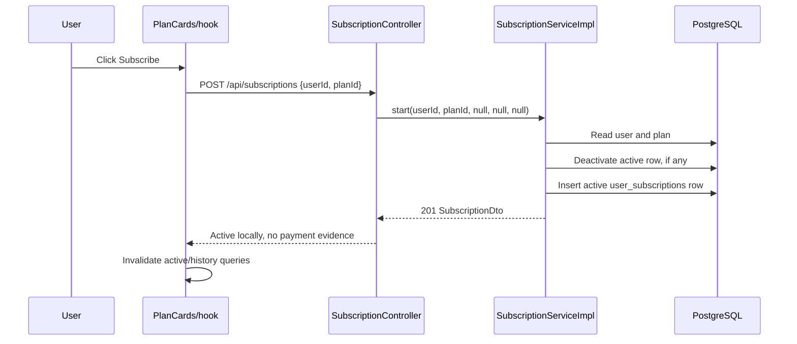
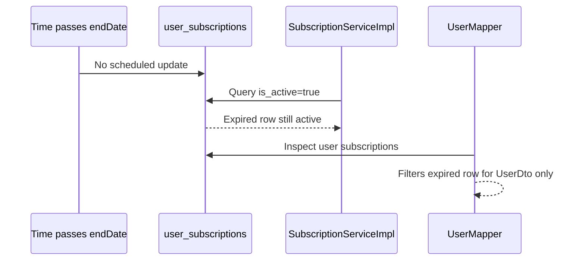
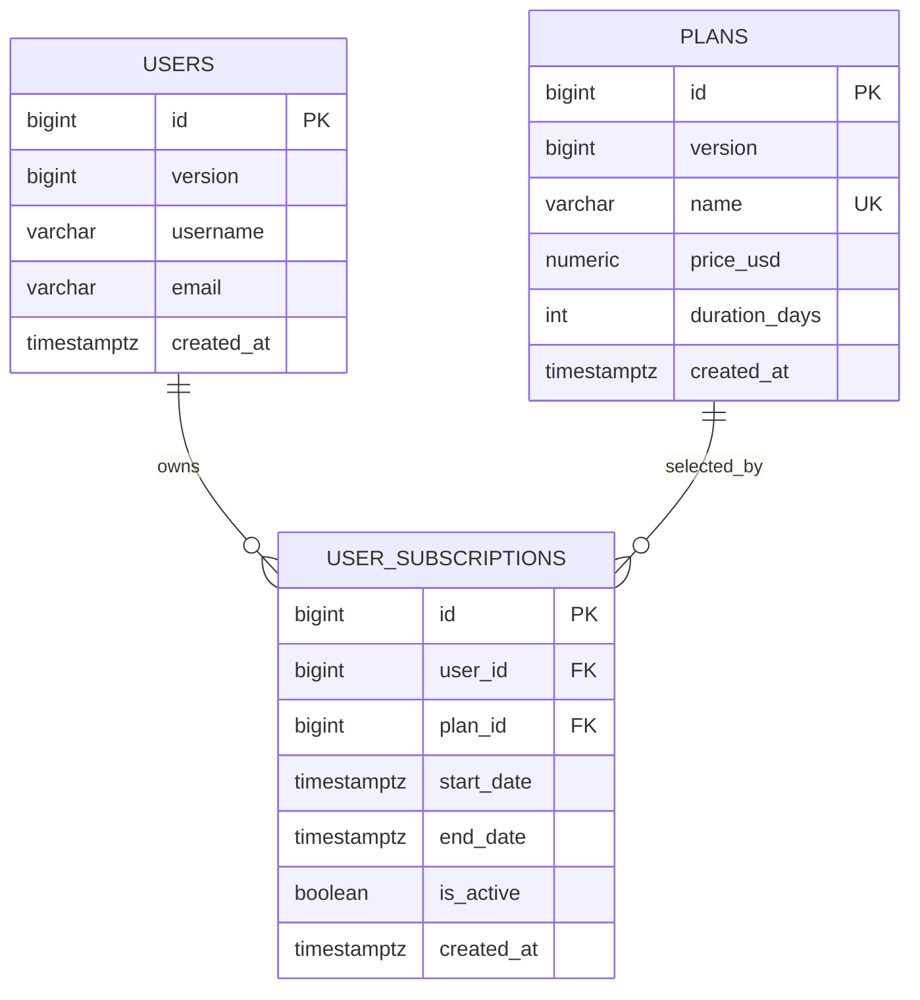
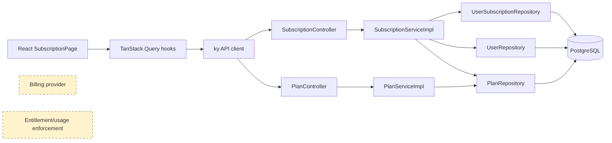

# Subscription and billing implementation audit

**Audit date:** 2026-07-23  
**Scope:** `backend/lined/`, `lined-web/`, root schema and relevant documentation.  
**Method:** static tracing of production and test sources, plus focused backend and frontend test attempts. No production code was changed.

## Executive conclusion

**Production readiness: Prototype only.**

The repository has a small, local subscription-recording feature: plans are stored in PostgreSQL, a registration flow assigns an active `FREE` record, and the web page can list plans, directly create a subscription, cancel it immediately, and show local history. This is **CONFIRMED** by the plan/subscription modules, schema, and web hooks.

It is not billing. A caller can create an active subscription for any existing user and plan with `POST /api/subscriptions`; there is no payment provider, checkout, webhook, authorization enforcement, entitlement enforcement, renewal, or expiry transition. The repository's own proposed checkout document explicitly calls the direct paid activation unpaid and proposal-only ([`backend/lined/docs/api-proposals/payment-checkout-api.md`](../backend/lined/docs/api-proposals/payment-checkout-api.md#L4-L10)).

Status terms below are deliberately evidence-based:

| Status | Meaning in this report |
|---|---|
| **CONFIRMED** | Explicitly implemented in current source. |
| **INFERRED** | Strong consequence of the implementation, but not a separately encoded rule. |
| **NOT IMPLEMENTED** | No implementation found in the scanned backend/frontend. |
| **UNCLEAR** | Evidence is insufficient to determine behavior. |
| **MOCKED** | In-memory frontend/MSW simulation, not a billing provider. |

## 1. Inventory

| Layer | File or class | Responsibility | Status |
|---|---|---|---|
| Database | [`backend/lined/src/main/resources/database/schema.sql`](../backend/lined/src/main/resources/database/schema.sql#L24) | `plans` and `user_subscriptions` tables, indexes, and FREE/PRO/FAMILY seeds | **CONFIRMED** |
| Plan domain | `plan/domain/PlanEntity`, `PlanRepository`, `BuiltInPlan` | Mutable plan name, USD price, duration, optimistic version; enum labels FREE/PRO/FAMILY | **CONFIRMED** |
| Plan API | `plan/api/PlanController`, DTOs, mapper; `plan/service/PlanServiceImpl` | Public CRUD/list/read plan API | **CONFIRMED** |
| Subscription domain | `subscription/domain/UserSubscriptionEntity`, `UserSubscriptionRepository` | User-to-plan subscription with start/end/active flag | **CONFIRMED** |
| Subscription API | `SubscriptionController`, DTOs, mapper; `SubscriptionServiceImpl` | Direct start, immediate cancel, active lookup, history | **CONFIRMED** |
| Account provisioning | [`app/AccountApplicationServiceImpl`](../backend/lined/src/main/java/io/backend/lined/app/AccountApplicationServiceImpl.java#L26) and `AccountProvisioning*` | Registration assigns default plan (FREE by default) and starts a subscription | **CONFIRMED** |
| User representation | [`user/api/UserMapper`](../backend/lined/src/main/java/io/backend/lined/user/api/UserMapper.java#L48) | Computes `activePlan` / `activeUntil` for `UserDto`, filtering elapsed end dates | **CONFIRMED** |
| Security | [`config/SecurityConfig`](../backend/lined/src/main/java/io/backend/lined/config/SecurityConfig.java#L8) | Password encoder only; no HTTP security filter chain | **CONFIRMED** |
| Web route/page | `lined-web/src/router.tsx`, `features/subscription/pages/SubscriptionPage.tsx` | Auth-guarded client route `/subscription`, data composition | **CONFIRMED** |
| Web UI | `CurrentPlanCard`, `PlanCards`, `SubscriptionHistoryCard` | Current plan/renewal label, direct subscribe, confirmed cancel, history | **CONFIRMED** |
| Web API/hooks | `features/subscription/api/{prod,dev,index,handlers}.ts`, `hooks/useSubscriptions.ts` | Real REST client and in-memory/MSW alternatives; query invalidation | **CONFIRMED / MOCKED** |
| Tests | backend plan/subscription/account/user-mapper tests; web subscription tests | Unit/controller tests and component/hook tests | **CONFIRMED** (web execution currently blocked; see §14) |
| Provider/payment modules | Full codebase scan for `PaymentProvider`, Stripe, Paddle, Lemon Squeezy, checkout, webhooks, invoices | No provider client, payment entity, checkout endpoint, webhook, or payment table | **NOT IMPLEMENTED** |
| Entitlements/limits | Full source scan for plan-gating or entitlement checks | No entitlement model and no plan-specific feature/usage enforcement | **NOT IMPLEMENTED** |

The term “family” outside `plan` is also used for `LobbyTypes.FAMILY`; it is a lobby classification, not evidence of a family billing account.

## 2. Current functionality matrix

| Capability | Status / behavior | Evidence | Readiness |
|---|---|---|---|
| List plans | **CONFIRMED**: returns every plan row | `PlanController.listAll()` at `PlanController.java:33-50` | Local MVP |
| Current subscription | **CONFIRMED**: returns the row where `is_active=true`, irrespective of end date | `SubscriptionServiceImpl.getActive()` at `:85-89` | Incomplete |
| Start/subscription | **CONFIRMED**: direct DB insertion; caller chooses user/plan and optional dates/active | `SubscriptionController.start()` `:30-81`; service `:32-68` | Unsafe prototype |
| Monthly billing | **INFERRED**: seed PRO/FAMILY are 30 days and UI labels any nonzero price “/month” | schema `:72-81`; `PlanCards.tsx:56-61` | No billing |
| Yearly interval/change interval | **NOT IMPLEMENTED** | No period field/endpoint/UI; checkout task remains proposed | Absent |
| Upgrade/downgrade | **CONFIRMED** mechanically: starting active plan ends prior record now and activates new one now | `SubscriptionServiceImpl.java:49-67` | Unpaid, no policy |
| Cancellation | **CONFIRMED** immediate: sets `active=false` and `endDate=now` | `SubscriptionServiceImpl.java:73-82`; UI copy `subscription.json:12-15` | Local only |
| Cancel at period end/resume | **NOT IMPLEMENTED** | No `cancelAtPeriodEnd`, status, resume endpoint, or scheduler | Absent |
| Automatic renewal/expiration | **NOT IMPLEMENTED** | No scheduler/listener/provider scan result; active query ignores `endDate` | Absent / incorrect read state |
| History | **CONFIRMED**: all user rows ordered descending by start | repository `UserSubscriptionRepository.java:11-13` | Limited (not financial history) |
| Billing history/refunds/invoices/trials/failed payment/grace period | **NOT IMPLEMENTED** | No models, status fields, endpoints, or provider integration | Absent |
| Admin management | **CONFIRMED but unprotected**: generic plan CRUD is public; no subscription admin workflow | `PlanController.java:98-220`, `SecurityConfig.java:8-16` | Unsafe |
| Provider checkout/portal/webhooks | **NOT IMPLEMENTED** | Payment endpoints are only proposed in `payment-checkout-api.md:24-55` | Absent |
| Subscription feature restrictions/usage limits | **NOT IMPLEMENTED** | No plan/entitlement checks outside subscription/account/user mapping | Absent |

## 3. Implemented end-to-end flows

### Flow A — viewing plans

**CONFIRMED.** The authenticated client route is registered at `lined-web/src/router.tsx:50-63`. `SubscriptionPage` calls `usePlans()` and `useActivePlan(userId)` (`SubscriptionPage.tsx:14-22`). `usePlans` calls `GET /api/plans`; `useActivePlan` calls `GET /api/subscriptions/{userId}/active`, treating 404 as no active subscription (`useSubscriptions.ts:13-33`). Plans originate from the `plans` table, seeded with `FREE $0/0 days`, `PRO $9.99/30`, and `FAMILY $19.99/30` (`schema.sql:72-81`), not a provider.

Prices are database values in production (`PlanEntity.priceUsd`, `PlanEntity.java:43-47`), although the dev/MSW mocks hardcode different presentation names and FAMILY price ($14.99) in `mockData.ts:3-25`. Current plan highlighting compares IDs client-side (`PlanCards.tsx:41-54`).

```mermaid
sequenceDiagram
  participant U as User
  participant W as SubscriptionPage
  participant A as Web API client
  participant B as Plan/Subscription controllers
  participant D as PostgreSQL
  U->>W: Open /subscription
  W->>A: usePlans(), useActivePlan(userId)
  A->>B: GET /api/plans
  B->>D: SELECT plans
  D-->>B: plan rows
  B-->>W: PlanDto[]
  A->>B: GET /api/subscriptions/{userId}/active
  B->>D: SELECT where user_id and is_active=true
  B-->>W: SubscriptionDto or 404
  W-->>U: Cards; highlight matching plan id
```

### Flow B — purchasing / starting a subscription

**CONFIRMED, but not payment processing.** Clicking a noncurrent card calls `useStartSubscription().mutate(plan.id)` (`PlanCards.tsx:63-75`); the hook posts only `{userId, planId}` (`useSubscriptions.ts:42-50`). The production client posts to `/api/subscriptions` (`api/prod.ts:20-22`).

`SubscriptionServiceImpl.start` loads user and plan, supplies `now`/`now + durationDays` only if dates are omitted, deactivates an already-active row, and saves the new row (`:36-68`). Paid access becomes active immediately at local DB save; no redirect, payment, provider verification, or webhook occurs. The API proposal independently confirms this direct path “activates any plan for free” (`payment-checkout-api.md:5-10`).



The dev API and MSW handlers simulate exactly the same direct activation in memory (`dev.ts:38-66`, `handlers.ts:37-76`): **MOCKED** network/state behavior, not payment simulation.

### Flow C — cancellation

**CONFIRMED immediate cancellation.** A confirmation dialog calls `POST /api/subscriptions/{userId}/cancel-active` (`CurrentPlanCard.tsx:71-85`, `api/prod.ts:24-26`). The service finds `is_active=true`, sets it false and overwrites `endDate` with `OffsetDateTime.now()` (`SubscriptionServiceImpl.java:73-82`). The frontend wording also says “cancelled immediately” (`subscription.json:12-15`). There is no provider cancellation request.

```mermaid
sequenceDiagram
  participant U as User
  participant W as CurrentPlanCard
  participant C as SubscriptionController
  participant S as SubscriptionServiceImpl
  participant D as PostgreSQL
  U->>W: Confirm Cancel subscription
  W->>C: POST /subscriptions/{userId}/cancel-active
  C->>S: cancelActive(userId)
  S->>D: Find is_active=true
  S->>D: UPDATE active=false, end_date=now
  C-->>W: SubscriptionDto
  W->>W: Refetch active/history; display free state
```

### Flow D — downgrading to FREE

**CONFIRMED only as a record replacement.** Selecting FREE is the same direct start path as any other plan; it ends the prior active row immediately then creates active FREE. There is no separate downgrade command and no inspection, deletion, hiding, locking, or creation blocking for resources. **NOT IMPLEMENTED**: resource-limit handling.

```mermaid
sequenceDiagram
  participant U as User
  participant W as PlanCards
  participant S as SubscriptionServiceImpl
  participant D as PostgreSQL
  U->>W: Select FREE
  W->>S: POST subscription with FREE plan id
  S->>D: Set prior active=false; end_date=now
  S->>D: Insert active FREE row
  S-->>W: New active subscription
  Note over D: Existing lobbies/events/tasks untouched
```

### Flow E — expiration

**NOT IMPLEMENTED as a lifecycle transition.** No scheduled job, request-time state update, or webhook changes an elapsed active row to inactive. Moreover, `getActive` only checks `is_active=true` (`SubscriptionServiceImpl.java:85-89`), so it returns an expired row. `UserMapper.activeSub` alone filters elapsed end dates when producing `UserDto` (`UserMapper.java:58-68`), yielding inconsistent representations.



## 4. Domain model and data model



| Concept | Finding |
|---|---|
| User | **CONFIRMED** owner of subscriptions directly (`UserEntity.subscriptions`, `UserEntity.java:76-78`). |
| Plan | **CONFIRMED** mutable catalog row: name, `BigDecimal priceUsd`, duration, created time, version (`PlanEntity.java:36-53`). No plan entitlement fields. |
| Subscription | **CONFIRMED** `UserSubscriptionEntity`: user FK, plan FK, start/end, boolean active, created time (`UserSubscriptionEntity.java:41-81`). |
| Billing account / account / team subscription | **NOT IMPLEMENTED**. “Account” application service is registration orchestration, not a billing account. |
| Payment / transaction / invoice / refund / provider customer/subscription/event | **NOT IMPLEMENTED**. |
| Personal/family/team ownership | **CONFIRMED** only personal user ownership. `FAMILY` is a plan name seed; it does not reference a group or lobby. |

Database constraints are at `schema.sql:24-58`: numeric nonnegative price, nonnegative duration, FK user/plan, `end_date >= start_date`, case-insensitive plan name index, user/date indexes, and a partial unique index allowing at most one `is_active=true` row per user. Timestamps are `TIMESTAMPTZ`; money is `NUMERIC(10,2)`/`BigDecimal`; currency is **NOT IMPLEMENTED** (implicit USD field name only). There are no migrations/Flyway/Liquibase scripts; schema initialization plus `ddl-auto=update` is configured in `application.properties:14-21`.

The subscription table has no version, provider identifiers, status, cancellation scheduling, payment amount/currency snapshot, or event id. Historical records cannot reliably reconstruct what the customer was charged: `SubscriptionMapper` reads current plan name (`SubscriptionMapper.java:12-16`) and the web history looks up the *current* plan price (`SubscriptionPage.tsx:18-22`, `SubscriptionHistoryCard.tsx:32-46`).

## 5. State model

There is no `SubscriptionStatus` or payment-status enum. The complete persisted subscription state is the `is_active` boolean plus dates.

| Current state | Trigger | Next state | Side effects | Implementation evidence |
|---|---|---|---|---|
| No active row | Start active subscription | Active | Insert active row, default dates if omitted | `SubscriptionServiceImpl.java:42-68` |
| Active | Start another active subscription | Ended + new Active | Old row inactive/end now; new active row inserted | `:49-67` |
| Active | Cancel active | Ended | Set inactive/end now | `:73-82` |
| Active with elapsed end date | Time passes | Still Active in table | No transition | `getActive()` `:85-89` |
| Ended | Start active subscription | New Active | Insert new row; old row remains history | `:59-67` |
| Any | Start with `active=false` | Inactive record | Insert record without replacing active row | `:47-67` |

```mermaid
stateDiagram-v2
  [*] --> NoActive
  NoActive --> Active: POST start(active null/true)
  Active --> Ended: cancelActive (end=now)
  Active --> Ended: start another active (old row)
  Active --> Active: start another active (new row)
  Active --> Active: endDate passes; no transition
  Ended --> Active: start active subscription
  NoActive --> Ended: POST start(active=false)
```



**CONFIRMED ambiguities/gaps:** `endDate` means a calculated plan end, replacement/cancellation time, or arbitrary client-supplied value; it is not an enforced “effective access until” value. States such as PENDING, TRIALING, PAST_DUE, CANCELLED, EXPIRED, PAUSED, REFUNDED, and PAYMENT_FAILED are **NOT IMPLEMENTED**. The UI’s ACTIVE/ENDED badges are derived only from the boolean (`SubscriptionHistoryCard.tsx:53-60`).

## 6. Encoded business rules

| Business scenario | Current behavior | Evidence | Risk / ambiguity |
|---|---|---|---|
| Upgrade active when? | Immediately at direct POST DB save | `SubscriptionServiceImpl.java:59-68` | No payment confirmation |
| Downgrade active when? | Immediately, same start path | `:49-67` | No scheduled downgrade or proration |
| Does cancellation remove access now? | Subscription record becomes inactive now | `:78-80` | No entitlement layer exists, so effective product impact is absent/unknown |
| Access until period end? | No; cancel overwrites end with now | `:78-80` | UI label “Renews” misleading for nonrenewing local records |
| Refund / refund-as-cancel | **NOT IMPLEMENTED** | No payment/refund model or API | Cannot reconcile financial state |
| Grace after failed payment / trial | **NOT IMPLEMENTED** | No failure/trial status or provider flow | Absent |
| Automatic renewal / failed renewal | **NOT IMPLEMENTED** | No job/webhook/provider | Rows do not renew |
| Expiry | No state change; active API remains active | `getActive()` `:85-89` | Contradicts `UserDto` mapper behavior |
| Exceed FREE limits | **NOT IMPLEMENTED** | No plan checks in product modules | No restriction exists |
| Resume cancellation | **NOT IMPLEMENTED** | No scheduled cancellation state | Absent |
| Multiple active rows | DB disallows committed duplicates per user | partial unique index `schema.sql:56-58` | Race produces DB error, not an idempotent result |
| Duplicate purchase request | Sequential direct requests replace first subscription, creating history; concurrent requests can violate unique index | service `:49-67`, schema `:56-58` | No idempotency key |
| Concurrent state safety | **UNCLEAR / insufficient** as an API guarantee; no subscription `@Version` or locks | entity has no version (`UserSubscriptionEntity.java`) | See §12 |
| Pricing versioned? | **NOT IMPLEMENTED**; plan row is mutable | `PlanEntity.java:40-47`, mapper reads relationship | Prior subscribers/history display revised plan values |

## 7. Plans, feature flags, entitlements, and limits

These are separate concepts in the current codebase:

| Concept | Current implementation |
|---|---|
| Feature flag | **NOT IMPLEMENTED in production source scanned.** Feature-flag documentation is a plan/spec, not evidence of a deployed entitlement mechanism. |
| Entitlement | **NOT IMPLEMENTED.** No entity, service, annotation, or check derives capabilities from plan. |
| Authorization | **NOT IMPLEMENTED for plan/subscription endpoints.** `SecurityConfig` has no request authorization, and controllers accept arbitrary IDs. |
| Usage limit | **NOT IMPLEMENTED.** No counts/limits linked to `PlanEntity`. |

| Capability / limit | FREE | PRO | FAMILY | Enforcement location |
|---|---:|---:|---:|---|
| All product capabilities found | Same | Same | Same | Nowhere; no plan-specific source checks found |
| Lobbies/members/reminders/free slots/recurring events/history retention/filters | No coded limit | No coded entitlement | No coded entitlement | Nowhere |

There are direct plan-name values (`BuiltInPlan.java:3-17`, schema seed) but no code path uses them to gate a product action. The only plan-specific duplication found is catalog/presentation naming: backend seed uses `FREE/PRO/FAMILY`, tests often use `PRO_MONTHLY`, while frontend mock data uses `Starter/Pro/Family` and a different Family price (`features/subscription/api/mockData.ts:3-25`).

## 8. REST API and contract audit

| Method | Endpoint | Controller | Authentication / authorization | Request | Response | Side effects |
|---|---|---|---|---|---|---|
| GET | `/api/plans` | `PlanController.listAll` | None enforced | — | `PlanDto[]` | None |
| GET | `/api/plans/{id}` | `getById` | None enforced | Path id | `PlanDto` | None |
| GET | `/api/plans/by-name?name=` | `getByName` | None enforced | Query name | `PlanDto` | None |
| POST | `/api/plans` | `create` | None enforced | name/price/duration | 201 + ETag | Creates catalog row |
| PUT | `/api/plans/{id}` | `update` | None enforced | `If-Match`, plan fields | 200 + ETag | Changes plan, including price/name |
| DELETE | `/api/plans/{id}` | `delete` | None enforced | `If-Match` | 204 | Deletes plan (subscription-history effect needs integration verification) |
| POST | `/api/subscriptions` | `SubscriptionController.start` | None enforced | userId, planId, optional dates/active | 201 `SubscriptionDto` | Ends active row then creates local row |
| POST | `/api/subscriptions/{userId}/cancel-active` | `cancelActive` | None enforced | Path userId | 200 `SubscriptionDto` | Immediately deactivates row |
| GET | `/api/subscriptions/{userId}/active` | `getActive` | None enforced | Path userId | 200 or 404 | None |
| GET | `/api/subscriptions/{userId}/history` | `history` | None enforced | Path userId | 200 list | None |

OpenAPI annotations exist on both controllers (`SubscriptionController.java:30-149`, `PlanController.java:33-220`) and backend docs list these endpoints (`backend/lined/docs/api.md:412-509`). However, the subscription API documentation’s 201/400/404 list omits the real unique-index conflict possibility; it also does not document lack of ownership controls. The client sends `X-User-Id` globally (`lined-web/src/lib/apiClient.ts:30-42`), but these controllers do not read it and `SecurityConfig` has no filter chain.

**CONFIRMED security result:** changing `userId` in a request body/path can create, read, cancel, or enumerate another user’s subscription. Plan creation, repricing, and deletion are likewise public. The server does resolve plan price from the database only incidentally—the subscription request contains no price—but it never charges or validates a trusted payment amount.

## 9. Frontend audit

**CONFIRMED pages/behavior:** `/subscription` is reachable through Settings (`SettingsMenu.tsx:26-32`) under client `RequireAuth`. The page loads three queries in parallel-ish render lifecycle, has skeletons for its three sections, a confirmation dialog for cancellation, and generic/404/409 error messages (`CurrentPlanCard.tsx:36-85`, `PlanCards.tsx:16-85`, `SubscriptionHistoryCard.tsx:13-67`). Mutations invalidate active/history rather than optimistically mutating cache (`useSubscriptions.ts:42-61`).

| UI concern | Finding |
|---|---|
| Checkout modal / provider redirect / return state / portal | **NOT IMPLEMENTED.** Task 26 specifies them as mock-first, backend-proposed work (`lined-web/docs/tasks/UI-26-payment-checkout.md:1-92`). |
| Billing-period selection | **NOT IMPLEMENTED.** All nonzero plans are displayed “/month,” regardless of `durationDays` (`PlanCards.tsx:56-61`). |
| Current renewal display | **INFERRED misleading.** UI always says “Renews {endDate}” for any active row (`CurrentPlanCard.tsx:55-57`), although no renewal occurs. |
| Payment/subscription history distinction | Subscription row history exists; payment history and receipts are **NOT IMPLEMENTED**. |
| Dev/mock consistency | **MOCKED mismatch:** `Starter` vs backend `FREE`; mocked Family $14.99 vs database $19.99. |
| API-client consistency | Production `cancelSubscription` discards a backend `SubscriptionDto` (`api/prod.ts:24-26`), but invalidation refetches, so it is functionally safe. |
| Provider credentials/card data | **NOT IMPLEMENTED / not stored**. No card fields/provider settings found. |

## 10. External provider and source of truth

No Stripe, Paddle, Lemon Squeezy, or other provider integration was found. There is no provider configuration/secret, client, checkout session, webhook endpoint, signature verification, event storage, idempotency/retry, customer portal, refund, invoice, receipt, or reconciliation process.

The source of truth is therefore **CONFIRMED local `plans`/`user_subscriptions` rows**, with an additional **MOCKED** client/MWS in-memory alternative when `VITE_USE_MOCKS=true` (`api/index.ts:1-14`). The payment checkout document is a useful future direction, but it is explicitly `Status: Proposed` and must not be treated as implementation (`payment-checkout-api.md:1-4`).

## 11. Transactions, concurrency, and consistency

`SubscriptionServiceImpl` is class-level read-only and method-level transactional for start/cancel (`SubscriptionServiceImpl.java:17-34`, `:71-82`). It uses no optimistic version on `UserSubscriptionEntity`, no pessimistic lock, idempotency key, provider event ID, retry, outbox, or inbox.

Concrete current failure scenarios:

1. **Concurrent starts for a user with no active row:** both transactions can see none; the partial unique index ensures at most one commits, but the other returns a database integrity failure rather than a stable 409/idempotent response. This is an **INFERRED** interleaving supported by separate find/insert calls and the partial unique index.
2. **Cancellation races with replacement:** cancellation identifies the then-active row. A simultaneous start can create a new active row after that read; cancellation then deactivates only the old row and may report success while the new plan remains active. **INFERRED** from separate nonlocked reads/writes.
3. **Expired active row:** time never clears `is_active`; direct active endpoint and later updates can operate on stale state. **CONFIRMED** by query implementation.
4. **External-side inconsistency:** not applicable today because there is no external call; it becomes an unaddressed design gap for any provider integration because no transactional boundary pattern exists. **NOT IMPLEMENTED.**

The plan has `@Version` and controller `If-Match` support (`PlanEntity.java:36-38`, `PlanController.java:160-213`), but this protects only plan changes—not subscription state. The plan service’s legacy/deprecated overloads also allow service calls without a version; controller paths parse `If-Match` while subscription mutations have no equivalent.

## 12. Security and privacy

| Area | Finding |
|---|---|
| Subscription ownership | **Critical, CONFIRMED:** no caller identity or ownership check on POST/GET/history/cancel. |
| Plan administration | **Critical, CONFIRMED:** no role authorization on create/update/delete. |
| Price manipulation | Client cannot send a price in the subscription DTO, but **Critical, CONFIRMED:** it can activate any plan for free; public plan CRUD lets it alter prices/catalog too. |
| Dates/active manipulation | **High, CONFIRMED:** API accepts client-provided start/end and `active`; only null defaults and `end >= start` DB check constrain them. |
| Webhook verification/secrets | **NOT IMPLEMENTED**, hence no signature/replay protection. |
| Payment identifiers/card data | **NOT IMPLEMENTED/not stored**; no card data exposure was found. |
| Logging | **UNCLEAR:** no payment data exists; normal debug logging is configured (`application.properties:23-25`). |

## 13. Tests and verification

| Scenario | Test exists | Test file | Missing cases |
|---|---|---|---|
| Start/default dates/previous deactivation | Yes, unit | `backend/lined/src/test/java/io/backend/lined/subscription/service/SubscriptionServiceImplTest.java:88-182` | DB constraint/race behavior |
| Missing user/plan / no active cancel | Yes, unit | same file `:184-235` | Unauthorized caller |
| Active/history mapping | Yes, unit | same file `:241-298` | Expired active API conflict |
| Controller delegation/status | Yes, unit-style controller | `subscription/api/SubscriptionControllerTest.java` | HTTP validation/security integration |
| Plan CRUD/unit behavior | Yes | `plan/service/PlanServiceImplTest.java`, `plan/api/PlanControllerTest.java` | Admin authorization and historical pricing |
| Registration default FREE subscription | Yes | `app/AccountApplicationServiceImplTest.java` | End-to-end persistence |
| User mapper filters expired row | Yes | `user/api/UserMapperTest.java:103-119` | Alignment with subscription active endpoint |
| Web subscription UI/hooks/utilities | Yes, source tests | `lined-web/src/features/subscription/**/__tests__/*.test.tsx` | Real backend E2E; payment flow |
| Payment success/failure/webhook/refund/renewal/trial/grace | No | — | All required billing lifecycle tests |
| Cancellation at period end/resume/downgrade limits | No | — | All |
| Authorization/IDOR/concurrency | No | — | All |

Commands executed:

```text
backend/lined/: ./gradlew test --tests 'io.backend.lined.subscription.*' --tests 'io.backend.lined.plan.*' --tests 'io.backend.lined.app.AccountApplicationServiceImplTest' --tests 'io.backend.lined.user.api.UserMapperTest'
BUILD SUCCESSFUL (focused unit tests)

lined-web/: npm test -- --run src/features/subscription
FAILED before test collection: Failed to resolve import "i18next" from src/i18n/index.ts
```

The frontend failure is an environment/dependency failure observed during this audit; no source or dependency modifications were made.

## 14. Architecture assessment

**CONFIRMED architecture:** a layered modular monolith: controller → service → repository/entity, with MapStruct DTO mapping. The subscription module is a transaction-script-like local lifecycle service, not a provider adapter or ports-and-adapters billing architecture. Account registration orchestrates user/role/plan/subscription services.



Assessment:

1. Plan catalog and local subscription history are separated into modules.
2. Billing is not separated from product access because neither billing nor access enforcement exists.
3. Provider-specific code is absent, so replaceability is unproven.
4. Plans are not entitlements; they only supply name/price/duration.
5. Cancellation is a local immediate state mutation; refunds do not exist.
6. Effective access is inconsistent: `UserMapper` checks end date, subscription endpoint does not.
7. Unit testability is reasonable for local service behavior, but no persistence/security/concurrency/provider behavior is proven.

## 15. Findings and risks

### Critical

1. **Unauthenticated cross-user subscription control and data disclosure** — **CONFIRMED.** `SubscriptionController` uses path/body user IDs with no identity header/authorization (`SubscriptionController.java:48-149`), while `SecurityConfig` only supplies a password encoder. A caller can activate, cancel, inspect, or enumerate another user’s subscription. Must be fixed before any real provider integration.
2. **Any caller can self-grant paid access for free** — **CONFIRMED.** `POST /api/subscriptions` directly saves an active plan (`SubscriptionServiceImpl.java:32-68`); no payment evidence is required. Must be fixed before real provider work.
3. **Public plan catalog mutation** — **CONFIRMED.** Plan create/update/delete have no admin guard (`PlanController.java:98-220`). An attacker can reprice or delete plans. Must be fixed before real provider work.

### High

1. **Expiry does not change active subscription state** — **CONFIRMED.** `getActive` ignores `endDate`; only the user mapper filters it. Failure: an elapsed paid plan remains active in subscription UI/API indefinitely. Must be fixed before real provider work.
2. **No billing lifecycle or provider reconciliation** — **CONFIRMED.** No checkout/webhook/status/payment entity. Failure: no charge, failed payment, refund, renewal, invoice, or cancellation can be represented/reconciled. Must be fixed before real provider work.
3. **No idempotency or subscription concurrency control** — **CONFIRMED / INFERRED failure cases in §11.** Database uniqueness limits multiple committed active records but does not provide a user-safe response or serial state transitions. Must be fixed before real provider work.
4. **No plan entitlement/limit enforcement** — **CONFIRMED.** Switching plans has no product effect. Must be resolved before monetized plans are offered.

### Medium

1. **History is not a financial/audit ledger** — **CONFIRMED.** It lacks amounts, currency, provider IDs/events, periods, outcome/status, refunds, receipts, and price snapshot. A mutable plan alters history presentation. Fix before financial reporting/provider integration.
2. **Client controls lifecycle dates and active flag** — **CONFIRMED.** Optional start/end/active fields are exposed in `SubscriptionCreateDto.java:7-24`. For a product API, this permits arbitrary effective dates within minimal DB validation. Fix before provider integration.
3. **Frontend/backend catalog mismatch in mock mode** — **CONFIRMED.** `Starter` and $14.99 Family mock values differ from seeded `FREE` and $19.99. Fix before using mocks to validate a payment UX.
4. **Plan delete may compromise history** — **INFERRED.** `PlanEntity` has cascade-all/orphan removal subscriptions (`PlanEntity.java:52-53`) while subscription history relies on the relationship. Prove deletion behavior with an integration test before enabling plan deletion.

### Low

1. **“Renews” wording is unsupported** — **CONFIRMED.** No renewal mechanism exists, but active card displays it (`CurrentPlanCard.tsx:55-57`).
2. **API documentation does not clearly scope the subscription API as unpaid/local or disclose its security constraints** — **CONFIRMED.** The proposal says so; live endpoint docs do not.

## 16. Final implementation summary

### What is already implemented

- Persisted plan catalog with FREE/PRO/FAMILY seed data and mutable price/duration.
- Persisted per-user subscription rows with one active row enforced at DB level.
- Registration-time default FREE subscription.
- Direct start, immediate cancellation, active lookup, and local row history APIs.
- React subscription page with plan cards, loading states, confirmation dialog, error messages, and query invalidation.
- Backend unit coverage for core local behavior.

### What is mocked or incomplete

- `VITE_USE_MOCKS` and MSW simulate plan/subscription records in memory; they do not simulate a provider payment.
- The checkout/payment task and payment API document are future proposals, not shipped flows.
- Frontend mock plan labels/prices do not match backend seed values.
- Frontend subscription tests exist but the current installed environment cannot resolve `i18next`.

### What is not implemented

- Payment provider, hosted checkout, provider customer/subscription mapping, customer portal, webhooks, signature verification, event idempotency, payment/invoice/receipt/refund data.
- Billing periods/yearly pricing, renewal, expiration transition, cancellation-at-period-end, resume, trial, failed payment, grace period, proration.
- Subscription status model beyond boolean active, financial audit history, plan-price snapshot.
- Entitlements, feature gating, quantitative usage limits, and downgrade-resource policy.
- Authentication/authorization/ownership and admin controls for subscription/plan endpoints.

### Current business rules

- Registration assigns the configured default plan, FREE by default, as active.
- A direct active subscription starts now and ends after `durationDays` unless the caller supplies dates.
- Starting a new active subscription ends a previous active record immediately.
- Cancelling ends access locally immediately; it does not contact a provider.
- The active endpoint considers the boolean only; it does not expire elapsed rows.
- Database allows at most one active record per user, but no API idempotency contract exists.

### Current architecture

- Layered Spring modular monolith with plan and subscription modules.
- PostgreSQL is the sole current source of truth.
- React/TanStack Query owns client server-state display and refresh.
- Local transaction service performs record changes.
- No billing-provider boundary, payment domain, event processing, or access-control boundary.
- Plans are catalog rows, not entitlements.
- `UserDto` independently computes effective active plan, creating inconsistent read semantics.

### Production readiness

**Prototype only.** The current implementation is a useful local plan-selection/history prototype, but it permits free self-activation of paid plans and cross-user control, has no payment lifecycle, and does not enforce paid access or plan limits.

### Recommended next analysis step

Before refactoring or choosing Stripe/Paddle/Lemon Squeezy, explicitly decide the domain policy: billing owner (user versus shared account), canonical subscription states and effective-access semantics, entitlement/usage matrix, provider source of truth/webhook contract, cancellation and downgrade timing, and required ownership/admin authorization model. Then turn those decisions into a provider-independent API/domain specification and concurrency/security test plan.
