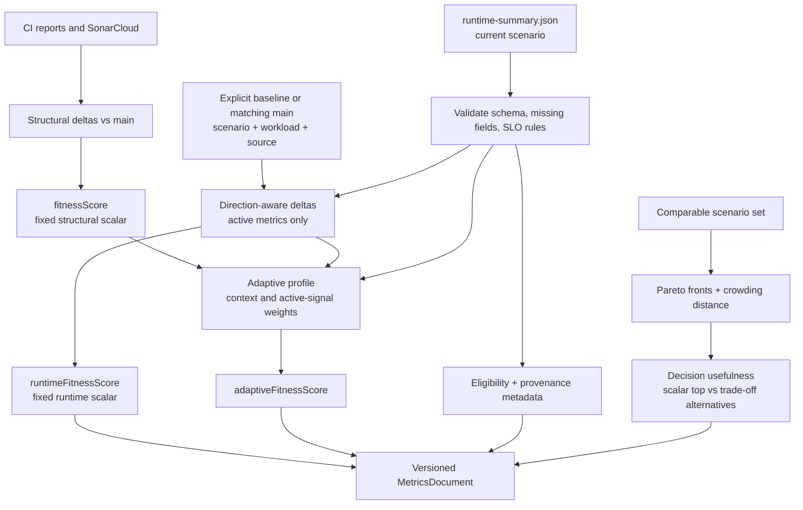

# CONTEXT.md — `fitness-metrics-collector/`

## Purpose

The fitness metrics collector is CI and research tooling for Lined. It turns
backend quality reports, SonarCloud measures, and optional runtime experiment
evidence into one versioned metrics document. It is not product runtime code,
does not serve an HTTP API, and does not run Kubernetes or k6 itself.

Its structural `fitnessScore` measures change against a `main` baseline. The
separate `runtimeFitnessScore`, `adaptiveFitnessScore`, Pareto result, and
decision-usefulness report preserve different comparison views instead of
replacing the structural score.

## What “fitness function” means here

A fitness function is an objective, repeatable way to evaluate whether a
chosen system characteristic remains healthy. Tests, static-analysis reports,
and runtime monitoring become fitness evidence only when the project gives
them an explicit rule: for example, a threshold, a baseline comparison, or a
scoring formula. It is not a measure of developer productivity and it does
not autonomously approve a merge, deploy a release, or change the application.

Lined uses this idea to make architectural trade-offs visible and comparable.
The structural score is a fixed-weight CI baseline for code quality and test
coverage. Runtime scoring compares observed latency, errors, throughput,
availability, restarts, and resource use with an equivalent baseline. Adaptive
and Pareto outputs then show when one scalar score is insufficient: a
candidate may improve one characteristic while sacrificing another. This gives
CI and experiments reproducible evidence for human review rather than a
single opaque "good/bad" result.

The input cadence is deliberately mixed: structural checks run when CI is
triggered, while runtime evidence comes from explicit scenario runs. A runtime
metric by itself is therefore not a stable comparison; the collector retains
its source, workload, missing fields, SLO classification, and provenance.

## How fitness comparisons work

Every score compares a candidate observation with a defined reference; it does
not compare unrelated runs or interpret an absent measurement as a successful
one. The collector keeps the result and the metadata needed to explain it.
Positive scores mean that the weighted evidence is better than the selected
baseline, negative scores mean worse, and zero means no weighted difference.
`null` means a score could not be calculated from the available evidence; it
is not the same as zero.

### Common normalization rule

For each metric, the collector first creates a direction-aware delta in
`[-1, 1]`. For higher-is-better metrics (for example, line coverage,
throughput, and availability), it calculates:

```text
delta = clamp((current - baseline) / baseline, -1, 1)
```

For lower-is-better metrics (for example, findings, latency, errors, restarts,
and utilization), it reverses the subtraction:

```text
delta = clamp((baseline - current) / baseline, -1, 1)
```

If both values are zero, the delta is zero. If only the baseline is zero, a
favorable non-zero current value becomes `1` and an unfavorable one becomes
`-1`; this prevents division by zero but makes the result a bounded comparison,
not a percentage-change claim. The collector rounds final scalar scores to four
decimal places and records the per-metric runtime deltas in the document.

### 1. Structural CI fitness: `fitnessScore`

This is the original fixed-weight CI baseline. It combines six normalized
deltas into one structural score:

```text
F = 0.25 × SpotBugs
  + 0.25 × critical Sonar violations
  + 0.30 × JaCoCo line coverage
  + 0.07 × Sonar code smells
  + 0.07 × Sonar duplicated-line density
  + 0.06 × Checkstyle violations
```

The reference for Sonar measures is the live `main` branch. The reference for
SpotBugs, Checkstyle, and coverage is the latest persisted `main` document;
when collecting `main` itself, the store asks for the previous snapshot so a
commit is not compared with itself. If that persisted baseline does not exist,
the current implementation logs the condition and uses zero for those three
reference values. That fallback creates a score but is weaker evidence than a
normal baseline-backed comparison and must not be treated as a measured
historical improvement.

`RUNTIME_ONLY=true` deliberately sets `fitnessScore` to `null`; it does not
invent structural evidence for a runtime experiment.

### 2. Runtime fitness: `runtimeFitnessScore`

Runtime scoring compares one validated `runtime-summary.json` with a baseline
summary. An explicit `RUNTIME_BASELINE_METRICS_JSON` wins. Otherwise, the
collector retrieves the newest `main` record matching the configured baseline
scenario (default `fixed-medium`) and the current summary's **workload** and
**source**. This keeps, for example, a `stress/local-kind` run from being
compared with a `baseline/local-kind` run.

Only metrics present in **both** summaries are active. Their fixed weights are
renormalized over the active set so missing data is excluded instead of being
counted as zero:

| Metric | Direction | Base weight |
| --- | --- | ---: |
| p95 latency | lower | 0.20 |
| p99 latency | lower | 0.15 |
| error rate | lower | 0.20 |
| throughput | higher | 0.15 |
| availability | higher | 0.15 |
| restart count | lower | 0.10 |
| CPU utilization | lower | 0.025 |
| memory utilization | lower | 0.025 |

The runtime score is the sum of each active, renormalized weight multiplied by
its normalized delta. It is `null` when there is no current summary, no
baseline, or no metric shared by both summaries.

Before scoring, `runtimeEvidence.ts` validates the summary and evaluates the
configured SLO rules. It records `eligibleForStableComparison` as false when a
baseline is missing or hard-constraint evidence is invalid or unknown. A
runtime score can still be present when eligibility is false; the eligibility
flag is the warning that the number should not be used as stable comparative
evidence.

### 3. Adaptive fitness: `adaptiveFitnessScore`

Adaptive fitness does **not** use `runtimeFitnessScore` as an input. It
reuses its per-metric normalized deltas, optionally combines them with the
structural score, and chooses a context-specific weight profile. This avoids a
single runtime scalar hiding which signals drove the result.

With `ADAPTIVE_FITNESS_CONTEXT=auto`, the selection order is:

1. `slo` when a hard SLO constraint is invalid;
2. `resource-pressure` when CPU or memory has an SLO warning;
3. `workload` when the runtime workload is not `baseline`;
4. `balanced` otherwise.

An explicit `balanced`, `workload`, `slo`, or `resource-pressure` value
overrides this order. Each profile gives a different emphasis to structural
quality, response time, correctness, throughput, availability, restarts, and
resource use; the exact versioned profiles are in
[`adaptiveScoring.ts`](scripts/adaptiveScoring.ts). As with runtime scoring,
the collector renormalizes weights over active signals only.

SLO evidence can also change a signal's value: an invalid constraint applies a
floor of `-1`, and a warning applies a floor of `-0.5`; the collector uses the
worse of that floor and the normalized delta. Consequently, adaptive fitness
can be lower than a pure baseline delta would suggest. It can also be computed
from structural evidence alone, or from SLO/resource-pressure evidence when a
runtime baseline is missing; the output's `missingSignals`, `selectedContext`,
and `signalValues` explain which case occurred.

### 4. Pareto comparison and decision usefulness

Pareto is a multi-candidate comparison, not another weighted scalar score. It
accepts `PARETO_RUNTIME_METRICS_JSONS` only when there are at least two unique
candidates with the same workload and source. An objective is active only if
every candidate measured it. A candidate dominates another when it is no worse
on every active objective and strictly better on at least one; lower latency,
errors, restarts, CPU, and memory are better, while higher throughput and
availability are better.

The first non-dominated front is stored as `selectedCandidateIds`. Crowding
distance marks diverse alternatives within a front; it is not an automatic
deployment recommendation. Pareto sorting here is deterministic reporting
over supplied scenario summaries—this collector does not execute a genetic
algorithm, deploy a scenario, or choose a winner.

`decisionUsefulness` then ranks the same active objectives with the fixed
runtime reporting comparator and compares its top candidate with the Pareto
front. Its purpose is explanatory: it records whether Pareto reveals a real
trade-off alternative that the fixed scalar ranking would otherwise hide.

### Data flow and interpretation boundary



Read the scalar values together with their versions, active weights, missing
metrics, eligibility, and provenance. They support a human comparison; they
are not a complete quality gate, proof of production behavior, or a substitute
for repeated comparable experiments.

## Structure

```
fitness-metrics-collector/
  scripts/
    collectMetrics.ts               CLI orchestration, report/Sonar parsing,
                                    MetricsDocument construction, DynamoDB store
    runtimeEvidence.ts              runtime-summary and SLO-threshold validation
    runtimeScoring.ts               fixed current-vs-baseline runtime score
    adaptiveScoring.ts              context-sensitive scalar runtime/structural score
    paretoOptimization.ts           deterministic non-dominated scenario ranking
    decisionUsefulnessReporting.ts  fixed-scalar comparison of Pareto alternatives
    collectMetrics.test.ts          Node test suite for all public behavior
  package.json                      build, metrics, and test commands
  tsconfig.json                     TypeScript CommonJS output configuration
```

`collectMetrics.ts` owns the command path and document contract. The other
modules are pure, typed scoring/evidence seams exercised from the same test
file; do not move their scoring rules into GitHub Actions or backend code.

## Inputs and output

Normal CI reads Checkstyle XML, SpotBugs XML/HTML, and JaCoCo XML produced by
the backend, then queries SonarCloud for `main` and the current branch or PR.
The structural score combines normalized deltas for SpotBugs, critical
violations, line coverage, code smells, duplicated-line density, and
Checkstyle violations.

Optional runtime inputs are collector-ready `runtime-summary.json` artifacts:
`RUNTIME_METRICS_JSON`, an explicit `RUNTIME_BASELINE_METRICS_JSON`, and a
comma-separated `PARETO_RUNTIME_METRICS_JSONS` set. `runtimeEvidence.ts`
requires schema version `1`, validates numeric ranges, records missing fields,
and classifies SLO constraints from `SLO_THRESHOLDS_JSON`. The collector can
run with `RUNTIME_ONLY=true` when structural reports are deliberately absent.

The output is the versioned `MetricsDocument` declared in
[`scripts/collectMetrics.ts`](scripts/collectMetrics.ts). It contains raw
metrics plus `fitnessScore`, `runtimeFitnessScore`, `adaptiveFitnessScore`,
`paretoOptimization`, `decisionUsefulness`, and runtime provenance. Set
`METRICS_OUTPUT_JSON` to write it locally. Persistence is optional: both
`AWS_METRICS_REGION` and `AWS_METRICS_TABLE_NAME` are required together, while
`METRICS_PERSIST=false` keeps an artifact local/read-only.

## CI and persistence flow

1. [`ci-backend.yml`](../.github/workflows/ci-backend.yml) builds the backend
   reports, installs this package, and runs `npm run metrics`.
2. On a pull request, the collector writes `metrics-document.json` with
   `METRICS_PERSIST=false`; CI uploads it as a short-lived artifact instead of
   allowing untrusted PR code to write DynamoDB.
3. [`persist-pr-metrics.yml`](../.github/workflows/persist-pr-metrics.yml)
   checks out trusted default-branch code, validates the artifact's branch and
   commit against the triggering run, then persists it through the main-write
   OIDC role. A `main` run persists directly.
4. `DynamoDbMetricsStore` reads the newest `main` structural snapshot and the
   matching sparse runtime baseline index. Its conditional put makes a repeat
   run for the same `branch`/`commitHash` an idempotent no-op.

The table/index contract and OIDC setup are authoritative in
[`dynamodb-metrics-store.md`](../backend/lined/docs/research/platform/dynamodb-metrics-store.md).

## Consumers and boundaries

- GitHub Actions consumes the generated document for CI metric persistence;
  the Python `fitness-metrics-analyzer/` reads the same document shape for
  research analysis.
- The backend runtime scenario runner produces the optional runtime summaries;
  see [`runtime-scenario-summaries.md`](../backend/lined/docs/research/platform/runtime-scenario-summaries.md).
- Score semantics and experiment-facing examples live in
  [`runtime-aware-scoring.md`](../backend/lined/docs/research/fitness/runtime-aware-scoring.md),
  [`adaptive-weighted-fitness.md`](../backend/lined/docs/research/fitness/adaptive-weighted-fitness.md),
  [`pareto-optimization-baseline.md`](../backend/lined/docs/research/fitness/pareto-optimization-baseline.md),
  and [`decision-usefulness-reporting.md`](../backend/lined/docs/research/fitness/decision-usefulness-reporting.md).
- Never treat a missing DynamoDB baseline, runtime baseline, or runtime metric
  as a fabricated zero measurement. The document records null scores,
  missing fields, provenance, and comparison eligibility where applicable.

## How to use and test

From this directory:

```bash
npm ci
npm test
```

`npm test` compiles TypeScript to ignored `dist/` and runs the Node test suite.
For a normal local structural run, generate the backend reports first, provide
`SONAR_TOKEN`, then run `npm run metrics`. For a local runtime-only result,
provide a validated runtime-summary path and an output path, as shown in the
runtime-scoring guide above; do not use raw k6 output as collector input.

## Operational constraints

- `SONAR_TOKEN` is required for normal structural collection and must never be
  committed.
- SpotBugs report parsing treats zero detected classes as invalid and exits
  with code `2`; this usually means backend build artifacts are missing.
- `dist/`, generated report artifacts, local runtime summaries, credentials,
  and DynamoDB state are not source files. Change the TypeScript sources and
  their tests instead.
